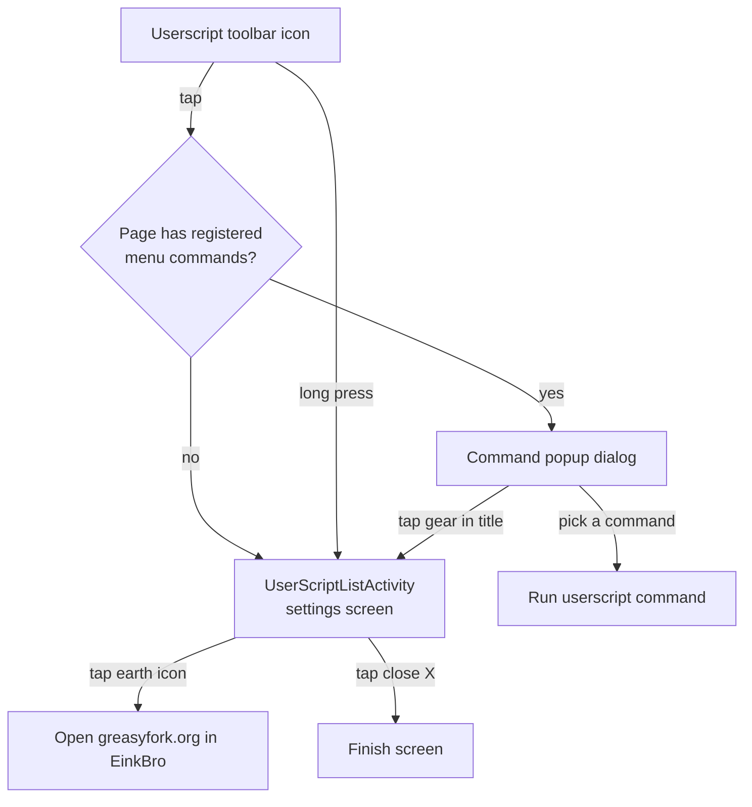

2026-06-21

# EinkBro: Userscript UI Enhancements

## Summary

Two enhancements made the userscript feature easier to navigate:

1. **Userscript settings screen header** now has an earth icon that opens
   [greasyfork.org](https://greasyfork.org/) inside EinkBro (so the user can find
   and install other userscripts), plus a close "X" on the rightmost position to
   match the other settings screens.
2. **Toolbar userscript command popup** now shows a settings (gear) button to the
   right of the "Userscripts" title. Tapping it dismisses the popup and opens the
   userscript settings screen — previously the only way in was a long-press on the
   toolbar icon or an empty page that fell back to the settings screen.

## Approach

The settings screen (`UserScriptListActivity`) is Jetpack Compose, so the two new
header buttons are just `IconButton`s added to the existing `TopAppBar` actions
slot: `Icons.Outlined.Public` (earth) wired to `IntentUnit.launchUrl(...)`, and
`Icons.Filled.Close` wired to `finish()`. Ordering left to right is earth, add,
close — close stays rightmost, consistent with `ToolbarConfigActivity`,
`AdBlockSettingActivity`, and `SettingActivity`.

The command popup is an `AlertDialog` (`ListSettingWithNameDialog`), not Compose,
so adding a button next to the title needed `setCustomTitle()` with a
programmatically built row: a `TextView` (weight 1) plus a borderless
`ImageButton`. Two design constraints shaped this:

- **Theme correctness.** The dialog uses `Theme.MaterialComponents.DayNight.Dialog.Alert`.
  A custom title view created from the plain activity context would resolve
  `colorControlNormal` / text color against the activity theme, which can mismatch
  the dialog body in night mode. The row is therefore built from a
  `ContextThemeWrapper(context, R.style.TouchAreaDialog)` and uses the
  theme-resolved `textAppearanceLarge` rather than a hardcoded Material appearance,
  so text and icon colors match the dialog body in both day and night modes.
- **Non-invasive API.** `getSelectedOptionWithString` and `ListSettingWithNameDialog`
  gained three optional, default-valued parameters
  (`titleActionIconResId`, `titleActionDescriptionResId`, `onTitleAction`). When
  absent, the dialog renders exactly as before via `setTitle()`, so every existing
  caller is untouched; only the userscript popup opts in. Tapping the gear dismisses
  the dialog, resumes the suspending `show()` with `null` (so the caller's
  `?: return` path runs and no command is invoked), then launches the settings
  screen.

A new gear vector (`ic_settings.xml`, filled with `?attr/colorControlNormal`) backs
the popup button. The earth-icon content description (`userscript_browse`) was added
to the default `strings.xml` only — consistent with the rest of the `userscript_*`
string family, which is not yet localized.

## Trade-offs

- The popup title is built programmatically instead of from an XML layout. That
  keeps the change self-contained (no new layout resource) at the cost of a few
  lines of view construction, and it required the `ContextThemeWrapper` so colors
  stay theme-correct.
- The gear only appears when the current page has registered userscript menu
  commands, because that is the only case where the popup is shown at all; on a page
  with no commands the toolbar icon already opens the settings screen directly, so
  the shortcut is redundant there.
- `userscript_browse` is English-only for now, matching the untranslated userscript
  string family rather than introducing a lone translated string into an otherwise
  English feature.

## Key Files

- `app/src/main/java/info/plateaukao/einkbro/activity/UserScriptListActivity.kt` —
  earth + close buttons in the `TopAppBar`, `GREASY_FORK_URL` constant.
- `app/src/main/java/info/plateaukao/einkbro/view/dialog/ListSettingDialog.kt` —
  optional title-action params and the themed custom-title builder.
- `app/src/main/java/info/plateaukao/einkbro/view/dialog/DialogManager.kt` —
  passes the new params through `getSelectedOptionWithString`.
- `app/src/main/java/info/plateaukao/einkbro/activity/BrowserActivity.kt` —
  wires the popup gear to open `UserScriptListActivity`.
- `app/src/main/res/drawable/ic_settings.xml` — new gear vector.
- `app/src/main/res/values/strings.xml` — `userscript_browse` content description.
