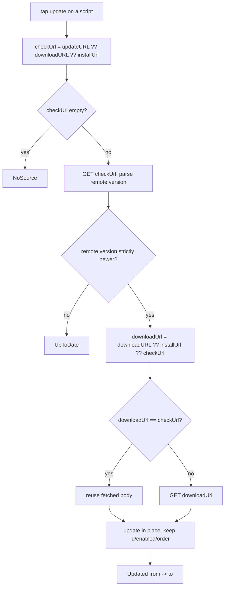

2026-06-13

# EinkBro — Per-script userscript update from @updateURL/@downloadURL

## Summary

The userscript manager can now update an installed script to its latest
version. Each script row has a refresh action that checks the script's remote
source, and if a newer version exists, downloads it and replaces the script in
place — keeping its id, enabled state, and list position. Updates are
version-gated: nothing is replaced unless the remote `@version` is strictly
newer than what's installed.

Triggering is manual and per-script — no background polling, no app-launch
checks. Tapping the refresh icon checks just that one script and reports the
outcome with a toast.

## Approach

The whole flow lives in `UserScriptManager.checkAndUpdate(id)` so both the
network work and the version decision sit behind one suspend call; the UI only
shows a spinner and a result toast.

URL resolution mirrors Tampermonkey:

- **Check URL** = `@updateURL`, else `@downloadURL`, else the original install
  URL (`sourceUrl`). `@updateURL` conventionally points at a metadata-only
  `.meta.js` doc, so it's the cheapest thing to poll for a version.
- **Download URL** = `@downloadURL`, else the install URL, else the check URL.
- When the download URL equals the check URL (the common case — a script with
  only an install URL, or only `@downloadURL`), the body already fetched for the
  version check is reused, so the whole update is a single network round-trip.

Version comparison (`UserScriptMetadata.isNewer`) splits on `.` and compares
each segment by its leading integer, then by any trailing suffix, so dotted
(`1.2.3`), date-style (`2024.10.07`), and pre-release (`1.5.0-beta`, which sorts
before `1.5.0`) versions all order correctly. An empty installed version makes
any non-empty remote count as newer; an empty remote version is never newer
(nothing concrete to update to).

The actual replacement reuses the existing `update()` path, which re-derives the
name from the new metadata, writes the body to its file, and keeps the DB row's
id/enabled/order. That's the same in-place mechanism the name-dedupe install
uses, so an update can never produce a duplicate entry.

The result is a small sealed type — `Updated(from, to)` / `UpToDate` /
`NoSource` / `Failed` — which the activity maps to a toast.

## Trade-offs

- **Manual, per-script only.** No "check all" button and no automatic checking
  on launch or on a schedule. It's the least surprising and cheapest option for
  an e-ink browser (no background network), at the cost of the user having to
  tap each script. A "check all" pass can be layered on later over the same
  `checkAndUpdate`.
- **Version-gated, with a silent overwrite when newer.** Re-fetching an
  unchanged script is a no-op (`UpToDate`), which avoids needless body rewrites,
  but it also means a script with no `@version` on either side can't be updated
  this way (the user can still re-install it manually through the editor). When
  an update does apply, the body is replaced without a confirm/undo — consistent
  with "pull the latest."
- **Trusts the remote's declared `@version`.** A script that bumps its body but
  not its `@version` won't be picked up; one that inflates `@version` without
  real changes will still re-download. This matches how every userscript manager
  behaves and keeps the check to a single metadata fetch.
- **New strings are English-only.** The rest of the userscript UI isn't
  localized in any `values-*` file, so translating only the update strings would
  leave the screen half-translated; they're left in the default `strings.xml`
  and fall back to English everywhere, matching the existing feature.

## Key Files

- `app/src/main/java/info/plateaukao/einkbro/userscript/UserScriptMetadata.kt` —
  parses `@updateURL`/`@downloadURL`; adds `isNewer()` and the segment-wise
  version comparator.
- `app/src/main/java/info/plateaukao/einkbro/userscript/UserScriptManager.kt` —
  `checkAndUpdate()` plus the `UpdateResult` sealed type and an `httpGet` helper.
- `app/src/main/java/info/plateaukao/einkbro/activity/UserScriptListActivity.kt` —
  per-row refresh icon with a spinner while checking and a result toast.
- `app/src/main/res/values/strings.xml` — five new userscript update strings.
