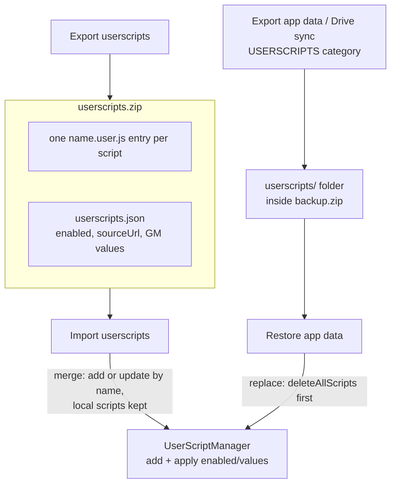

2026-07-31

# EinkBro: Userscript Backup — Zip Export/Import + Backup Category

Issue #625 asked for a way to move userscripts between devices (WebDAV sync preferred, zip
export/import as the acceptable minimum). Before this change userscripts were covered by
**no** backup path at all — which is easy to miss, because the `user_scripts` table *is* in
the Room database. Two things conspired:

- The app-data zip's `DATABASE_DATA` category doesn't dump the database file; it serializes
  a hand-picked list of tables to JSON, and `user_scripts` was never added to the list.
- Script bodies aren't in the database anyway. A single script (e.g. Immersive Translate)
  can exceed Android's 2MB CursorWindow, so bodies live as files under
  `filesDir/userscripts/<id>.user.js` and the DB row holds only metadata. Even a raw DB
  copy would restore empty scripts.

So a full "Export app data" silently lost every installed userscript — a bug in its own
right, fixed here alongside the requested feature.

## What shipped

Two new rows in Settings → Backup ("Export userscripts" / "Import userscripts", translated
in all locales), plus a new `USERSCRIPTS` entry in `BackupCategory` so the existing
app-data zip, "Share app data", and Google Drive sync (which uses `BackupCategory.entries`)
all carry scripts from now on.

## The zip format

A zip is the natural container because bodies are already standalone files. Each script is
written as its own `<name>.user.js` entry — so the archive is directly usable by other
userscript managers, and import accepts foreign zips of plain `.user.js` files — plus one
`userscripts.json` entry for the state the script header cannot carry: enabled flag, source
URL, and the script's GM `setValue` storage. In the app-data backup the same layout sits
under a `userscripts/` folder.

## Merge vs replace

The two restore paths deliberately differ. Restoring an app-data backup **replaces**
(delete all, then install from the zip) — consistent with every other category, where
restore means "make this device match the backup". The standalone import **merges**:
scripts are installed via the existing `add()` path, which updates in place when the
`@name` matches, so importing a zip from another device — or a single-script zip from
another manager — can never wipe local scripts. Manifest metadata (enabled state, GM
values) is applied after each install; entries without manifest coverage just default to
enabled.

## Notes from implementation

- The Uri- and File-based restore functions in `BackupUnit` were near-identical 60-line
  duplicates; they're consolidated into one `restoreZipEntries`, which is also where
  userscript entries are collected during the single streaming pass (bodies and manifest
  can appear in any order) and restored after the loop.
- A backup taken with zero scripts installed still writes the manifest entry, and restore
  keys its "clear first" decision on that — otherwise replace semantics silently degrade
  to a no-op for empty backups.
- Per-file try/catch during import: one malformed manifest entry must not abort the rest
  of the batch (partial imports previously also skipped the final in-memory cache reload).
- Filename collisions are suffixed rather than overwritten on both the write side
  (sanitized script names can collide) and the read side (same basename at different
  depths in foreign zips), so no script body is silently dropped.
- App-data restore now runs under `Dispatchers.IO`; it previously ran on the caller's main
  dispatcher, which mattered little for JSON entries but not for multi-MB script bodies.

WebDAV sync remains out of scope; the zip round-trip plus Drive sync covers the
cross-device use case the issue described.
