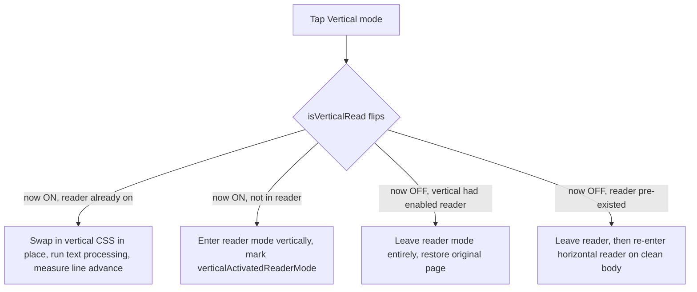
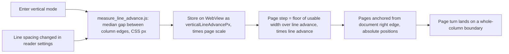

2026-07-12

# EinkBro: Enhancing the CJK Vertical (Tategaki) Reading Mode

EinkBro can render an article vertically, right-to-left, the way Chinese and
Japanese books are set. The feature worked but had rough edges: the on/off
toggle could get stuck, page turns sliced columns at the screen edge, the
reader layout sliders did nothing in vertical mode, and the text processing
had several small typographic bugs. This change reworks the feature across
correctness, typography, layout, and code health, and adds a committed test
page so the same checks can be re-run next time.

## The toggle was getting stuck — and why

The most visible bug: turning vertical mode *off* often did nothing, leaving
the reader trapped in vertical layout. The old exit path called
`webView.reload()`. But entering reader mode replaces the page body via
`document.body.outerHTML = ...`, and once that has happened Android's
`WebView.reload()` no longer re-fetches the document — it silently no-ops.
Confirmed from logcat: `resetState()` ran but no `onPageStarted` /
`onPageFinished` followed, and the test server logged no new request.

The fix stops relying on reload. Exiting now tears reader mode down the way
the rest of the app already does — `disableReaderMode()` restores the
pre-reader body from its in-memory cache, no network — and remembers how
vertical mode was entered so it returns to the right place. `process_text_nodes.js`
rewrites the DOM irreversibly (kanji dates, tate-chu-yoko spans, full-width
punctuation), so the body genuinely has to be rebuilt rather than restyled.

A `verticalActivatedReaderMode` flag records whether enabling vertical was
also what turned reader mode on. On exit: if vertical brought reader mode with
it, leave reader entirely and land on the normal page; if the user was already
reading horizontally, drop back into the horizontal reader on a freshly rebuilt
body. `toggleReaderMode` now keeps `isVerticalRead` in lockstep with the mode
it enters, so the reader-settings dialog's re-parse path (which toggles reader
off then on) preserves vertical read instead of silently dropping it.

## Page turns that never slice a column

Vertical reading paginates along the horizontal axis. The old code scrolled by
a fixed `width - 40dp`, so a column of text could land straddling the screen
edge — the exact artifact e-ink is least forgiving of, because the ghost of
the half-drawn stroke lingers after refresh.

Now a small script measures the rendered line advance (the median gap between
neighbouring column edges) and pagination steps by a whole multiple of it,
with pages anchored as absolute positions from the document's right edge so
the grid never drifts. Changing line spacing re-measures, so snapping survives
a settings change.

A related latent bug fell out here: `jumpToBottom` in vertical mode was a copy
of `jumpToTop` (both jumped to the right edge). The document end in
`vertical-rl` is the *left* edge, so it now scrolls there.

## Typography

The tate-chu-yoko treatment — short Latin/number runs composed into one upright
square inside the vertical line — was done with `transform: rotate(-90deg)` and
hand-tuned margins, which is why the git history has repeated "finetune margin
again" commits: a CSS transform doesn't change layout, so the box stays sized
for the un-rotated run. It now uses the purpose-built `text-combine-upright: all`
(with the `-webkit-text-combine` legacy alias), which composes real glyph
metrics and needs no margin compensation.

Three text-processing fixes: the kanji-date zero was the geometric circle
`U+25CB` rather than the ideographic zero `U+3007`; full-width punctuation was
applied blindly (breaking "Hello, world", "3,000", and URLs), so it is now
gated to punctuation that actually sits inside CJK text — and the map gained
`;`, `(`, and `)`, which had been missing; and 3-letter all-caps acronyms
(USA, CPU) were skipped entirely, leaving them rotated sideways, so they now
stack upright like the 4-letter ones.

## Reader layout settings in vertical mode

The page-margin and line-spacing sliders previously early-returned in vertical
mode. They map cleanly after all: padding is physical, and under
`writing-mode: vertical-rl` `line-height` sets the breadth of each vertical
line — i.e. inter-column spacing. Both now apply and re-render live; only the
two-column landscape layout stays horizontal-only, since it can't coexist with
vertical writing. A line-spacing change re-measures the line advance so page
turns stay snapped to the new grid.

## Progressive enhancement and code health

The vertical stylesheet, extracted from an inline Kotlin string into an asset,
now also carries `text-spacing-trim` and `line-break: strict` (ignored by older
WebViews, so safe to apply unconditionally) and native vertical ruby styling —
`<ruby>` furigana was confirmed to survive Readability and render beside the
line. Cleanups: the never-used vertical branch of `injectMozReaderModeJs` and
its parameter were removed, along with a dead helper and leftover debug logging.

## Verification

A committed test page, `test_server/vertical.html`, exercises every path in one
article — kanji dates, tate-chu-yoko, upright acronyms, ordered lists, ruby, and
the CJK-versus-Latin punctuation split — plus the toggle/exit transitions and
live line-spacing adjustment. Everything was checked on an emulator: the layout
renders correctly, USA/CPU stack upright, ruby annotates, `；（）「」﹙﹚`
behave (full-width in CJK, half-width in English), and page turns land on clean
column boundaries before and after a spacing change. A full code review found no
regressions.
