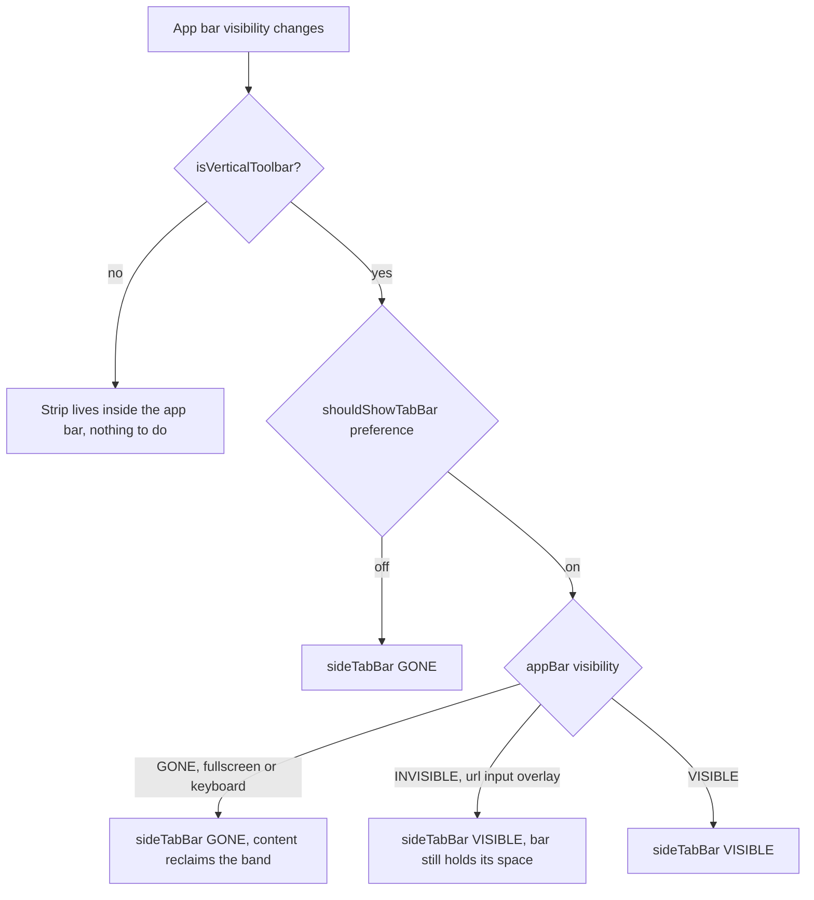

2026-08-16

# EinkBro: the vertical toolbar's tab strip refused to leave in fullscreen

## What was broken

With the toolbar set to vertical mode, going fullscreen did not actually give the
page the whole screen. The toolbar column itself disappeared as expected, but the
horizontal strip of tabs stayed pinned along the top (or bottom) edge, eating a
band of the viewport for the entire fullscreen session. The same stale band showed
up whenever the soft keyboard came up: the code hides the app bar to make room for
the keyboard, and again the tabs stayed behind.

## Root cause

The two toolbar layouts carry their tab strip differently.

In horizontal mode the strip is *inside* the app bar, so it is hidden for free —
one `appBar.visibility = GONE` takes the tabs with it, and every caller that hides
the toolbar has been implicitly relying on that for as long as the feature has
existed.

Vertical mode cannot do that. The toolbar is a narrow vertical column, so the tab
strip was given its own top-level view, `sideTabBar`, constrained to the parent
edge rather than to the app bar. Nothing links the two. Its visibility was decided
once, at layout time, from a single input — the `config.tab.shouldShowTabBar`
preference — inside `moveAppbarToLeft`/`moveAppbarToRight`. After that the strip
was simply on, and the delegates that hide the app bar had no idea there was a
second view to hide.

## The fix

Visibility of the strip now derives from two inputs instead of one: the preference
*and* the app bar's current visibility. `ViewUnit.shouldShowSideTabBar()` holds
that rule, and both vertical layout paths call it in place of reading the
preference directly, so the strip starts out correct. A new public
`ViewUnit.updateSideTabBarVisibility()` re-evaluates the rule and re-applies the
`ConstraintSet` — re-anchoring the strip and re-connecting the content pane's
edges, so the content actually expands into the band the strip gives up rather
than leaving a gap. It is a no-op outside vertical mode.

Three call sites feed it: `FullscreenDelegate` on both the enter path (app bar
`GONE`) and the exit path (app bar `VISIBLE`), and `ChromeSetupDelegate` on the
keyboard hide/show path.

The interesting part of the rule is that it tests for `GONE` specifically, not for
"not visible". `GONE` is the app bar surrendering its space, which is precisely
when the strip should go too. But the url input overlay hides the bar with
`INVISIBLE` — the bar keeps its layout slot, the column stays reserved, and the
strip is expected to remain in place beside it. Treating those two states alike
would have made the tabs flicker away every time the user tapped the address bar.

Keeping the decision in one predicate rather than spreading `sideTabBar.isVisible`
assignments through the delegates matters here: the strip's visibility and the
content pane's constraints have to move together, and any future caller that hides
the app bar only needs to remember the one `updateSideTabBarVisibility()` call to
get both right.
