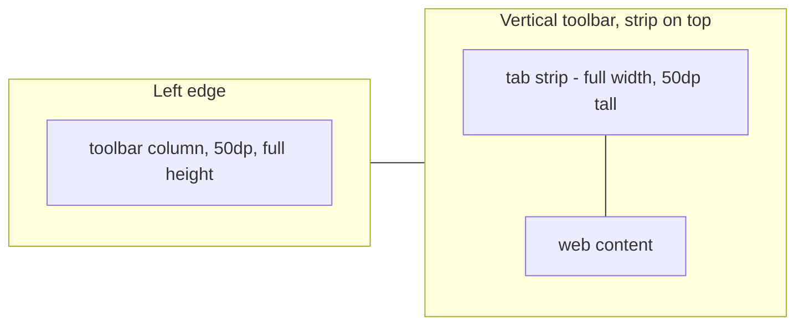
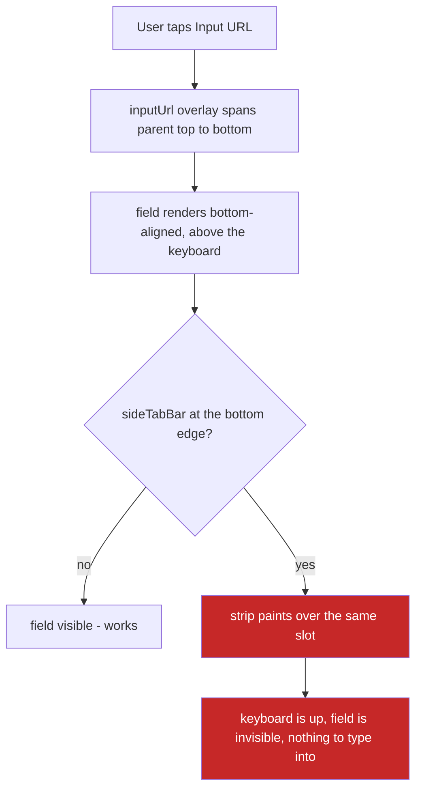

2026-08-16

# The tab bar now works with a vertical toolbar

## What this adds and why

Turning on "Show tab bar" did nothing while the toolbar was on the left or right
edge. The setting stayed on, the strip never appeared, and the only clue that tabs
existed was the tab-count icon in the toolbar column.

This was not a regression. `ComposedToolbar` has two branches, and only the
horizontal one ever drew the strip:

```kotlin
if (isVertical) {
    Row(Modifier.width(50.dp).fillMaxHeight()) { ComposedIconBar(...) }   // showTabs unread
} else {
    Column(Modifier.height(if (showTabs) 100.dp else 50.dp)) {
        if (showTabs) { PreviewTabs(...) ; HorizontalSeparator() }
        ComposedIconBar(...)
    }
}
```

`PreviewTabs` had exactly one call site in `Toolbar.kt`, inside that `else`, and
`git log -S` shows one commit ever touched it. Vertical mode arrived later in
`88b7e0c79` and never wired it up; the `showTabs = shouldShowTabs && !isVertical`
guard in `ComposeToolbarViewController` only made the dead parameter explicit.

## Where the strip goes

The vertical toolbar is a 50dp column. Stacking tabs vertically inside it — the
literal rotation of the horizontal layout — would squeeze every title into 50dp of
width, and widening the column would cost ~130dp of page width permanently. So the
strip stays horizontal and keeps the full screen width, and the toolbar column
stays 50dp beside it:



That needed a view outside the app bar, since the app bar in vertical mode is
constrained to a 50dp-wide column. `sideTabBar` is a new `ComposeView` on the root
`ConstraintLayout`, positioned by `ViewUnit.updateAppbarPosition` alongside the
existing per-position constraint code, and `GONE` for top/bottom toolbars, which
keep the strip inside the app bar exactly as before. `PreviewTabs` plus the
new-tab button moved into a shared `TabStripRow` so both renderers draw the
identical strip.

A "Tab bar on top" setting picks which edge it sticks to; the rule between strip
and page flips to the content-facing side to match.

## The URL input regression this exposed

The first working build had the strip visible and the browser unusable in one
specific combination: vertical toolbar with the strip at the bottom meant the URL
field was **gone**. Tapping "Input URL" raised the keyboard onto a screen with
nowhere to type.

`inputUrl` is a full-overlay `ComposeView` whose content is bottom-aligned above
the keyboard. `sideTabBar` is a sibling added to the root *after* it, so it paints
over that overlay — and at the bottom edge it lands on exactly the slot the URL
field occupies.



The top placement had a quieter version of the same fault: the overlay started at
the parent top with the strip painted across its first suggestion rows.

`adjustInputUrlForVerticalToolbar` now stops the overlay short of whichever edge
the strip occupies, mirroring the content constraints rather than duplicating the
reasoning.

The lesson worth carrying: adding a sibling view to a `ConstraintLayout` changes
z-order for every overlay already on it. The tab strip was not "just" a new view —
it silently reordered painting against `inputUrl`, and the break showed up in a
feature nobody had touched.

## Verification

Every toolbar position crossed with every strip edge, read off the live view tree:

| toolbar | strip | toolbar column |
|---|---|---|
| Left, strip top | `(131,63) 949x134` | `(0,63) 131x2274` |
| Left, strip bottom | `(131,2203) 949x134` | `(0,63) 131x2274` |
| Right, strip top | `(0,63) 949x134` | `(949,63) 131x2274` |
| Right, strip bottom | `(0,2203) 949x134` | `(949,63) 131x2274` |
| Bottom toolbar | absent | `(0,2074) 1080x263` |
| Top toolbar | absent | `(0,63) 1080x263` |

The URL field was exercised by tapping soft-keyboard keys rather than
`adb shell input text`, which bypasses the IME and would have hidden precisely
this class of bug: `example` typed through, with suggestions and history
filtering live.

230 unit tests pass, lint is clean, and the two new strings are translated across
all 30 locales.

Not covered: the `K_SIDE_TAB_BAR_ON_TOP` listener was never exercised from the
Settings screen — the preference was driven directly and the activity relaunched,
so live toggling without a restart is untested. Nothing has been checked on real
e-ink hardware.
