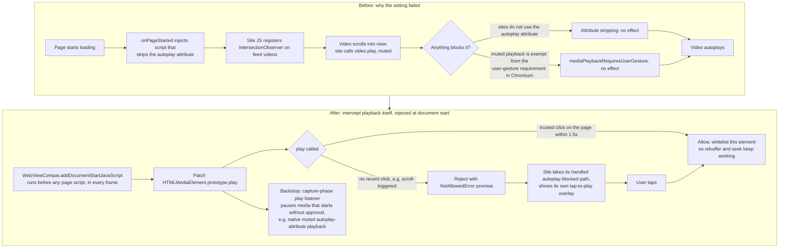

2026-07-11

# EinkBro: Make "Allow video autoplay" actually block feed sites

## What was broken

The "Allow video autoplay" toggle in Behavior settings had no effect on the sites people most want it for — Instagram, Facebook, X, and Threads. With the setting off, feed videos still started playing the moment they scrolled into view.

## Root cause

The old implementation had two layers, and both were aimed at the wrong target:

1. `mediaPlaybackRequiresUserGesture = true` on the WebView. Chromium's autoplay policy exempts **muted** playback from the gesture requirement — and feed sites autoplay muted by design, precisely to slip past this rule. Even for unmuted media, the first tap anywhere on the page grants sticky activation, satisfying the rule permanently.
2. An injected script that stripped the `autoplay` **attribute** (createElement patch, one-time sweep, MutationObserver). Feed sites never use the attribute: their React players call `videoElement.play()` from an IntersectionObserver callback when a video enters the viewport, so attribute stripping was a no-op.

Two smaller gaps compounded it: `evaluateJavascript` in `onPageStarted` races the page's own scripts (first videos could already be playing), and the injection never reached iframes (embedded players).

## The fix

Intercept playback itself, not the attribute, and inject early enough that the page can't get ahead of it.

Key design decisions, in order of importance:

- **Gate on `click`, not on any interaction.** A touch scroll produces pointer events but never a `click`, so scroll-triggered feed autoplay stays blocked — while tapping a video or a site's custom play button opens a 1.5-second window in which `play()` succeeds. Enter/Space/`k` keydowns count too, for keyboard-driven players.
- **Reject exactly like Chromium's autoplay policy** (`NotAllowedError` DOMException). Sites already handle that failure: they show their poster and tap-to-play overlay instead of a stuck spinner. Silently pausing would desync their player UI.
- **Approval is sticky per element** (WeakSet). Players re-call `play()` on rebuffer and seek; blocking those would stall a video the user deliberately started.
- **A capture-phase `play` listener as backstop** catches playback that never goes through the patched `play()` — chiefly Chromium natively starting a muted video that carries the `autoplay` attribute, or a `play` reference captured before injection on the fallback path. Attribute stripping is retained as belt-and-braces.
- **`addDocumentStartJavaScript` instead of `onPageStarted` injection** (guarded by `WebViewFeature.DOCUMENT_START_SCRIPT`, available since androidx.webkit 1.4.0; the project ships 1.11.0). It runs before any page script, in every frame, and survives SPA soft navigations. The returned `ScriptHandler` is removed when the user re-enables autoplay. Old WebViews keep the previous `onPageStarted`/`onPageFinished` injection as fallback.
- **The prototype patch is world-global, so shadow DOM is covered** where it matters. Some sites host their players inside shadow roots, which `querySelectorAll` and MutationObserver don't pierce — but `HTMLMediaElement.prototype.play` is shared by every element regardless of tree. Only the attribute-stripping backstop is shadow-blind, and the play-listener backstop narrows that further.
- **Toggling the setting now takes effect immediately**: a `K_ENABLE_VIDEO_AUTOPLAY` case in BrowserActivity's preference listener re-applies WebView preferences and reloads the current tab.

## Verification

Driven headlessly over CDP on the emulator. A new test page (`test_server/autoplay_test.html`) exercises both vectors: a programmatic no-gesture `play()` rejected with `NotAllowedError`, a muted `autoplay`-attribute video ended up paused, and a trusted tap played the video. On a public feed site using the same muted-JS-autoplay pattern (with shadow-DOM players), all 22 feed videos stayed at `currentTime: 0` through load and scrolling, and tapping one played exactly that one. A signed release build was installed on the Hisense e-ink phone.

Shipped in PR [#619](https://github.com/plateaukao/einkbro/pull/619).
