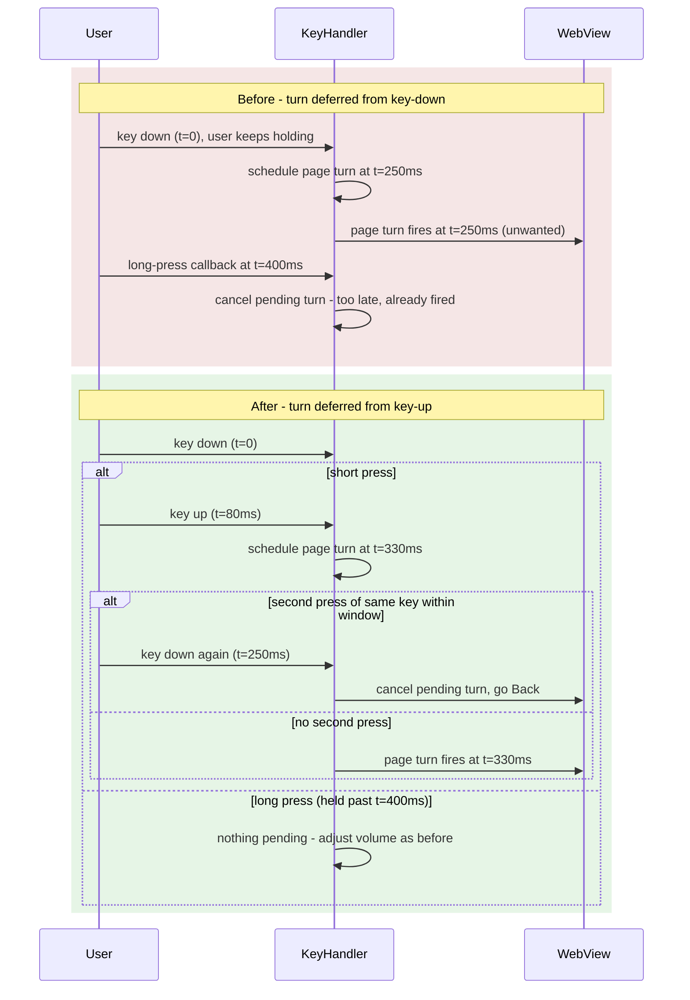

2026-07-11

# Volume double-click-for-back: schedule the page turn on key-up, not key-down

PR #618 (community contribution) added an opt-in gesture: double-tap a volume
key to go Back, with single taps still turning the page after a short deferral
so the second tap can be detected. Reviewing it surfaced one real bug plus a
handful of smaller issues; this commit (pushed onto the contributor's PR
branch) fixes them.

## What was broken

With the feature enabled, **every long-press volume adjustment also flipped a
page first**. The PR deferred the single-tap page turn from the key-*down*
event by a 250ms window and relied on the long-press callback and key-repeat
events to cancel it when the key was held. But Android only delivers those
signals at the long-press timeout (about 400–500ms) — well after the 250ms window
expired. The deferred turn always fired mid-hold at t=250ms; the cancellation
paths could never win the race and were effectively dead code.

## The fix

Schedule the deferred page turn from **key-up** instead of key-down. A held
key then never has a pending page turn at all — there is nothing to cancel,
by construction, no matter how the window constant compares to the system
long-press timeout. A second key-down while the released key's turn is still
pending is the double-click and triggers Back; the flag `backHandledKeyCode`
keeps that second press's own key-up from scheduling a fresh turn.

The trade-off: a single tap's page turn now lands at release + 250ms rather
than press + 250ms, so latency grows by the press duration (about 50–100ms). That
is the price of making the gesture unambiguous with respect to holds, and it
only applies when the opt-in toggle is on — the default path still turns the
page instantly on key-down.

## Smaller fixes in the same commit

- **Per-key pending jobs.** The single `pendingPageTurnJob` reference was
  silently overwritten when the *other* volume key was tapped inside the
  window, orphaning a job that could no longer be cancelled. Pending turns
  now live in a `Map<keyCode, Job>`; a long press cancels them all.
- **Deduplicated direction logic.** The vertical-read up/down mapping existed
  three times (both key handlers plus the new `performVolumePageTurn`). The
  two near-identical `handleVolumeDownKey`/`handleVolumeUpKey` are folded
  into one `handleVolumeKey(keyCode, event)` that calls the shared mapping.
- **Setting summary states its dependency.** The toggle silently does nothing
  unless the master "Volume key" page-turn setting is on; the summary now says
  so.
- **Translations.** The PR added the two new strings only to the default
  `values/strings.xml`; per project convention they are now translated in all
  30 locale files (values-sat keeps English, matching its neighbors).

Verified with `:app:compileDebugKotlin` and `:app:processDebugResources`;
behavioral tuning of the 250ms window remains for e-ink hardware, as the PR
author noted.
