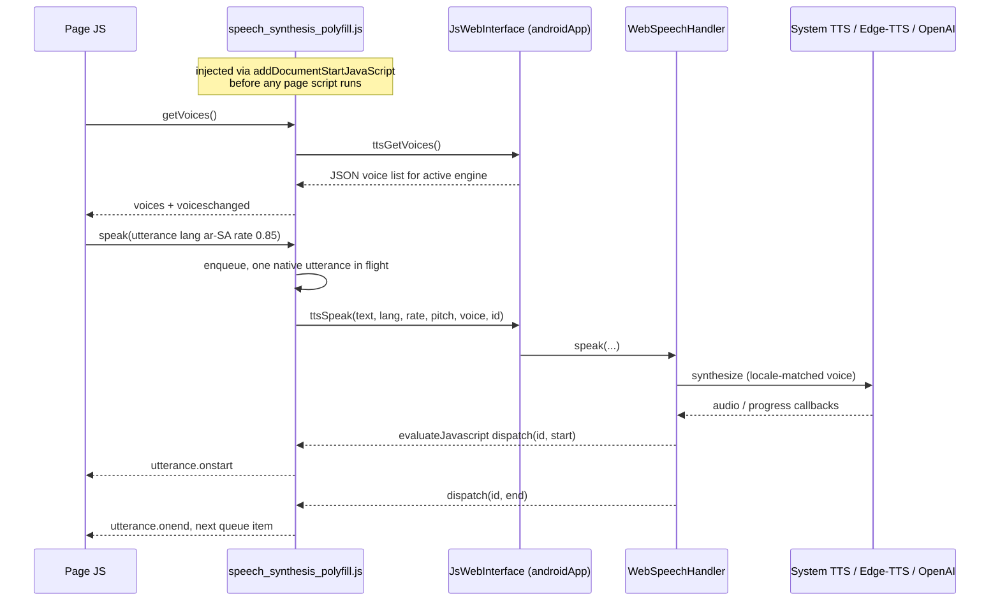

2026-07-23

# EinkBro: Web Speech API polyfill backed by the app's TTS engines

EinkBro now supports pages that implement their own read-aloud with the Web
Speech API (`window.speechSynthesis`) — tap-to-pronounce language-learning
pages, articles with a "listen" button. Android WebView ships no speech
synthesis backend, so on such pages every other browser feature worked but
speech was silent; the page-side feature simply reported "no voices".

Rather than special-casing any one site, the fix is a generic polyfill: a JS
shim that implements `speechSynthesis` and `SpeechSynthesisUtterance`, and a
native handler that speaks the forwarded utterances with whichever engine the
user already picked in EinkBro's TTS settings — system `TextToSpeech`,
Edge-TTS, or OpenAI. Pages get real voices lists (81 system locales, 318 Edge
neural voices), and their requested language, rate, pitch, and voice are
honored — an `ar-SA` utterance actually comes out in Arabic regardless of the
reader-mode locale settings.

## How it's built

**Injection timing is the crux.** Pages typically capture
`window.speechSynthesis` in an IIFE at parse time, so `onPageFinished` — or
even `onPageStarted` — injection loses the race. The polyfill rides the same
`WebViewCompat.addDocumentStartJavaScript` path the autoplay blocker
established (with the same `onPageStarted`/`onPageFinished` fallback for
WebViews without `DOCUMENT_START_SCRIPT`). WebView may expose a *non-functional*
native `speechSynthesis` (empty voices, no-op `speak`), so the shim always
replaces it rather than feature-detecting.

**The utterance queue lives in JS; native speaks one utterance at a time.**
`WebSpeechHandler` is a Koin singleton owning a dedicated `TextToSpeech`
instance — deliberately not shared with `TtsManager`, so a page-requested
language switch can't disturb an ongoing article read. Edge/OpenAI utterances
are fetched as MP3 bytes and played through the existing
`CustomMediaPlayer`/`ByteArrayMediaDataSource` machinery; its reset-listener
trick doubles as the cancellation unblock for the suspended playback
coroutine. Edge voice resolution: page-chosen voice, else the user's
configured voice when its language matches the request, else exact locale,
else language prefix, else the configured (multilingual) fallback.

**Voices load asynchronously by contract.** The system engine initializes in
the background, so the first `getVoices()` may return `[]`; the polyfill
retries and announces late arrivals via `voiceschanged` — the same contract
Chrome has, which pages already handle.

**Event ordering matters more than spec purity.** On `cancel()` the spec says
removed utterances get `interrupted`/`canceled` error events. Firing them
async (as a queued task, spec-style) breaks the ubiquitous cancel-then-speak
pattern: pages reuse one cleanup handler for `onerror`, and a deferred event
would tear down the *next* utterance's UI (e.g. its reading highlight). The
polyfill fires them synchronously inside `cancel()` so cleanup completes
before the caller sets up the following utterance. `pause()`/`resume()`
genuinely pause byte-engine playback; system TTS has no pause API, but the
`paused` flag still toggles so pause/resume button patterns don't wedge.

## Hardening (from review)

- All `MediaPlayer` calls are marshalled to the main thread; `cancel()` from
  the JS bridge thread posts the reset instead of calling it cross-thread.
- A synchronous `tts.speak()` failure now dispatches an error event —
  previously the JS queue would stall forever waiting for a progress callback
  that never comes.
- `ETts` XML-escapes content into its hand-built SSML. This closes a
  page-controlled SSML injection (web text newly reaches this path) and fixes
  a pre-existing article read-aloud break on text containing `<` or `&`.
- Utterance ids are validated (`^[0-9]{1,12}$`) at both the bridge entry and
  before interpolation into `evaluateJavascript`; NaN rate/pitch from pages
  calling the bridge directly are normalized (NaN slips through `coerceIn`).

## Known limitations

- Any page can invoke TTS without a consent prompt — matching the Web Speech
  API's unprivileged nature, but with Edge/OpenAI engines page text goes to
  that cloud service (OpenAI at the user's API cost). A global or per-site
  toggle is a possible follow-up.
- Events reach the main frame only (`evaluateJavascript` scope): an iframe's
  utterance plays but its `onstart`/`onend` never fire.
- `boundary`/`mark` events are never emitted.
