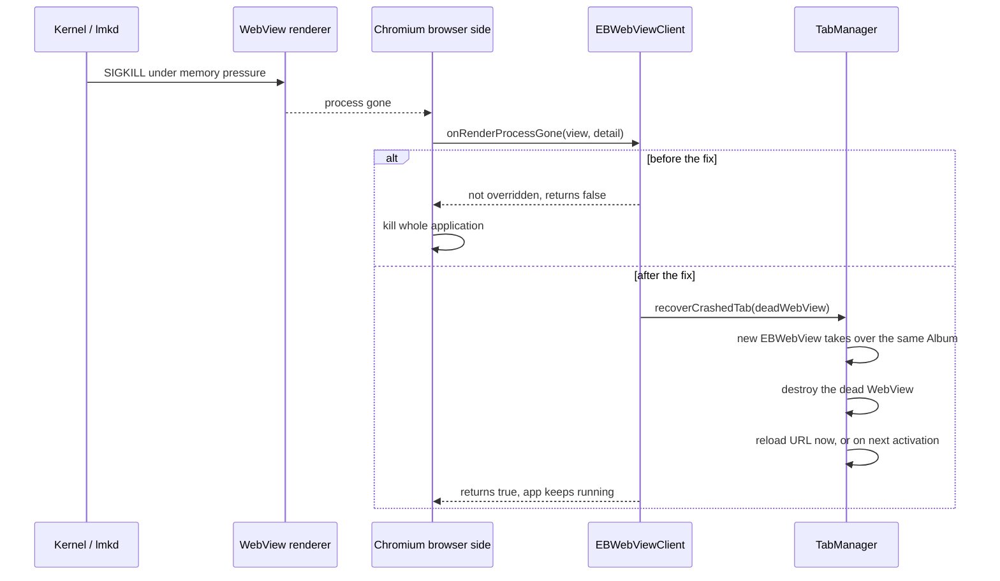

2026-09-04

# EinkBro: survive WebView renderer death instead of dying with it

## What was broken

While a YouTube video was being transcribed with Gemini on a Boox Go 6, the app
simply vanished. It happened twice within two minutes: once after the user pressed
Home to wait, once while a Save-as-EPUB file picker was opening. No crash dialog,
no stack trace in the device log.

## Root cause

The Go 6 has 1.8 GB of RAM and lives under constant memory pressure; the system
logs `am_low_memory` every few hundred milliseconds. A YouTube watch page with a
live hardware video decoder makes the WebView renderer the largest process on the
device, so whenever something else needs memory the kernel kills it. Opening the
file picker, which also spins up DocumentsUI and the Google Drive documents
provider, was enough.

A killed renderer is a normal event that WebView reports through
`WebViewClient.onRenderProcessGone`. EinkBro never overrode it, and Chromium's
documented behaviour for that case is to kill the host application:

```
Renderer process (24456) crash detected (code -1).
Render process (24456) kill (OOM or update) wasn't handed by all associated
webviews, killing application.
```

The Gemini request was a red herring. It sends only the YouTube URL, from the app
process, and never touches the renderer.



## The fix

`EBWebViewClient.onRenderProcessGone` now returns true and hands the dead
`EBWebView` to its host through a new `WebViewCallback.onRenderProcessGone`.
`BrowserActivity` forwards it to `TabManager.recoverCrashedTab`, which:

- builds a replacement `EBWebView` (reusing the preloaded one when available) and
  attaches it to the dead tab's existing `Album`, so the tab keeps its position and
  title in the tab strip without touching the album view model;
- swaps it into the `BrowserContainer`, detaches and destroys the dead view;
- for the foreground tab, clears the current-album pointer so `showAlbum` does not
  try to deactivate the destroyed view, shows the replacement and reloads the URL;
  for a background tab, marks the album not loaded and stores the URL as
  `initAlbumUrl`, the same path a restored tab takes on first activation;
- shows a "Page crashed. Reloading" toast, since scroll position and playback
  state are gone.

A single renderer serves every tab, so one kill produces one callback per tab in
quick succession. A per-album timestamp keeps a page that kills its renderer on
every load from reloading forever: a second death within ten seconds brings the
tab back empty instead. WebViews that are not tabs (link previews, tool WebViews,
the second pane) are detached and destroyed. The popup WebView created by
`onCreateWindow` and the dictionary WebView get the same treatment inline.

Two smaller changes reduce how often the kill happens in the first place. Page
media is paused when a Gemini transcription starts, because Chromium releases the
hardware decoder a few seconds after playback stops and that decoder is the bulk
of the renderer's footprint on this device. The renderer priority policy was
considered and left alone: the default already keeps the renderer at foreground
priority, and the log showed a strong binding at the moment of death.

## Verification

`chrome://crash` through a VIEW intent does nothing, because the intent dispatch
only accepts http and https. The renderer was killed instead through the DevTools
socket of the debuggable build with the `Page.crash` command. The app process kept
its pid, all three live WebViews received the callback, the foreground tab
reloaded, a background tab loaded when tapped, and a new renderer was spawned.
Unit tests and lint stayed green.
