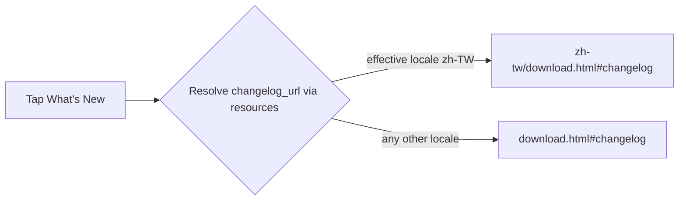

2026-08-03

# EinkBro: What's New Links to the Site Changelog, Localized for zh-TW

After the v16.0.0 removal of the self-update features, the About screen keeps
just two links — "What's New" and "Contributors". What's New still pointed at
the raw `CHANGELOG.md` on GitHub, which renders poorly on E-Ink and is
English-only even though the project site maintains a fully translated zh-tw
mirror. It now opens the project site's download page scrolled to its
Changelog section, and Traditional Chinese users get the Chinese page.

## How it works

The download pages (`docs/download.html` and `docs/zh-tw/download.html`)
gained an `id="changelog"` anchor on their Changelog headings, so the link can
deep-link straight to that section rather than the top of the page.

On the app side, the URL moved from a hardcoded string in the
`LinkSettingItem` enum into a string resource, `changelog_url`. The default
value points at the English page; `values-zh-rTW` overrides it with the zh-tw
page. Because EinkBro applies its in-app UI-language override through
`attachBaseContext`, resolving the URL as a resource at render time picks the
right page whether the locale comes from the system or from EinkBro's own
language setting — no locale-sniffing code needed.

`LinkSettingItem` gained an optional `urlResId` that takes precedence over its
`url` string, so other link items keep their hardcoded URLs unchanged. This
works because the project disables the `MissingTranslation` lint check — a
resource overridden in only one locale is fine; every other locale falls back
to the default English URL.
