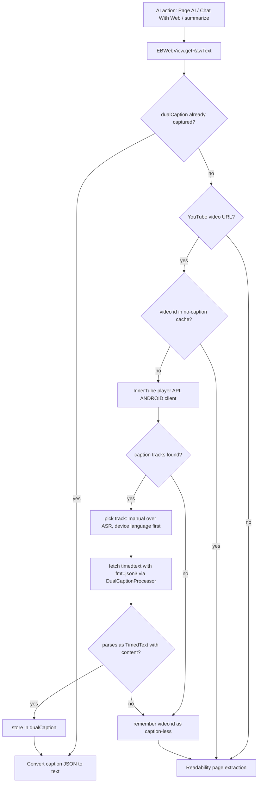

2026-07-30

# EinkBro: YouTube captions as AI page content

When an AI feature runs on a YouTube video page — Page AI actions, Chat With Web, or summarize — the content handed to the model is now the video's caption transcript instead of Readability-extracted page text. The watch page DOM is nearly useless as AI context (it is mostly comments, related videos, and player chrome), while the transcript is exactly what the user means by "this page".

## How it already almost worked

All AI text paths funnel through `EBWebView.getRawText()`, which already preferred `dualCaption` — caption JSON captured by `NinjaWebViewClient` when the YouTube player itself requests a `timedtext` URL. But that capture only happens if the user plays the video *and* turns captions on first. On a freshly opened video, `getRawText()` fell through to Readability and the AI got page noise.

The change adds an active fetch in front of that fallback: if the page is a YouTube video and no caption was captured, fetch the transcript, store it in `dualCaption`, and let the existing branch do the rest. Everything downstream of `dualCaption` (dual-language merge, TTS reading, EPUB export) behaves exactly as if the player had requested the captions itself.

## Why the InnerTube ANDROID client

The obvious approach — read `ytInitialPlayerResponse.captions.captionTracks` from the page (or the watch page HTML) and fetch a track's `baseUrl` from Kotlin — does not work anymore. YouTube gates the web player's timedtext URLs behind a proof-of-origin token: fetched outside the player they return HTTP 200 with an empty body, even with full cookie continuity from the same session. This was confirmed with live requests during implementation; a first draft that extracted tracks from the page via injected JS was deleted for this reason.

The InnerTube player API (`youtubei/v1/player`) queried with the ANDROID client context returns caption track URLs that are served without the token, regardless of UA or cookies. This is the same route youtube-transcript-api settled on. It has a second benefit: the request is keyed by the video id parsed from the current URL, which sidesteps the SPA-staleness problem entirely (`ytInitialPlayerResponse` keeps describing the first-loaded video across YouTube's client-side navigations).

Details that fell out of testing:

- The ANDROID client hands out `fmt=srv3` (XML) URLs; the existing `TimedText` model needs `fmt=json3`, so the format parameter is force-replaced.
- `tlang` still works on these URLs, so routing the download through `DualCaptionProcessor.processUrl()` keeps the dual-caption language merge for free.
- Track selection prefers a manual track over auto-generated (ASR), and the device language within each tier.

## Guardrails

- A per-video negative cache on `EBWebView` stops caption-less videos from re-hitting the network on every AI action.
- The fetch is wrapped in a 60s `withTimeoutOrNull` — a hung-network safety net sized above the internal per-request timeouts (up to 3 requests at 10s connect + 10s read), so it can only fire on a genuinely dead connection, never mid-transcript on a slow one. The transcript itself is always fetched whole.
- Any failure — private or age-restricted video invisible to the anonymous InnerTube call, no caption tracks, unparseable response — degrades to the previous behavior: Readability page extraction.

Verified end to end on the emulator: with a video never played and captions never enabled, a Page AI summary described the spoken content of the video — text that exists only in the caption track, not in the page DOM. Pure helpers (video id extraction, track selection, URL format rewrite) are unit-tested in `YouTubeCaptionFetcherTest`.
