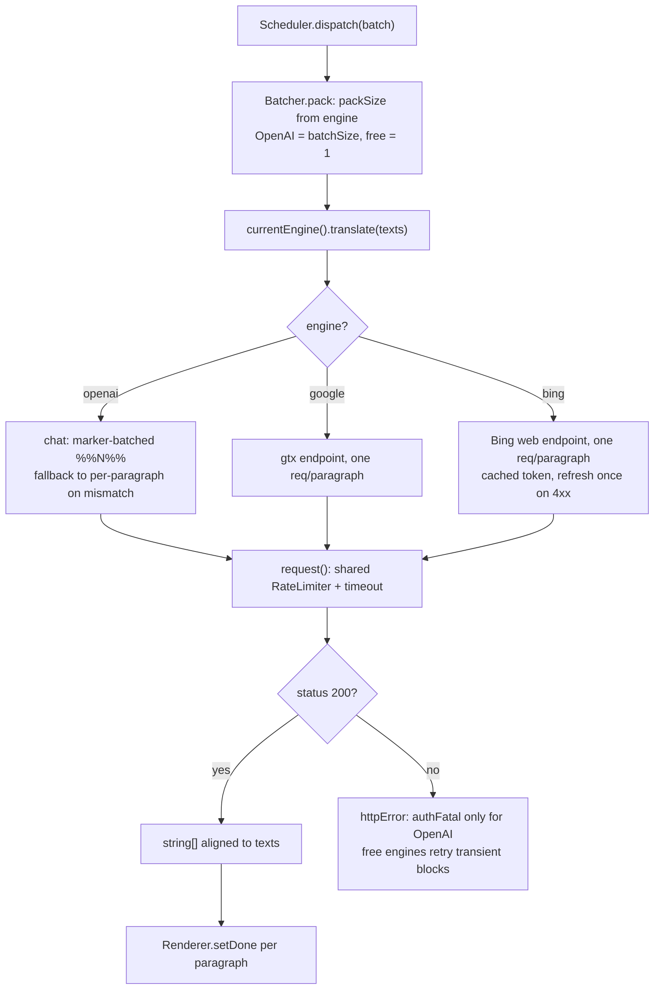

2026-06-23

# Immersive Translate: free Google & Microsoft engines + a minified build (v0.6.0)

## What changed and why

Until 0.6.0 the userscript could only translate through an OpenAI-compatible
chat endpoint, which meant every reader needed an API key (or a local server)
before a single paragraph would translate. That's a steep first-run cost for a
tool whose whole point is "open a page, read it bilingually." 0.6.0 removes the
gate: a new **Translation engine** dropdown in settings picks between three
backends, two of which are free and keyless, so the script works out of the box.

- **OpenAI / compatible** — the existing marker-batched chat client (needs an
  API key or a compatible server URL).
- **Google Translate** — free, no key, via the public `gtx` endpoint.
- **Microsoft Translator (Bing)** — free, no key, via the Bing web endpoint.

**Google is the default engine on a fresh install**, so the script translates
immediately with zero setup; OpenAI stays for users who want LLM-quality
translations or a self-hosted model. (Existing installs keep their saved engine —
the default only applies to new installs, since saved settings merge over the
defaults.)

The release also ships a **minified build** alongside the readable source, since
the script now runs on e-ink readers where parse time and download size matter.

## How the engines are structured

The old `Translator` singleton (key rotation, `chat()`, bespoke HTTP error
handling) was refactored into a small **`Engines` registry**, each entry exposing
a uniform contract: `translate(texts) -> Promise<string[]>` aligned to the input,
plus `packSize()` (segments per call) and `needsKey` (gates `enable()`). The
scheduler no longer knows anything engine-specific — it packs a batch and calls
`currentEngine().translate(texts)`.

A few design constraints shaped the implementation:

- **Free engines have no batching protocol.** They translate one paragraph per
  request (`packSize: () => 1`), so a page fans out into many small requests.
  To keep that from hammering the public endpoints, every engine routes through
  one shared `request()` helper that sits behind the single `RateLimiter` — a
  per-paragraph fan-out is throttled exactly like an OpenAI batch.
- **Concurrency is per-engine.** Each engine exposes `concurrency()` and the
  scheduler's `pump()` caps in-flight requests at `currentEngine().concurrency()`
  rather than one global number. The free engines, which fan out per paragraph,
  use a fixed cap of 5 (`FREE_CONCURRENCY`); OpenAI keeps its user-tunable
  `maxConcurrent` (default 2), so the two engine families have distinct,
  appropriate limits. The Max-concurrent settings field is hidden for the keyless
  engines since it doesn't apply to them.
- **Auth failures mean different things per engine.** A 401/403 from OpenAI is a
  bad key and should pause the queue (fatal). The same status from Google/Bing is
  a transient block, so `httpError(res, msg, authFatal)` only makes auth fatal for
  OpenAI; the free engines retry with backoff instead.
- **Bing needs a scraped token.** The Bing endpoint requires a short-lived token
  and key parsed out of the translator page HTML. These are cached until expiry
  and refreshed exactly once on a stale-token 4xx before giving up — avoiding a
  refresh storm while surviving token rotation.
- **Language codes differ.** Google and Bing want non-BCP-47 codes for Chinese
  (Google by region `zh-CN`/`zh-TW`, Bing by script `zh-Hans`/`zh-Hant`); a small
  `mapLang` table converts the target, passing everything else through unchanged.
- **Cache correctness.** The in-memory cache key now includes the engine, so
  switching engines doesn't serve a Google translation where OpenAI was asked.

In the UI, settings fields tagged `openaiOnly` (base URL, key, model, temperature,
batch size, prompt overrides) hide unless the OpenAI engine is selected, so the
keyless engines present a clean, knob-free panel.

## The build pipeline

`build.mjs` (run via `npm run build`, terser as the only dev dependency) produces
`immersive-translate-openai.min.user.js` from the readable source. The key
constraint is that userscript managers parse the `// ==UserScript== … ==/UserScript==`
metadata block literally, so the build copies that header **byte-for-byte** and
minifies only the IIFE body that follows. The one deliberate edit to the header is
repointing the min build's `@updateURL`/`@downloadURL` at itself, so an installed
min build self-updates from its own raw-GitHub URL rather than pulling the readable
source. terser mangles local names only — property names, strings, and the `%%N%%`
marker protocol survive intact. The body comes out ~49% smaller.

The readable `.user.js` remains the source of truth; the `.min.user.js` is a
committed artifact (so the download URL stays in lockstep with source), while
`node_modules/` and the generated `test/harness.min.html` are git-ignored. The
build also emits that minified harness so `test/smoke.py` can run the full check
suite against the minified build via `IMTX_HARNESS=…/harness.min.html`.

Before committing, the minified output was regenerated and confirmed identical to
the checked-in artifact, so the published download matches the source exactly.
