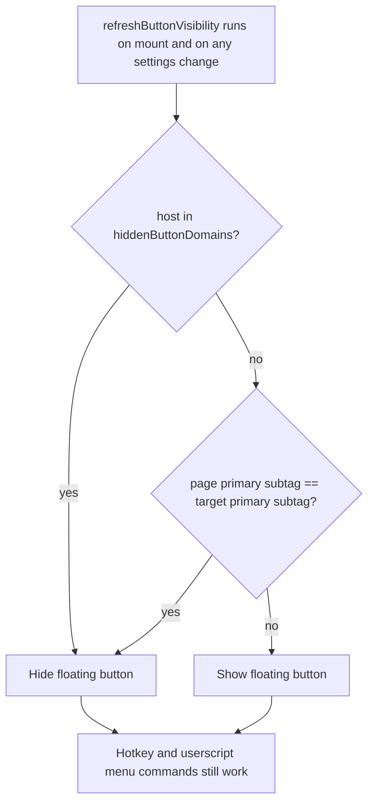

# Immersive Script — Hide floating button on target-language pages and per-site

## Summary

The floating **譯** button is now hidden in two situations:

1. **Automatically** when the page is already in the target language — i.e. the page's declared language (`<html lang>`, falling back to a `content-language` `<meta>`) shares its **primary subtag** with the configured target language (so an `en-GB`/`en-US` page hides the button when the target is `en`). There is nothing to translate on such a page.
2. **Manually per-site** via a new userscript menu command, *"Hide floating button on this site (on/off)"*, backed by a new `hiddenButtonDomains` setting (one hostname per line, suffix-matched like the existing `autoDomains`).

Hiding only affects the floating button. The `Alt+T` hotkey and the userscript-manager menu commands keep working, so translation stays reachable even on a hidden-button or already-target page.

## Approach

`refreshButtonVisibility()` toggles `btn.style.display` based on `shouldHideButton()`, which OR-combines the two reasons. It runs once on mount and is registered on `Store.onChange`, so switching the target language or toggling the menu re-evaluates visibility immediately — no reload needed.

Language matching deliberately compares only the **primary subtag** (`primarySubtag()` lowercases and splits on `-`/`_`). This is consistent with the existing Han-ratio `isAlreadyTarget()` heuristic, which already treats any Chinese page as "already target" for any `zh-*` target without distinguishing Traditional vs Simplified. Comparing primary subtags also gives the most useful default for the common case (`en-US`/`en-GB`/`en` all collapse to `en`).

The button element is always created and kept in the shadow DOM; hiding is just `display:none`. That keeps the other `UI` methods (`setButtonOn`, `setButtonError`, the idle-dim timers, the `window.__imtxBtn` test hook) working unchanged whether or not the button is visible.

The two list-typed settings (`autoDomains`, `hiddenButtonDomains`) were unified behind a `list: true` field flag, so `fieldHtml`/`readForm` no longer special-case `autoDomains` by name.

Version bumped `0.3.1` → `0.4.0`.

## Trade-offs

- **No force-show.** The per-site control only adds hiding; it cannot force the button to appear on a page where the language auto-hid it. If a page mis-declares its `lang` (false positive), the button stays hidden — but translation is still reachable via the hotkey and the always-available menu commands, so no capability is lost. A tri-state per-site override was considered and rejected as over-engineering for the rare case.
- **autoDomains interplay left untouched.** A site in `autoDomains` whose language matches the target will still auto-enable translation on boot while the button is hidden. This is an unlikely contradictory configuration and out of scope; only button *visibility* was changed, not the translation trigger.
- **Primary-subtag matching is coarse for `zh`.** A Simplified-Chinese (`zh-CN`) page hides the button when the target is `zh-TW`. This matches the pre-existing translation behavior (such pages were already skipped), so it introduces no new inconsistency.

## Key Files

- `immersive-translate-openai.user.js`
  - `DEFAULTS` — added `hiddenButtonDomains: []`.
  - `primarySubtag()` / `pageLang()` / `pageLangIsTarget()` — new language-detection helpers next to `langName`.
  - `SETTING_FIELDS` — `autoDomains` marked `list: true`; new `hiddenButtonDomains` textarea field; `fieldHtml`/`readForm` generalized to the `list` flag.
  - `UI.shouldHideButton()` / `UI.refreshButtonVisibility()` — visibility logic; wired into `mount()` (initial call + `Store.onChange`) and exposed on the `UI` API.
  - `installMenu()` — new *"Hide floating button on this site (on/off)"* command before *Settings*.
- `README.md` — features bullet, usage-table row, and settings notes for the new behavior.

Verified with `node --check`, the existing 16-check smoke suite (all pass), and an ad-hoc Playwright check covering page `en` + target `zh-TW` (shown), target `en` (hidden), target `en-GB` (hidden), and per-site list (hidden).
