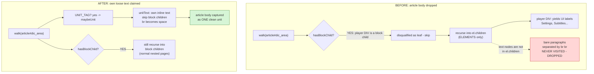

# Immersive Translate: Mixed-Content Article Bodies (Naver News)

## Problem

The userscript failed to translate Naver news articles such as
`https://n.news.naver.com/article/659/0000044574`. The page's visible article
text was simply skipped — the user saw the surrounding chrome (and, oddly, the
embedded video player's UI labels) translated, but not the news itself.

## Root Cause

Naver's article container is an `<article id="dic_area">` whose paragraphs are
**bare text nodes separated by `<br><br>`**, with no `<p>` wrappers, and it
shares the element with a leading block-level child — the video player `<div>`:

```
article#dic_area
  div.vod_player_wrap        <- block-level child (video player)
  "새로 설치한 맨홀 안에..."   <- bare text node (real paragraph)
  br br
  "오늘(19일) 오전..."        <- bare text node
  br br
  ...
```

The scanner only ever translated whole *elements* (leaf blocks). Two rules
combined to drop the body:

1. `hasBlockChild(#dic_area)` returned `true` because the player `<div>` is a
   block tag, so `#dic_area` was disqualified as a leaf unit and never claimed.
2. Recursion descended via `el.children`, which is **elements only**. The bare
   text nodes had no element wrapper, so they were never visited. `<br>` is not
   a unit tag and has no children, so it contributed nothing.

The only translatable elements reachable inside `#dic_area` were the video
player's controls, so those got translated while the article body did not.

Live CDP measurement (Playwright-driven Chromium against the real URL, waiting
for `networkidle` so the JS-hydrated DOM matched what the script sees at
`document-idle`): of 132 units the scanner collected page-wide, only 6 fell
inside `#dic_area` — all video-player UI ("Settings", "Subtitles/CC options",
…). Article paragraphs captured: **0**.



## Solution

Teach the scanner that a block *container* can also own loose text, with two
coordinated changes in `immersive-translate-openai.user.js`:

- **`unitText`** now returns the element's *own inline text* — direct text nodes
  plus inline-element descendants — while **skipping block-level element
  children** (each remains its own unit). `<br>` is converted to a space so
  `<br><br>`-separated paragraphs don't run together. For a plain leaf (no block
  children) the result is identical to before, so existing pages are unaffected.
- **`walk`** lets any `UNIT_TAG` element claim its own text even when it also has
  block children, and still recurses into those children so normally-structured
  nested pages keep working. Pure leaves behave exactly as before (claimed, not
  re-descended into).

This is a general fix for any `<br>`-separated, no-`<p>` body mixed with a
leading media/figure block — not a Naver-specific patch.

Verified on the live page via CDP after the fix: `#dic_area` is captured as a
single unit whose text is the complete article (all four paragraphs joined with
single spaces, the video-player text excluded). A `test/pages/naver-style.html`
fixture plus three `test/smoke.py` assertions guard the behavior; all 19 smoke
checks pass.

## Key Files

- `immersive-translate-openai.user.js` — `Scanner.unitText` and `Scanner.walk`
  (the two-line behavioral change with comments).
- `test/pages/naver-style.html` — new fixture mirroring a Naver body (block child
  + bare text + `<br><br>`, no `<p>`).
- `test/smoke.py` — three assertions: body translated as a unit, exact joined
  text (`<br>` → space, player skipped), and player child not double-translated.

## Lessons Learned

- The scanner's model assumed every translatable paragraph lives inside a leaf
  block *element*. Real-world CMS markup violates this: text often sits as loose
  nodes beside block siblings. "Element-only" tree walks silently drop such text.
- `Element.children` excludes text nodes; any walk that relies on it must have a
  separate path for an element's own inline content, or that content vanishes.
- Verifying against the **live, JS-hydrated DOM** (via CDP) — not just the
  server-rendered HTML — was essential: the static HTML and the runtime DOM both
  exhibited the bug, but only the live check proved the fix captured the real
  body and excluded the dynamically-injected player UI.
