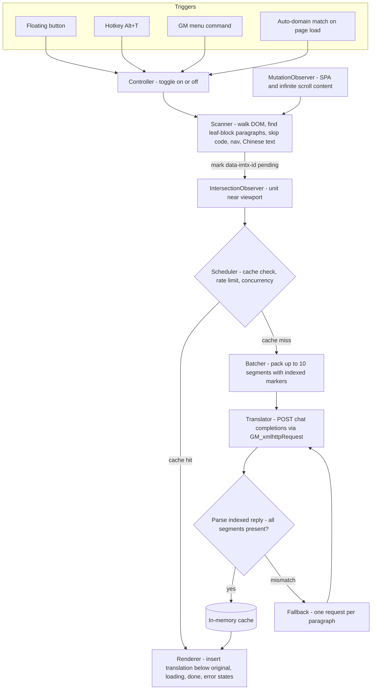

# immersive_script: Immersive translation userscript (OpenAI-compatible only)

**Repo:** https://github.com/plateaukao/immersive-script · **Commit:** `7e407b3` (2026-06-13)

## Summary

Greenfield single-file Tampermonkey/Violentmonkey userscript providing bilingual "immersive" web page translation — the translation is inserted directly below each original paragraph. Unlike the reference [Immersive Translate userscript](https://greasyfork.org/scripts/523378) (which bundles ~10 engines into 21k lines), this supports exactly one engine family: the OpenAI `/v1/chat/completions` API and any OpenAI-compatible server (LM Studio, llama.cpp, OpenRouter, self-hosted proxies). Default target language is zh-TW, configurable. Verified manually in Tampermonkey and by a 9-check Playwright smoke test that runs the real userscript headlessly via GM shims.

## Approach

- **One IIFE, twelve banner-commented sections** (Store, Cache, LangDetect, Translator, Batcher, Scheduler, Scanner, Renderer, UI, Hotkey/Menu, Controller). No build step; the file installs as-is.
- **Translation units are leaf blocks**: block-level elements with no block-level children, ≥18 chars, excluding `pre/code/form controls/contenteditable/nav/aria-hidden`. A Han-ratio heuristic (kana-aware, so Japanese still translates) skips already-Chinese text when the target is Chinese.
- **Batching protocol**: up to 10 paragraphs per request, each prefixed with a `%%N%%` marker line; the reply is split on the same markers and validated (every index exactly once). On mismatch the batch silently falls back to one-request-per-paragraph with a marker-free prompt, which has no mismatch mode by construction. Discovered constraint: marker syntax had to avoid anything models rewrite — `%%N%%` survives verbatim where markdown-ish delimiters get "helpfully" reformatted.
- **Lazy by design**: IntersectionObserver only translates near-viewport units; MutationObserver (debounced, ignoring the script's own insertions to avoid feedback loops) handles SPAs and infinite scroll without history patching.
- **Plain-text translations**: `textContent` in, `textContent` out. The reference script's `@0#` placeholder system for preserving inline tags is its single largest complexity source, and accepting model-returned HTML is an XSS hazard; with the formatted original one line above, plain text loses little. Model output is never parsed as HTML.
- **Resilience**: 5 req/1.3s sliding-window rate limit (matches reference), concurrency cap 2, two retries with backoff honoring `Retry-After`; auth/network failures pause the queue (no hammering a dead endpoint) and surface a toast; failed paragraphs render a click-to-retry line. A generation counter discards in-flight responses after toggle-off (they still land in cache).
- **UI in closed shadow DOM** on `documentElement` with inline host styles, since page CSS like `div { display:none }` beats `:host` rules. macOS quirk: `Alt+T` yields `†` in `e.key`, so the hotkey matcher compares `e.code` (`KeyT`).
- **Token-free test rig**: a zero-dep Node mock implementing `/v1/chat/completions` with failure modes (`mismatch/429/500/slow/badkey`), a GM-shim harness page that runs the *real* userscript in a plain browser, and a Playwright smoke test asserting detection counts, batching (4 paragraphs → 1 request), exclusions, dynamic pickup, and zero-request toggle restore. CORS headers on the mock exist only for the shim; real `GM_xmlhttpRequest` bypasses CORS.

## Trade-offs

- **Plain-text translations** lose inline links/bold inside the translated line (original keeps them) — chosen over the placeholder-token system for simplicity and XSS safety.
- **In-memory cache only** (FIFO, 2000 entries): persistent GM-storage caching would survive reloads but go stale across model/prompt changes; the in-memory version covers what actually hurts (toggles, SPA re-renders) with zero invalidation logic.
- **Mixed-content blocks** (`<li>text<ul>…</ul></li>`) translate the nested list but skip the bare text in the parent — handling it would require wrapping raw text nodes.
- **zh-CN pages are skipped when targeting zh-TW**: the language heuristic detects "Chinese", not script variant.
- **`@connect *`** is required because the API base URL is user-configurable (localhost, self-hosted), at the cost of one install-time Tampermonkey warning.

## Key Files

- `immersive-translate-openai.user.js` — the entire userscript (~1,040 lines)
- `test/mock-server.mjs` — OpenAI-compatible mock with failure modes
- `test/harness.html` + `test/smoke.py` — GM-shim harness + 9-check Playwright smoke test
- `test/pages/{static-article,spa,code-blocks}.html` — manual test pages
