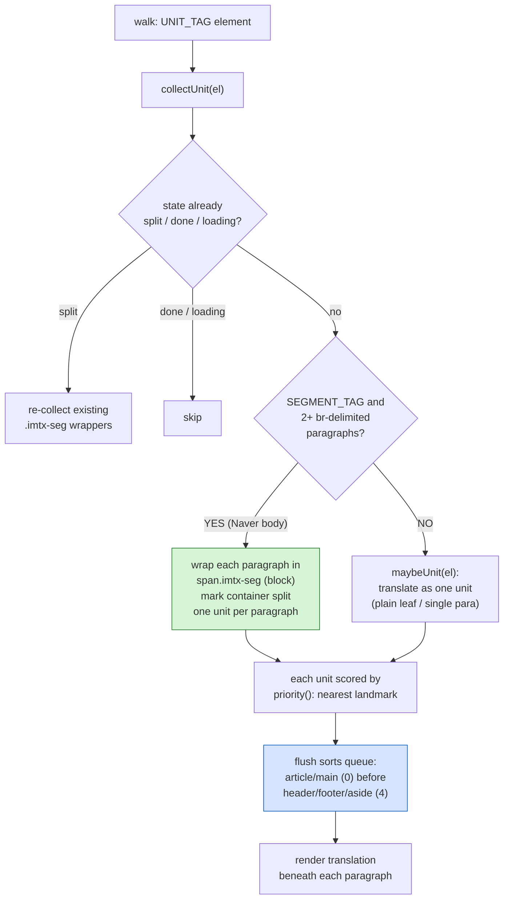

# Immersive Translate: Per-Paragraph Splitting and Region Priority

## Summary

Two refinements to how the userscript translates article bodies, both prompted
by Naver news (`#dic_area` is an `<article>` whose paragraphs are bare text
nodes separated by `  `, with no `
` wrappers):

1. **Paragraph-by-paragraph.** A block container whose loose text breaks into two
   or more ` `-delimited paragraphs is now split into one translation unit per
   paragraph, with each translation rendered directly beneath its source
   paragraph (true bilingual interleave) — instead of collapsing the whole body
   into a single blob whose lone translation lands at the very end.
2. **Region priority.** Each unit is scored by its nearest landmark ancestor and
   the dispatch queue is sorted so the article body translates before page chrome
   (header / footer / aside) when several units enter the queue together.

## Approach

**Segmentation.** The scanner's per-element entry point became `collectUnit`.
For elements in `SEGMENT_TAGS` (`div, article, section, aside, td, blockquote`),
it partitions the element's direct children into paragraph "runs" — maximal spans
of inline content delimited by ` ` runs, block-level children, or excluded
subtrees. If two or more runs clear the minimum length, each run's nodes are
wrapped in place in a `` (CSS `display:block`) and that
wrapper becomes the translation unit; the container is marked
`data-imtx-state="split"`. Everything else — plain leaves and single-paragraph
bodies — is translated as one unit exactly as before.

Several constraints shaped this:

- **Wrapper validity.** Wrapping bare text requires an element to attach state and
  a translation to. A `` is valid as a child of any container, whereas a
  `
`/`
` wrapper would be invalid (and auto-closed by the parser) inside a
  `
`. Segmentation is therefore restricted to block containers where loose
  multi-paragraph text actually occurs, and the wrapper is always a ``.
- **Re-scan idempotency.** `isExcluded` skips `.imtx-seg`, and `unitText` ignores
  `.imtx-seg` children, so the container's own text reads as empty after
  splitting and the wrappers are never re-wrapped or double-counted. The Mutation
  observer also skips them, so the script's own DOM insertions don't trigger a
  feedback rescan.
- **Disable/enable.** On the `split` sentinel, `collectUnit` re-collects the
  existing `.imtx-seg` wrappers, so toggling translation off and on re-queues the
  paragraphs (whose state the disable path had rewound from loading to pending).
- **Splitting on any ` ` run.** A run of one-or-more ` ` is treated as a
  paragraph boundary. This yields exactly the right paragraphs for `  `
  bodies; the only cost is that a single ` ` used as a soft line break is also
  split, which is acceptable for bilingual reading.

**Priority.** `priority(el)` walks ancestors and returns a score from the nearest
landmark — `article`/`main` (and ARIA `role=main|article`) = 0, generic content =
3, `header`/`footer`/`aside` (and the matching ARIA roles) = 4. The score is
attached at enqueue time, and `Scheduler.flush` sorts the pending units before
packing them into batches, so higher-priority regions occupy the earliest
requests. Because units are still gated into the queue by viewport visibility,
priority acts as the ordering within each visible batch rather than overriding
scroll position.

## Trade-offs

- **DOM mutation.** Segmentation inserts `` wrappers into the page. This is
  the standard cost of immersive bilingual rendering and is safe for rendered
  article bodies, but a host script that rewrites the container's `innerHTML`
  would discard the wrappers (they are rebuilt on the next scan).
- **Per-paragraph requests vs. one blob.** Paragraphs still batch into a single
  request via the indexed-marker protocol, so splitting does not increase request
  count; it improves per-paragraph translation quality and lets each paragraph
  render as soon as its batch returns.
- **Priority is a tiebreaker, not a scheduler.** It reorders units that enter the
  queue together; it deliberately does not defer already-visible chrome behind
  off-screen article text, because viewport relevance remains the primary signal.
- **Soft line breaks split too.** Treating any ` ` run as a paragraph break can
  over-split content that uses single ` `s within a paragraph (addresses,
  poetry). Judged acceptable for the news/article bodies this targets.

## Key Files

- `immersive-translate-openai.user.js` — `SEGMENT_TAGS`/`PRIORITY_TAGS` constants;
  `splitSegments`, `segText`, `wrapSegment`, `collectUnit`, `priority` in the
  Scanner; `.imtx-seg` exclusion in `isExcluded`/`unitText`/`EXCLUDE_CLOSEST` and
  the mutation guard; priority sort in `Scheduler.flush`; `.imtx-seg` CSS; version
  0.4.2 to 0.5.0.
- `test/pages/naver-style.html` — mixed-content fixture (block child + bare text +
  `  `), reused for both features.
- `test/smoke.py` — per-paragraph split, exact paragraph text, `split` sentinel,
  player child untouched, and priority scoring (article=0, chrome=4, generic=3).
  24 checks pass.
