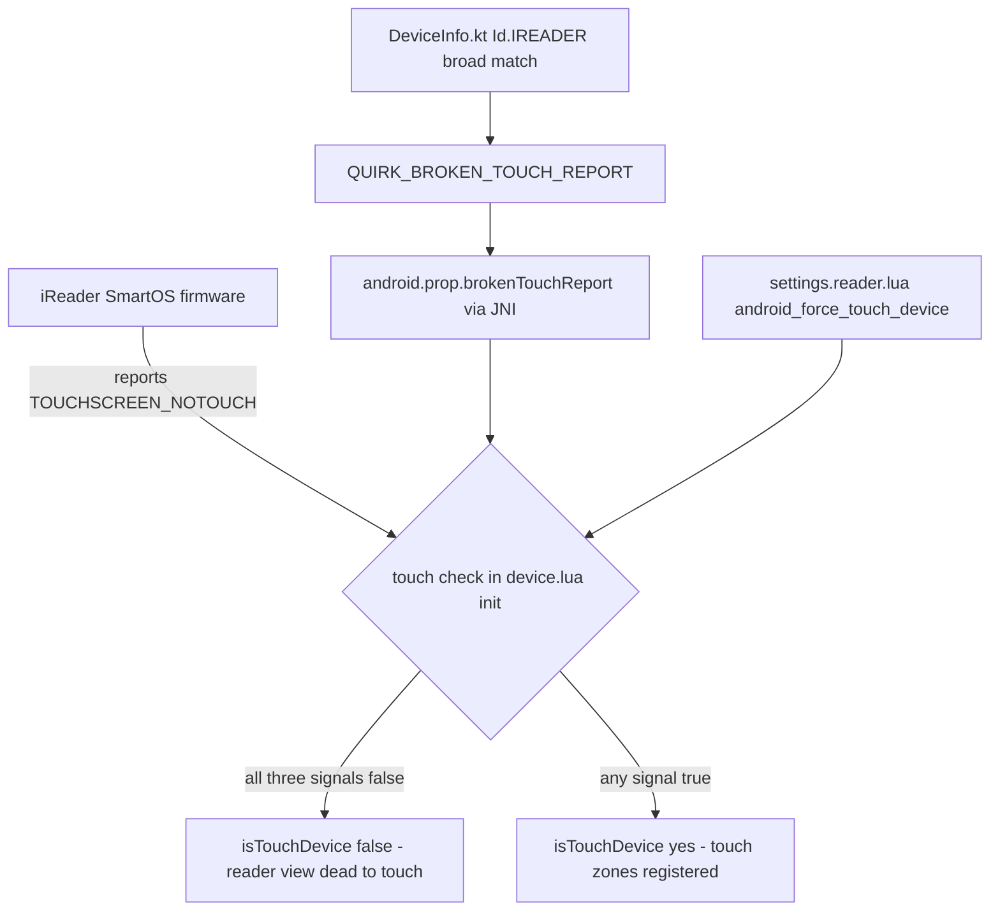

2026-08-07

# KOReader on iReader: fix dead touch in the reader view

## What was broken

On iReader/掌阅 devices (Ocean 2, Ocean3/Ocean3 Plus, the Smart series), KOReader's
file browser responded to touch normally, but as soon as a book was opened the
screen went dead: no tap-to-turn-page, no tap/swipe for the top menu, no
long-press text selection. Only the hardware page-turn buttons worked. Upstream
tickets koreader#9071, #9154, #10293 and #11014 all describe this and were closed
as "firmware / not our bug / wontfix".

## Root cause

iReader's semi-closed SmartOS ROM lies to the Android framework: it reports the
touchscreen class as `ACONFIGURATION_TOUCHSCREEN_NOTOUCH`. KOReader's Android
frontend trusts that value in `Device:init()`, so `isTouchDevice` stays false —
and every reader-module gesture zone (`readermenu`, `readerpaging`,
`readerhighlight`, ...) is registered inside an `if Device:isTouchDevice()`
guard, so none are ever created. The file browser survives because Menu/ListView
widgets handle their own events without those zones.

The same misreport was confirmed and fixed upstream for the Mobiscribe Wave
(launcher issue #589, launcher PR #590, koreader PR #15273), which is the
template this change transplants.

## The fix

Port the upstream `QUIRK_BROKEN_TOUCH_REPORT` pattern into the fork and extend
it to the iReader family:

- **Launcher** (`plateaukao/android-luajit-launcher` e87346f): new `Id.IREADER`
  in `DeviceInfo.kt` plus the quirk flag, plumbed through `LuaInterface` /
  `MainActivity` / `Device` and exposed to Lua as
  `android.prop.brokenTouchReport`. The upstream `Id.MOBISCRIBE_WAVE` entry was
  brought along too, keeping future rebases clean.
- **Frontend** (`plateaukao/koreader` f4c2dea7e): the touchscreen check in
  `frontend/device/android/device.lua` now also passes when the quirk is set.

Because the locked ROM's `Build` fingerprint is not publicly documented anywhere
(the GitHub reporters couldn't enable adb), the iReader match is deliberately
broad — any of MANUFACTURER / BRAND / MODEL / DEVICE / PRODUCT containing
`ireader` or `zhangyue`. And in case even that misses, the frontend gained a
manual escape hatch: setting `["android_force_touch_device"] = true` in
`koreader/settings.reader.lua` (editable over MTP) forces touch on
unconditionally.

## Release

Both ABIs were built via the koreader/koandroid Docker image and signed with the
debug cert, then published as a GitHub release on plateaukao/koreader for
iReader owners: `android-arm64` for Ocean3 Plus-class devices and 32-bit
`android-arm` as fallback (the Ocean 2's 1 GB ROM may be 32-bit; the arm64 APK
refused to install on device). E-ink refresh handling is unchanged — the quirk
only restores touch; iReader models still run the generic Android e-ink path.
