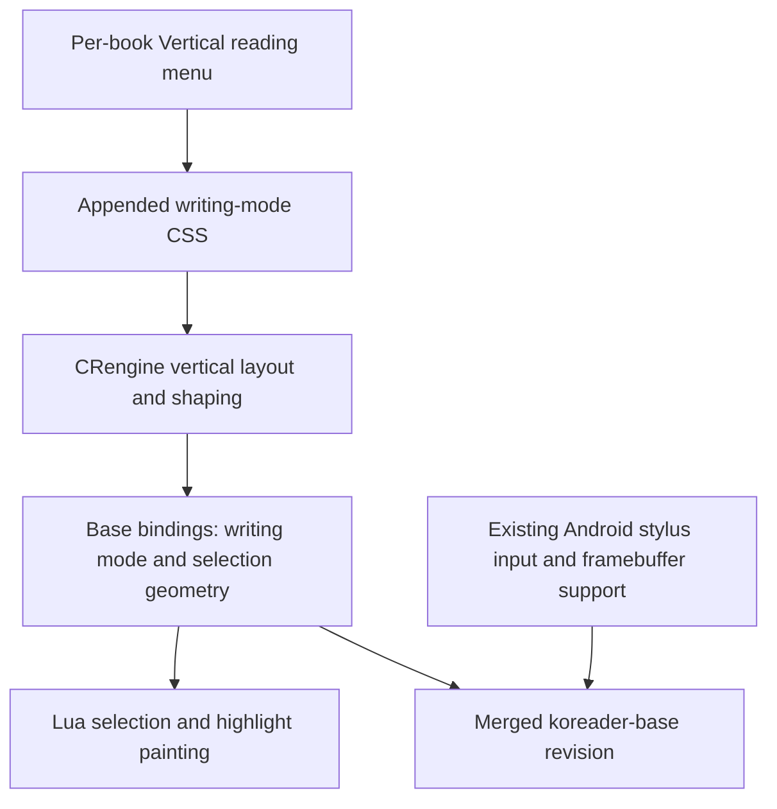

<!-- added: 2026-09-20 -->
# KOReader: port native vertical reading while preserving stylus support

## Problem

The `supernote_ink` fork needed native vertical EPUB typesetting alongside its existing Android stylus support. The integration also needed a discoverable per-book switch, correctly oriented highlights and selections, and acceptable reopening and rendering performance.

This record covers the September 18–19, 2026 port through KOReader commit `d6d7e8c45`, koreader-base `e1e8dc7c`, and CRengine `40f49e26`. It describes the committed implementation; it does not certify the current working tree or a particular APK.

## Root Cause

Vertical reading crosses three layers: the Lua reader, the C++ Lua bindings in koreader-base, and CRengine's layout and font machinery. A frontend toggle alone cannot provide vertical glyph metrics, OpenType `vert`/`vrt2` substitutions, ruby positioning, or right-to-left column flow. Selection geometry and line-style highlights also contain horizontal-layout assumptions.

Two additional engine problems affected performance:

- Persistent style records included vertical properties in their hashes but omitted those properties from serialization. Restoring vertical documents therefore failed style restoration and forced a full render.
- Vertical shaping repeatedly queried FreeType for glyph advances and origins. Measuring only up to the column height also caused HarfBuzz to reshape the remaining paragraph for successive columns.

## Solution

### Integrate the native engine through the existing fork

Import the tategumi vertical-rendering work from `m-tky/koreader-base` and its CRengine fork, merging it into the stylus-enabled base branch. Keep the fork's Android input and framebuffer work in the resulting history. Pin the combined base revision in the KOReader superproject rather than replacing the stylus branch with the vertical branch.

The base bindings expose `isVerticalText()` and adapt selection/hit-testing geometry for vertical text. The imported engine history also carries fixes for ruby link decorations, inline-block images, hanging punctuation, fallback font sizing, and ragged column wrapping.



### Add a per-book vertical reading control

`ReaderTypeset` stores `vertical_reading` in the book settings. When enabled, it appends the following rules after the user's style tweaks:

```css
html, body {
    writing-mode: vertical-rl !important;
    text-orientation: mixed !important;
}
```

The shared `getAppendedStyleSheet()` path is used when reading settings, applying styles, and changing stylesheets. Toggling reloads the document so layout can recalculate its page map and restore the reading position.

Disabling the switch removes this override. It does not force a book with its own vertical CSS into horizontal layout. Highlight orientation therefore follows CRengine's actual writing mode rather than the saved toggle value.

### Make saved and active highlights follow the text

Add `squiggly` to the highlight style menu and implement it in `ReaderView`. In vertical mode, underline and squiggly strokes run along the right side of a column, strikethrough runs through its center, and the highlight coverage percentage adjusts rectangle width. Horizontal text retains the horizontal drawing paths.

For rolling documents, `CreDocument` suppresses native selection painting and tracks the selected XPointer range. `ReaderView` paints that range with the selected highlight style and color, avoiding a second native selection overlay. Clearing selections clears the tracked range; extending a saved highlight sets the replacement range through the same path. Off-screen ranges are skipped when their positions can be determined.

### Restore vertical styles from the persistent cache

CRengine now serializes and deserializes `writing_mode`, `text_orientation`, `text_combine_upright`, and `text_emphasis_style`. The cache format changes from `3.05.82k-vwm3` to `3.05.82k-vwm4`, invalidating incompatible old records. The first load after this change may rebuild an old cache; subsequent restoration has the vertical fields it needs.

### Reduce repeated shaping work without changing font metrics

Create a HarfBuzz child font that caches vertical advance and origin callbacks per glyph while delegating to the parent font. This preserves the parent's metrics and font behavior. Destroy the child when the font's caches are cleared so changed font settings cannot reuse stale metrics.

Measure full safe-width text chunks (`0x7FFF`) for vertical layout, leaving column breaking to the later layout stage. This removes the column-height measurement limit that repeatedly shaped paragraph suffixes. No numeric speedup is claimed here without a retained benchmark result.

### Update stylesheet packaging

The imported base layout moved the stylesheet source. The superproject Makefile now packages `$(CR3GUI_DATADIR)/cr3.css` instead of the obsolete `$(THIRDPARTY_DIR)/kpvcrlib/cr3.css` path.

For Android releases, build both `android-arm` and `android-arm64` with the existing Docker workflow and retain its caches. If packaging uncommitted Lua changes, update `assets/module/version.txt`: the launcher uses that marker to decide whether to refresh its extracted frontend. Committed changes use the normal build version mechanism.

## Validation

The committed `base/tests/vertical_render_regression.lua` harness compares pagination and rendered pixels between baseline and candidate renderer libraries. It prints page counts, full height, page-boundary CRCs, and pixel CRCs to stdout, with timings on stderr.

The normal workload covers `vertical-rl`, `vertical-lr`, and `horizontal-tb`; generated mixed-script text; ruby; upright combined digits; alignment and box decoration; long paragraphs; and three EPUB fixtures. It also changes hinting, font size, and fallback font settings. Benchmark mode uses a larger repeated-CJK workload and samples the first, middle, and final pages.

Run from a compatible Linux base build directory:

```sh
./luajit ../../tests/vertical_render_regression.lua libs/libkoreader-cre.so > candidate.txt 2> candidate-times.txt
./luajit ../../tests/vertical_render_regression.lua libs/libkoreader-cre.so --benchmark > benchmark.txt 2> benchmark-times.txt
```

Capture the same outputs with the baseline library in an equivalent environment and compare the fingerprints. This documentation pass inspected the source and commit diffs; it did not rerun the renderer or device tests. The harness does not replace device checks for menu persistence, selection dragging, highlight extension, cold/warm reopening, or stylus behavior.

## Key Files

| Layer | Files | Responsibility |
| --- | --- | --- |
| KOReader | `.gitmodules`, `base` gitlink | Fork source and combined base revision |
| KOReader | `frontend/apps/reader/modules/readertypeset.lua` | Vertical CSS, per-book setting, reload |
| KOReader | `frontend/apps/reader/modules/readerhighlight.lua` | Squiggly menu and extended selection tracking |
| KOReader | `frontend/apps/reader/modules/readerview.lua` | Selection painting and writing-mode-aware highlights |
| KOReader | `frontend/document/credocument.lua` | Writing-mode query and XPointer selection state |
| KOReader | `Makefile` | Stylesheet packaging path |
| koreader-base | `cre.cpp` | Engine bindings and vertical selection geometry |
| koreader-base | `tests/vertical_render_regression.lua` | Page/pixel comparison and benchmark harness |
| CRengine | `crengine/src/lvstyles.cpp`, `crengine/src/lvtinydom.cpp` | Style persistence and cache version |
| CRengine | `crengine/include/lvfntman_vert.h`, `crengine/src/lvfntman_vert.cpp`, `crengine/src/lvfntman.cpp`, `crengine/src/lvtextfm.cpp` | Glyph metric caching and shaping workload |

## Lessons Learned

- Treat writing mode as engine state throughout layout, selection geometry, and decoration drawing.
- Keep cache hashing, serialization, and cache-format versioning synchronized when adding style properties.
- Preserve exact font behavior when optimizing shaping; pagination and pixel comparisons are useful companions to timing results.
- A submodule pointer update can carry both a substantial feature port and unrelated upstream changes. Record the engine and base revisions explicitly and check the existing device integrations.
- Successful APK packaging is insufficient to validate a Lua frontend update if the launcher's extraction version marker has not changed.

## Commit References

- [Native vertical EPUB rendering, 7ab196a30](https://github.com/plateaukao/koreader/commit/7ab196a30643e6952b47e4a20be27465c24bcd80)
- [Per-book menu toggle, 02fc78384](https://github.com/plateaukao/koreader/commit/02fc78384adbb771f5ea071da3ebaff2e36914b6)
- [Stylesheet packaging fix, 916d232f0](https://github.com/plateaukao/koreader/commit/916d232f0b92b0c66fa3ffd7996d727e70bef224)
- [Squiggly highlights and vertical selection support, b2ea3c761](https://github.com/plateaukao/koreader/commit/b2ea3c76132a06c557f95bb4a2ddc81f6545befd)
- [Cache/performance integration preserving stylus support, d6d7e8c45](https://github.com/plateaukao/koreader/commit/d6d7e8c457b2390309b614d92ae47184204d390c)
- [Base revision and regression harness, e1e8dc7c](https://github.com/plateaukao/koreader-base/commit/e1e8dc7c2d1176a295ec97302e6edb4f560e8c07)
