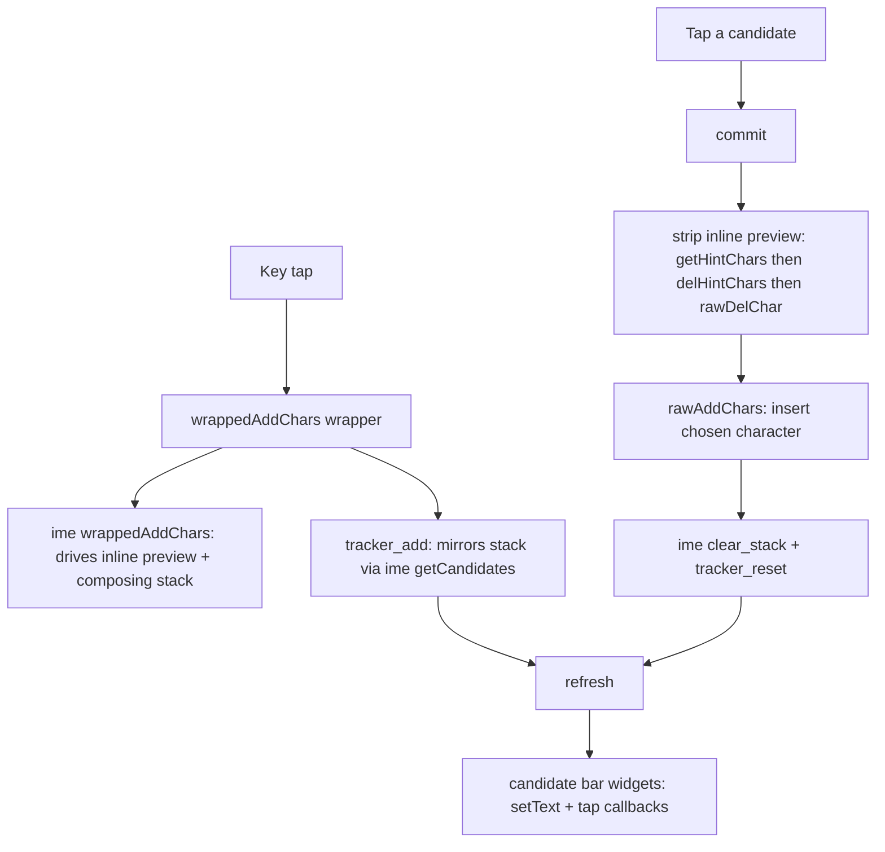

# Boshiamy keyboard: tappable candidate bar

## Summary

The 嘸蝦米 (Boshiamy) KOReader user patch previously showed candidates only
*inline* — the engine wrote `字[候選…]` into the text field and you cycled with
the `←`/`→` arrow keys. This change adds a **candidate bar**: an extra row above
the keyboard that lists the candidates for the code being typed, where you tap a
candidate to commit it and page through longer lists with `◀`/`▶` keys at the
row's ends.

It is modeled on
[`QiuYukang/pinyinplus.koplugin`](https://github.com/QiuYukang/pinyinplus.koplugin),
but with a deliberately different integration strategy: pinyinplus *replaces*
KOReader's `generic_ime` engine (it reimplements code-buffer tracking, lookup,
and commit). This patch instead *augments* `generic_ime`, so the existing inline
preview, `←`/`→` cycling, stepped backspace, and the "show candidates" toggle all
keep working unchanged.

## Approach

`generic_ime` already maintains the authoritative composing state, but it keeps
its stack in a module-private upvalue (`local _stack`) that the patch cannot
read. The design works around that with two halves:

1. **A read-only mirror to *populate* the bar.** A small tracker shadows the
   engine's composing stack — appending to the current unit's code, splitting
   into a new unit when a code stops extending, and stepping back on backspace —
   exactly mirroring `generic_ime`'s own transitions for the Boshiamy config (no
   wildcard, no case folding, no auto-separate). Crucially, it reuses
   `ime:getCandidates()` for every lookup, so the bar's data is byte-identical to
   what the engine composes. The mirror tracks only the candidate *list* (not the
   selected index), which is all the bar needs.

2. **The engine's own helpers to *commit* a tap.** Selecting a bar candidate must
   not desync the engine. Rather than synthesize `→` keypresses, `commit()` calls
   the engine's `getHintChars()`/`delHintChars()` to strip the inline `[…]` hint,
   deletes the single on-stage character with a raw `delChar`, inserts the chosen
   character, then `clear_stack()`s. Because the strip reads the *real* private
   stack, any earlier composing units are preserved untouched — tapping behaves
   like pressing Space on the chosen candidate.

The bar is a real keyboard row baked into the layout, not a separate widget.
Three KOReader-internal constraints shaped it, all discovered by reading the
`virtualkeyboard.lua` source:

- **Row 1 drives the width math.** `VirtualKeyboard:addKeys` computes
  `base_key_width` from `#self.KEYS[1]`, so the bar row is exactly 10 entries
  (`◀` + 8 candidate slots + `▶`, each `width = 1.0`). Any other count would
  rescale every QWERTY row.
- **Empty labels collide with Shift.** `en_keyboard` registers
  `shiftmode_keys[""] = true`, so a slot built with an empty label would become a
  Shift key. Slots build with a literal `" "`; the real candidate text is written
  via `TextWidget:setText` *after* the build.
- **Key widgets are rebuilt constantly.** Every layer change (Shift/Sym) calls
  `addKeys` and discards the candidate keys' labels/callbacks. The patch
  monkey-patches `VirtualKeyboard.addKeys` once (gated on `self.KEYS == kb.keys`
  so no other layout is touched) to re-grab the live widgets and re-render after
  each rebuild. The hook is installed inside the `package.preload` factory, which
  runs once, before the first `addKeys`.

Because the only externally observable contract this depends on is
`generic_ime`'s composing-stack semantics, the change ships with a headless
regression test that loads the *real* `generic_ime.lua` (with its three deps
stubbed) and replays the tracker + commit path against a fake inputbox, asserting
the resulting text for single / list / multi-unit / backspace / paging cases and
with the inline hint both on and off. If an upstream refactor changes the engine,
the test fails loudly instead of the bar silently desyncing.

## Trade-offs

- **Mirror vs. reading private state.** Shadowing the stack risks drift if
  `generic_ime` changes. Accepted because the alternative (a full pinyinplus-style
  reimplementation) would discard the engine's working cycling/backspace/preview
  behavior, and the regression test pins the contract. The commit path is
  additionally drift-resistant: it strips via the engine's *real* state and only
  the candidate *string* comes from the mirror.
- **The bar row is always present.** When idle it's a blank row, costing one row
  of vertical space and an extra keyboard row's height. Collapsing it
  dynamically would mean rebuilding the layout on every compose/idle transition;
  the always-present row (as pinyinplus also does) is simpler and stable.
- **Inline hint now defaults off.** With a bar, the inline `[候選…]` brackets are
  redundant, so `show_candi` defaults to `false`. Existing installs with a saved
  `true` keep both until toggled; the menu item is reworded to "Show inline
  candidate hints" to disambiguate from the bar.
- **Fixed-width single-char slots.** Boshiamy candidates are all single
  characters (verified against the data table), so the bar skips pinyinplus's
  dynamic per-candidate width math — 8 equal slots, no `addKeys`-for-width
  re-layout. A rare multi-char candidate would render tight rather than break.
- **Global hook on `addKeys`.** Installed once for the session and gated by
  layout identity, so other keyboards are unaffected, but it is a process-wide
  monkey-patch rather than something scoped to the Boshiamy instance.

## Key Files

- `2-boshiamy.lua` — the patch. New: the tracker (`tracker_add`/`tracker_del`/
  `tracker_reset`), `refresh`/`setKey`, `commit`, the 10-unit candidate row, the
  `grabRefs` + `VirtualKeyboard.addKeys` hook, and tracker/refresh calls threaded
  through the existing IME glue wrappers. `show_candi` default flipped to `false`.
- `test/test_boshiamy.lua` — headless regression test against the real
  `generic_ime`. Run: `KOREADER_SRC=~/src/koreader luajit test/test_boshiamy.lua`.
- `README.md` — documents the bar, the tap/page interaction, and the reworded
  inline-hint toggle.
- `CLAUDE.md` — repo guide; the candidate-bar section records the three
  `virtualkeyboard.lua` gotchas above so they don't have to be re-derived.
- Upstream references (read-only, in the KOReader checkout):
  `frontend/ui/data/keyboardlayouts/generic_ime.lua` (the engine and its
  `getCandidates`/`getHintChars`/`delHintChars` API) and
  `frontend/ui/widget/virtualkeyboard.lua` (`addKeys` width math, `VirtualKey`
  widget nesting, layer rebuilds).
