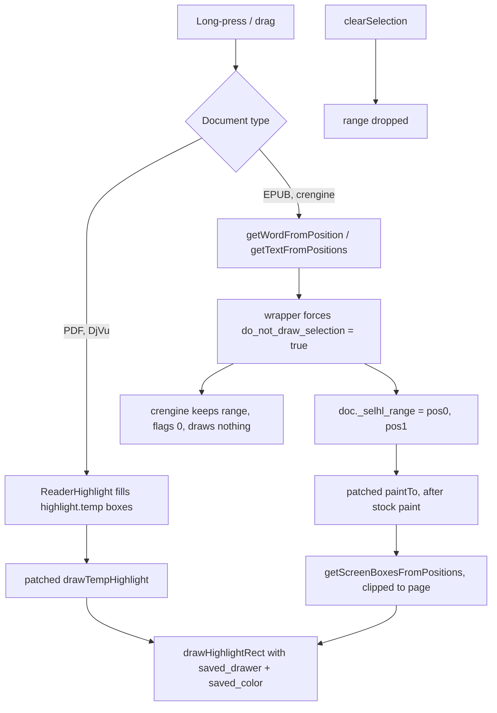

2026-08-22

# KOReader patch: draw the drag selection in the default highlight style

`2-selection-highlight-style.lua` (koreader-patches-private, commit `20dcf77`) makes the
in-progress text selection — what you see while long-pressing and dragging — render with
the reader's **current default highlight style and color**, i.e. exactly how the highlight
will look once saved. Stock KOReader shows inverted boxes on paged documents (older builds;
newer ones use a separate "selection opacity" gray) and, on EPUB, a flat gray fill that
crengine paints itself. The user wanted the selection to simply *be* the highlight preview.

## Why it needs two code paths

KOReader renders the selection differently per document engine, and only one of them is
restylable from Lua directly:

- **Paging (PDF/DjVu):** `ReaderHighlight` stores the drag boxes in
  `ReaderView.highlight.temp`; `ReaderView:drawTempHighlight()` paints them with a
  hard-coded `temp_drawer`. Overriding that one method and calling the stock
  `drawHighlightRect()` with `highlight.saved_drawer` / `saved_color` is enough — every
  style (lighten, underline, strikeout, invert, and patched-in ones such as the squiggly
  patch) is handled by the same function saved highlights use.
- **Rolling (EPUB / crengine):** the engine draws the selection *inside the page render*
  (`selectRange()` with draw flags, then `FillRect` with `crengine.highlight.selection.color`
  behind the glyphs). Upstream's newer "Use highlight color for selection" option only
  recolors that fill; it cannot produce an underline or strikeout. So the patch stops
  crengine from drawing at all and paints the selection itself.

## The crengine side in detail

`cre.cpp`'s `getTextFromPositions` still calls `selectRange(r)` when `drawSelection` is
false, just with range flags `0`; `ldomXRangeList::getRanges` erases flag-0 ranges from the
mark list, so nothing is painted but the returned `text`/`pos0`/`pos1` are identical. That
made "suppress + track + repaint" safe:

- `CreDocument:getWordFromPosition` and `getTextFromPositions` are wrapped to always pass
  `do_not_draw_selection = true`, and to record `{pos0, pos1}` in `doc._selhl_range` unless
  the *caller* asked for no drawing (dictionary lookups, keyboard selection) — those never
  showed a selection before and still don't.
- A lookup that returns nothing keeps the previous range, mirroring crengine, which only
  replaces the selection on a hit.
- `ReaderView:paintTo` is wrapped; after the stock paint, the tracked range is turned into
  screen boxes with `getScreenBoxesFromPositions(pos0, pos1, true)` — the same call
  `drawXPointerSavedHighlight` uses, and crengine already clips the segments to the visible
  page, so across-page selection and two-page mode need no special handling. The same cheap
  `getPosFromXPointer` viewport pre-check as the saved-highlight painter avoids the call
  when the range is off-screen.
- `CreDocument:clearSelection` drops the range. `ReaderHighlight:extendSelection` is the one
  remaining native-draw site (`getTextFromXPointers(…, true)`); its wrapper clears crengine's
  selection through the raw `_document` (bypassing the patch's own wrapper) and tracks the
  extended range. `getTextFromXPointers` itself is deliberately not wrapped — search-result
  highlighting goes through it and keeps its stock look.

Two details worth remembering: `drawHighlightRect` in recent builds switches to
`highlight_selection_lighten_factor` whenever `highlight.temp` is non-empty, so the paging
path blanks `temp` for the duration of the call to get the regular highlight opacity; and on
EPUB the patch skips `temp` boxes when a range is tracked, because the pencil stylus plugin
also fills `highlight.temp` on EPUB and the selection would otherwise be painted twice.

## Verification

- `luajit test/test_selection_highlight_style.lua`: stubbed modules, asserts what reaches
  `drawHighlightRect`, that crengine calls carry the draw-suppression flag, range
  tracking/clearing, the extend path, and idempotent loading.
- On the Android emulator with KOReader v2026.07-20: EPUB selection rendered as the default
  yellow lighten, then as green underline after changing the default style; a generated
  text PDF rendered green underline instead of inverted boxes; selection cleared cleanly; no
  errors in logcat.

## Side fix: sim-use Android backend

Verifying on the emulator surfaced that `sim-use` (dev build) died with "could not load
resource bundle". `scripts/dev-install.sh` installed `/opt/homebrew/bin/sim-use` as a
symlink; SwiftPM resolves resource bundles relative to `Bundle.main`, i.e. the directory of
the exec'd path, so it searched `/opt/homebrew/bin/` instead of `dist/stage/`. The script now
writes an `exec` wrapper (as Homebrew's own `bin/sim-use` does). The staged binary also
loaded the FB frameworks twice (absolute brew-keg paths plus the staged copies via rpath,
154 objc duplicate-class warnings per call); its load commands were repointed to `@rpath`.
The bridge APK is `minSdk 30` by design (`AccessibilityService.takeScreenshot`), so the
API 28 AVD can't host it — use the API 34/37 AVDs. That change lives in the sim-use repo and
is not part of this commit.
