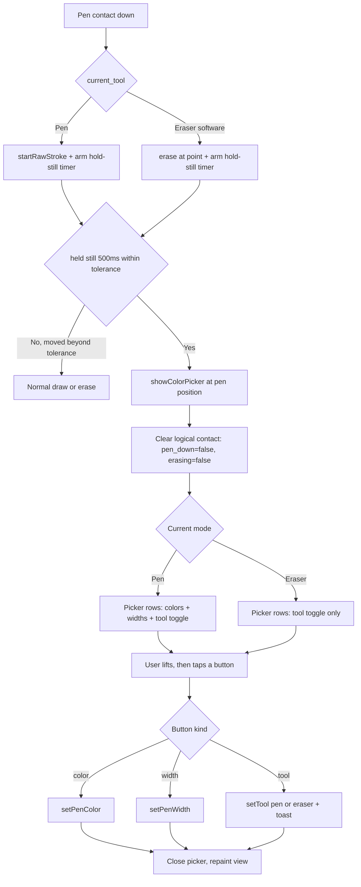

# KOReader Pencil: Pen/Eraser Toggle in the Long-Press Picker

## Summary

The pencil plugin's hold-pen-still gesture already opened a picker for pen
color and stroke width. This change adds a **pen/eraser toggle** to that
picker and — crucially — makes the picker reachable in **both pen and eraser
mode**, so the stylus alone can switch tools without reaching for the menu, a
side button, or a double-tap gesture.

In pen mode the picker stacks whatever rows are enabled (colors, widths) plus
the new toggle row. In eraser mode the color/width rows are pen-only and
therefore hidden, so holding the eraser still on a blank spot brings up a
picker containing just the toggle — the natural "get me back to the pen"
affordance.

The toggle is gated by a new `experimental_tool_toggle` setting (default on,
with a menu entry to disable).

## Approach

**Reuse the existing picker, generalised to N rows.** `ColorPickerWidget`
previously special-cased one or two rows (colors, widths) with explicit layout
branches. That was replaced with an ordered-row model: `_orderedRows()` returns
the non-empty button info-lists in display order, and both hit-testing
(`handlePenTap`) and painting (`paintTo`) walk that single list. Adding the
tool row is then just a third entry — colors / widths / tools now compose in
any combination without combinatorial layout code.

**Match the existing visual language.** The toggle buttons reuse the corner
tool-badge convention already in the plugin: a filled black square means pen, a
hollow square means eraser. The active tool gets the thick selection border the
color/width buttons already use. Because `FrameContainer:getSize()` derives
size from content + border (it ignores the explicit `width`/`height` except for
internal alignment), the hollow eraser glyph subtracts its border from the
content so both glyphs render as the same `icon_size` square.

**Trigger the picker in eraser mode.** The hold-still detector
(`scheduleColorPickerCheck` -> `checkColorPickerTrigger`) was pen-only because
the eraser branch of `handleStylusSlot` returns early. The same start-position
/ timer / tolerance tracking was added to the eraser branch, gated to the
*software* eraser only (`current_tool == TOOL_ERASER`) so the physical eraser
end keeps erasing instead of popping a toggle.

**The swallowed-lift hazard.** While the picker is shown it sits on the window
stack, so `isOverlayActive()` is true and `handleStylusSlot` early-returns at
its overlay guard. That means the **pen-lift event is swallowed**, which would
leave `pen_down` (and, in eraser mode, `erasing`) stuck true after the picker
closes — eating the next stroke. `showColorPicker()` now clears that logical
contact when it opens (committing any in-progress eraser deletion to the undo
stack first). This also fixes the same latent issue for the pre-existing
color/width picker. Tap selection itself flows through the gesture system
(`onTapSelectColor`), which was extended to carry a `tool_value` alongside
`color_value` / `width_value`; the in-callback eraser-branch routing mirrors
the pen branch as a defensive fallback.

**Confirmation via toast, not badge.** A tool switch from a deliberate menu
pick shows a one-second `InfoMessage` ("Pen" / "Eraser"), consistent with the
picker's own color/width confirmations, rather than the corner badge used by
the quick gesture/double-tap toggle. `setTool` gained a `silent` flag so the
picker path can suppress the badge and avoid a redundant double-indicator.

## Trade-offs

- **Default-on changes hold-still behaviour.** With `experimental_tool_toggle`
  on by default, holding the pen still now opens a picker even for users who
  had no color/width picker enabled, and holding the eraser still opens one
  too. This is a deliberate discoverability choice for a personal fork; the
  menu entry disables it.

- **Eraser-mode long-press still erases the first contact.** Tap-to-erase
  semantics are preserved, so holding still *on a stroke* erases it before the
  toggle appears (the deletion is committed to the undo stack). The intended
  gesture is to hold on a blank spot. Suppressing the first-touch erase was
  rejected to avoid degrading the deliberate tap-to-delete gesture.

- **One combined commit.** The pencil changes were committed alongside the
  previously-uncommitted Onyx Boox scribble drain path because the two live in
  the same file and no pre-edit snapshot existed to split them cleanly. The
  Onyx launcher half (in the `luajit-launcher` submodule) was intentionally
  left uncommitted pending a separate, deliberate submodule commit.

## Key Files

- `plugins/pencil.koplugin/main.lua`
  - `loadSettings` / `saveSettings` / `addToMainMenu` — new
    `experimental_tool_toggle` setting + menu entry.
  - `setTool(tool, silent)` — optional badge suppression.
  - `ColorPickerWidget` — `tools` / `current_tool` fields; `_makeButton` tool
    glyph; `_orderedRows()`; generalised `init` / `handlePenTap` / `paintTo`.
  - `showColorPicker` — per-mode row gating, `tool_value` callback routing, and
    the logical-contact clear that prevents the stuck `pen_down` / `erasing`.
  - `handleStylusSlot` eraser branch — hold-still tracking + picker tap routing.
