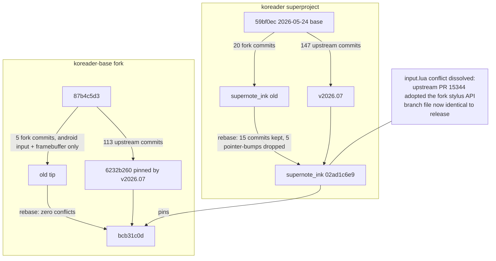

2026-07-28

# KOReader: rebase supernote_ink onto v2026.07 — upstream adopted our stylus API

The `supernote_ink` fork branch had been sitting on a May 24 upstream base (59bf0ec) while
upstream released **v2026.07 "Sailing Walrus"** (147 commits ahead). We rebased the whole
stack — superproject plus the koreader-base fork — onto the release, and it turned out far
cleaner than a three-month drift usually is, for one happy reason: **upstream PR #15344
("Support SDL stylus input") adopted the fork's stylus routing API wholesale**.
`Input:registerStylusCallback`, `Input:unregisterStylusCallback`, `Input:routeStylusEvents`,
the `pen_slot` handling and the `Input.TOOL_TYPE_*` exports all landed upstream with
identical names and values (plus spec tests and a new `TOOL_TYPE_HIGHLIGHTER`). The fork's
125-line `frontend/device/input.lua` patch dissolved: after the rebase the file is
**byte-identical to the release**, and pencil.koplugin needed zero changes — its
`input_stylus_hook.lua` fallback shim checks `if not Input.registerStylusCallback` and now
simply never activates.

## What was done

Before rebasing, three WIP snapshots were committed (the multi-device port work from recent
sessions):

- **base** `656a0e4f` — RK3576/M08P EBC fast-waveform toggle during stylus strokes
  (`android.einkStrokeFast` driven from `input_android.lua` on stylus DOWN/UP).
- **luajit-launcher** `4415341` — Huawei MatePad Paper Auto-HandWrite firmware ink
  (`HuaweiAhw.kt` + `HuaweiEPDController`), RK3576 EPD controller with `RkEinkFast`
  sys-prop toggle, Onyx scribble drain client, and the LuaInterface/MainActivity wiring.
- **superproject** — pencil.koplugin Huawei AHW integration (stroke drain reusing the Onyx
  overlay-stroke path), configurable long-press hold time, logical-coords detection.

Then two rebases:

1. **koreader-base fork → 6232b260** (the base SHA v2026.07 pins). The fork's 5 commits
   touch only `ffi/input_android.lua` and `ffi/framebuffer_android.lua`; upstream's 113
   commits touched neither. Zero conflicts. New tip `bcb31c0d`.
2. **supernote_ink → v2026.07** via `git rebase -i --onto`. Five pointer-only "base bump"
   commits were dropped from the todo (their job is served by the final pin), and the
   Laumss PR #1 merge flattened. Three conflict stops, all predicted by a `git merge-tree`
   dry run beforehand:
   - `frontend/device/input.lua` — resolved by taking upstream's version outright.
   - `base` gitlink twice — resolved to the rebased `bcb31c0d`.

   Result: 15 commits atop v2026.07, tip `02ad1c6e9`.

## Rationale for the two judgment calls

- **Taking upstream's input.lua wholesale.** Besides cosmetics, upstream renamed
  `kobo_eraser_active` → `stylus_eraser_active` (nothing outside the file references
  either name) and gated `BTN_TOOL_PEN`/`BTN_TOOL_RUBBER` handling behind
  `wacom_protocol or isSDL()` where the fork handled them unconditionally. The
  Android/Supernote path gets tool types via `ABS_MT_TOOL_TYPE` emitted by the fork's
  base (`input_android.lua`), not via those button codes, so the gate is irrelevant there.
- **Dropping the pointer-bump commits** instead of replaying them: each would have
  produced a submodule conflict resolving to a pre-rebase base SHA that no longer matters;
  the final pin to `bcb31c0d` carries all the same content.

## Fork delta after the rebase

Exactly the intentional surface, nothing else: pencil.koplugin (bundled), Supernote
sidebar keycode filtering in `event_map.lua`, the release-android CI workflow,
`.gitmodules` fork URLs, menu-order entries, a version marker, and the two submodule
pointers. The luajit-launcher fork needed no rebase at all — upstream hasn't moved that
submodule since May.

## Build and install

Built `android-arm64` in the `koreader/koandroid:0.9.7-22.04` Docker image (amd64-only on
Docker Hub; runs under Rosetta — the container platform is the build host, the APK is a
true arm64 target). One new quirk of the v2026.07 build system: `kodev release` now runs
`make po` (translation fetch) before the build, and the old image lacks `g++`, which
prints a harmless probe warning. A first attempt died with SIGKILL right after OrbStack
cold-started; the retry built in 5m20s. Signed with uber-apk-signer (same debug cert as
prior installs, so `adb install -r` upgraded in place preserving app data) and installed
on the Supernote Nomad. Startup logs confirm `SupernoteInk: found binder for
"service_myservice"` with live `realTimeHandWriting` replies, and the pencil plugin loads
(v2026.07 now warns that `name` in `_meta.lua` is deprecated — cosmetic; the name comes
from the plugin directory).

Backups kept: `backup/supernote_ink-pre-v2026.07` in both the superproject and base.
