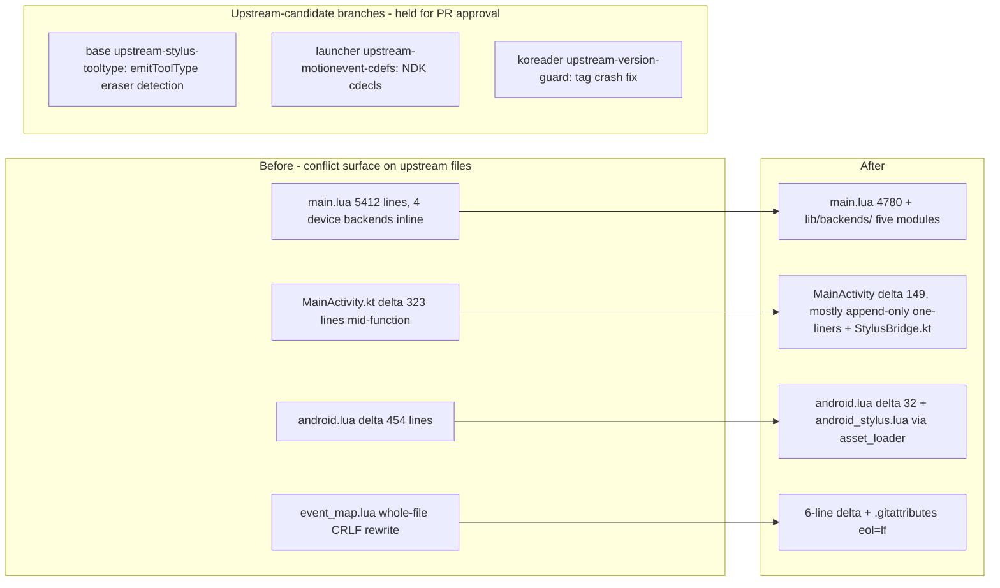

2026-07-28

# KOReader: shrink the supernote_ink fork's conflict surface for future rebases

Right after rebasing `supernote_ink` onto v2026.07 (see the companion ADR), we
audited the fork for whatever made that rebase harder than it needed to be, and
restructured so the next one is close to mechanical. The guiding observation:
the fork's *own* files (pencil.koplugin, vendor Kotlin objects) never conflict —
what conflicts is every line the fork changes *inside upstream-owned files*.
So each refactor moves fork logic out of upstream files and leaves behind the
smallest possible hook.

## What changed, in dependency order

**CRLF normalization (koreader).** `event_map.lua` and `pencil.koplugin/main.lua`
had CRLF endings from a Windows editor, which made git treat a 6-line change as
a whole-file rewrite — any upstream touch of `event_map.lua` would have
conflicted across all 72 lines. Normalized to LF and added a `.gitattributes`
(`*.lua text eol=lf`; no such file exists upstream, so it's purely additive).

**CI (koreader).** The release workflow only fired on `sony-dpt-v*` tags
(android-arm). Added `supernote-v*` → `android-arm64` via a `startsWith` on
`github.ref_name`, so Supernote releases stop being a manual Docker exercise.

**Pencil plugin backends (koreader).** `main.lua` mixed ~640 lines of four
inline device integrations with the core annotation logic. They moved to
`lib/backends/{common,sony,supernote,onyx,huawei}.lua`: uniform
`setup(p)`/`teardown(p)` lifecycle driven from an `InkBackends` list, explicit
per-device operations (`SupernoteBackend.applyPen`, `OnyxBackend.applyStyle`,
`*.clearOverlay`) where refresh policy genuinely differs. `common.lua` holds
the previously *triplicated* stroke-baking code (parse points → stroke record →
undo stack → paint into Screen.bb) plus shared constants. Backend functions
take the plugin instance and mutate the same state fields main.lua's
refresh-policy branches read (`supernote_ink_active`, `huawei_ahw_enabled`, …),
so this is relocation, not redesign. Adding the next device (M08P, MatePad) is
now a new-file exercise. The `lib/supernote_ink.lua` binder client was already
the model for this shape and is untouched.

**Launcher wiring (android-luajit-launcher).** Two hotspots:

- `MainActivity.kt` carried 323 changed lines *inside* upstream functions —
  overlay stacking in `onCreate`, vendor hooks in `onResume`/`onPause`/
  `onDestroy`, the Sony stroke queue. All of it moved into a new
  `device/StylusBridge.kt` object; MainActivity now makes one-line calls
  (`StylusBridge.init(this)`, `needsSurfaceView()`, `buildContentView(...)`,
  `onResume(w, h)`…). Remaining delta: 149 lines, dominated by the *append-only*
  LuaInterface delegate block, which upstream edits can't collide with.
- `assets/android.lua` carried a contiguous 440-line block of vendor JNI
  wrappers inside `run()`. It moved to a new `assets/android_stylus.lua`
  (a decorator: `return function(android, JNI, ffi) … end`) loaded through
  upstream's existing `android.asset_loader`, which compiles Lua straight from
  APK assets — that's the same mechanism `require` uses in the launcher, so no
  loader changes were needed. android.lua's delta fell from +454 to +32 (the
  hook plus two small NDK cdef hunks).

**Upstream-candidate branches (held, not yet PRs).** The May→July experience —
upstream's #15344 adopting the fork's stylus API verbatim and dissolving the
whole input.lua patch — says the durable fix for rebase pain is upstreaming.
Three branches are prepared and pushed, PR submission pending approval:

- `koreader-base upstream-stylus-tooltype`: single squashed commit cooking
  `AMotionEvent` tool types into `ABS_MT_TOOL_TYPE` emu events with Wacom-EMR
  eraser-button promotion. The Sony overlay forwarding was stripped out during
  extraction (a cherry-pick had dragged it along; caught by grepping the result
  for fork-only symbols).
- `android-luajit-launcher upstream-motionevent-cdefs`: the companion NDK
  enums + `getToolType`/`getButtonState` cdecls (pure additions from
  `android/input.h`).
- `koreader upstream-version-guard`: `Version:getShortVersion()` crashes on
  tags that don't match `vYYYY.MM`; fall back to the raw rev string.

If the base pair lands upstream, the base fork shrinks to the 18-line Sony
framebuffer gate + the RK3576 fast-waveform toggle — close to dissolving.

## Verification

Every Lua file syntax-checked with host luajit. The android-arm64 Docker build
compiles the Kotlin (StylusBridge) and packages the new assets; installed on
the Supernote Nomad for on-device behavior verification (no behavior change
intended anywhere). The `/sdcard/koreader/plugins/` external copy of the plugin
is being retired in favor of the bundled one — single source of truth in the
repo, `adb push` remaining the fast iteration path.
