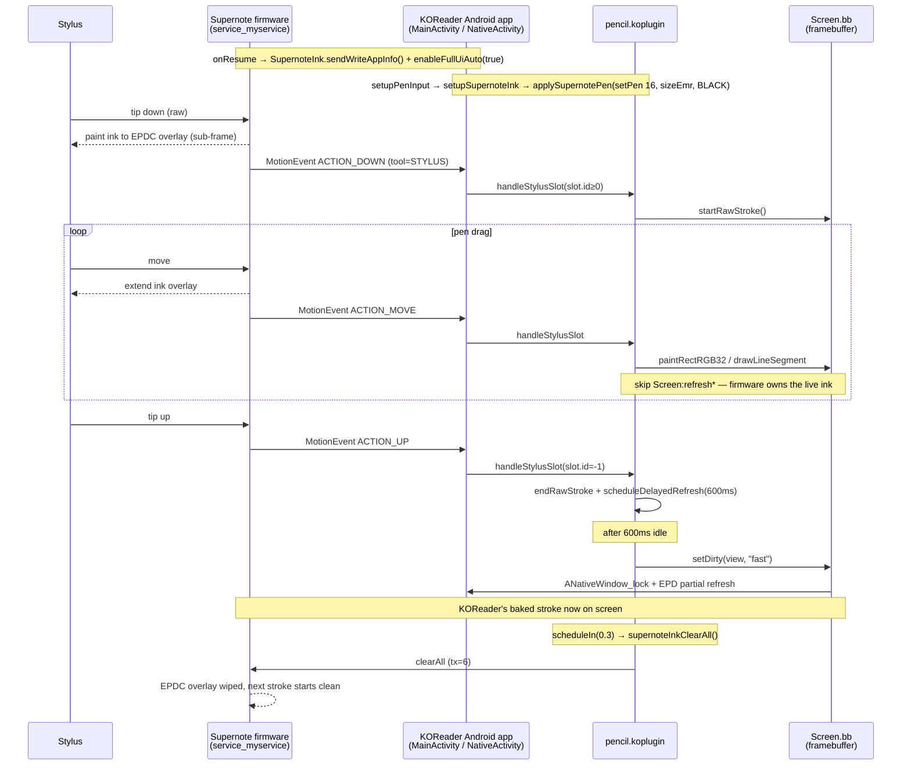

# KOReader stylus support for Supernote Manta

## Summary

Added pencil annotation support to KOReader for the Supernote Manta
(Ratta A5X2 family) by porting the `supernote_draw` reference app's
firmware-ink binder client into the Android launcher and wiring the
`pencil.koplugin` to drive it. The same APK still runs on Sony DPT and
generic Android — the new path is gated at runtime by the presence of
the Supernote `service_myservice` binder.

## Approach

Supernote Manta is fundamentally a different stylus integration model
from the Sony DPT-CP1 that KOReader already supports.

### Sony DPT (existing)

- Two stacked `SurfaceView`s: a native one for KOReader's page renderer
  and a `TRANSLUCENT` `StylusView` overlay where Java rasterises stroke
  segments via `SurfaceHolder.lockCanvas` in NOCONVERT_DU mode.
- `libSystemUtil.so` JNI toggles a kernel "Direct Handwriting" state
  that paints stroke pixels straight to the EPDC.
- The Lua input cook forwards stylus events to the overlay via
  `stylusOverlayInjectEvent` so Java can drive its own render thread.
- The framebuffer skip-list (`stylusOwnsSurface()`) suppresses
  `ANativeWindow_lock` blits during a stroke so they don't overwrite
  the DHW kernel pixels.

### Supernote Manta (this change)

- Firmware-side EPDC ink path via the `service_myservice` system
  binder (interface `android.demo.IMyService`). The firmware already
  paints stroke pixels at sub-frame latency; the app's only job is to
  configure the pen and tell the firmware which screen regions must
  skip ink. **No second `SurfaceView`, no `lockCanvas`, no kernel DHW
  toggle, no input forwarding** — KOReader's existing stylus pipeline
  works unchanged for event delivery.
- The pencil plugin still paints into `Screen.bb` per point (so the
  ink persists across page turns) but **suppresses mid-stroke EPD
  refreshes**, because the firmware is already showing the ink.
  KOReader's delayed-commit path bakes the finished stroke into the
  framebuffer at `setDirty(view, "fast")` time, after which the plugin
  fires `supernoteInkClearAll()` (~300ms later) to wipe the firmware
  overlay so the next stroke starts clean.

### Layer-by-layer wiring (per `koreader-eink-stylus-support` skill)

| Seam | Sony DPT | Supernote Manta |
|---|---|---|
| 1. Input source | `AInputQueue` → `input_android.lua` | same |
| 2. Tool classification | `emitToolType` + buttonState | same |
| 3. Lua cook → plugin | `pencil.handleStylusSlot` | same |
| 4. Userspace overlay | Java `StylusView` (req'd) | not needed — firmware paints |
| 5. Kernel-fast path | `SonyDhw` JNI → `setDhwState` | `SupernoteInk` Binder → `setPen` |
| 6. Refresh policy | gate framebuffer + clear overlay on commit | gate mid-stroke refresh + `clearAll` on commit |

### Detection

Runtime, via the binder lookup: `SupernoteInk.isAvailable()` queries
`ServiceManager.getService("service_myservice")` (and the legacy
`service.myservice` alias). Returns true only on Supernote firmware.
A `SUPERNOTE_MANTA` entry was also added to `DeviceInfo.Id` so future
code can branch on it, but the pencil plugin and JNI shim gate purely
on `isAvailable()` so the same APK is safe on non-Supernote Android.

## Trade-offs

- **Monochrome ink in the live preview.** The firmware EPDC overlay
  only supports its own grayscale color codes (BLACK / GRAY / DGRAY /
  LIGHT). KOReader's color picker (Red / Orange / etc.) renders the
  *persistent* stroke baked into `Screen.bb`, but the in-progress live
  ink is always black. Acceptable on grayscale e-paper.
- **No mid-stroke refresh on Supernote.** This is intentional — the
  firmware is the canonical pen renderer, and a Lua-side refresh would
  fight it. The cost: stroke pixels in `Screen.bb` don't appear on
  screen until the 600ms delayed-commit fires. On Sony, the kernel DHW
  path makes that gap invisible by painting through it; on Supernote,
  the firmware overlay serves the same role.
- **Disable-area UI gating is best-effort.** The firmware will happily
  paint ink wherever the pen touches, including inside KOReader menus
  / dialogs. The current shim disables ink on `onPause` and re-enables
  on `onResume`, plus `setupSupernoteInk` enables, `teardownSupernoteInk`
  disables. Menu-time gating would need extra wiring to `UIManager`
  show/hide events; deferred.
- **Pen-type fixed to firmware INK (16).** KOReader has one logical
  "pen" tool with a configurable width; the firmware exposes four
  styles (Needle / Ink / Mark / Calligraphy). INK is the closest match
  to KOReader's solid-stroke look. Adding the other three would need
  new menu entries in `pencil.koplugin`.

### Key files

**Submodule `platform/android/luajit-launcher`:**
- `app/src/main/java/org/koreader/launcher/device/supernote/SupernoteInk.kt` *(new)*
  — binder client object. Lookup, transact codes for `sendWriteAppInfo`
  (0), `setDisableAreas` (1), `setPen` (2), `clearAll` (6), plus the
  `getSystemService("eink").enableFullUiAuto(bool)` reflection.
- `app/src/main/java/org/koreader/launcher/device/DeviceInfo.kt`
  — `SUPERNOTE_MANTA` enum + Build-property heuristic.
- `app/src/main/java/org/koreader/launcher/LuaInterface.kt`
  — five `supernoteInk*` methods exposed to Lua via JNI.
- `app/src/main/java/org/koreader/launcher/MainActivity.kt`
  — `SupernoteInk.setContext()` in `onCreate`; resume/pause register
  + tear down the firmware ink ownership; implements the five
  `LuaInterface` methods.
- `assets/android.lua`
  — Lua-side wrappers calling the JNI methods.

**Main repo:**
- `plugins/pencil.koplugin/main.lua`
  — `setupSupernoteInk` / `teardownSupernoteInk` parallel to the Sony
  hooks; `applySupernotePen()` driven from every code path that may
  change the effective tool (`setTool`, gesture toggles, eraser
  slot.tool detection, `setPenWidth`); `addRawPoint` skips mid-stroke
  refresh when Supernote ink is active; `scheduleDelayedRefresh`
  schedules `supernoteInkClearAll()` 300ms after the commit.

## Control flow



## Verification recipe

On a Supernote Manta with this APK:

```bash
adb logcat -c
# write 5 strokes, pause 1s, write 5 more, turn the page
adb logcat -d | grep -E 'SupernoteInk|Pencil: (raw stroke|Supernote|delayed)'
```

Expected pattern:

```
SupernoteInk: found binder for "service_myservice"
Pencil: Supernote ink enabled
Pencil: Supernote pen -> ink, width= 3
Pencil: raw stroke started
Pencil: raw stroke ended with N points
... (4 more pairs, no Supernote pen lines between strokes)
Pencil: delayed refresh triggered
SupernoteInk: tx=6 ...    <- clearAll fires once per pause
Pencil: raw stroke started
... (second burst)
SupernoteInk: tx=6 ...
```

Counter-examples:

- `SupernoteInk: no binder for ...` on a Manta → check that
  `service_myservice` is registered (firmware version regression).
- Multiple `delayed refresh triggered` per pause → `pending_refresh`
  cancel-by-fn-ref broke; same bug pattern as the Sony fix.
- `tx=6` between consecutive strokes inside the same burst →
  `clearAll` is firing too eagerly; check that the
  `scheduleIn(0.3, ...)` block only runs from the delayed-commit path,
  not from `endRawStroke` directly.
