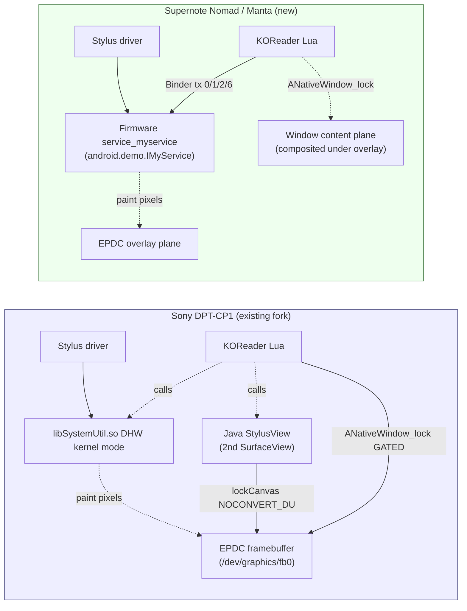
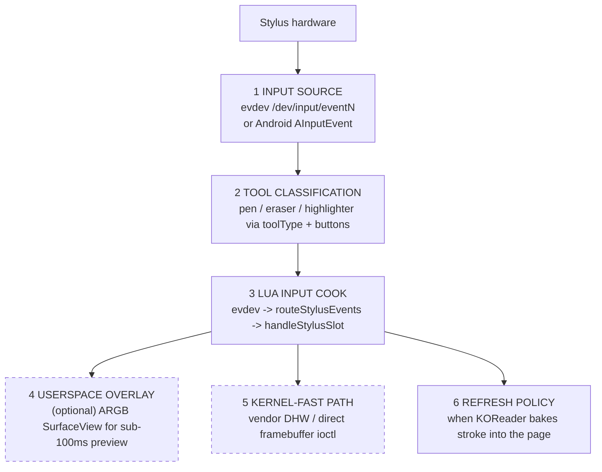
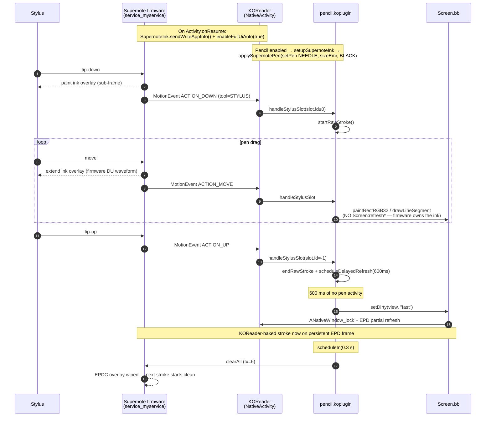
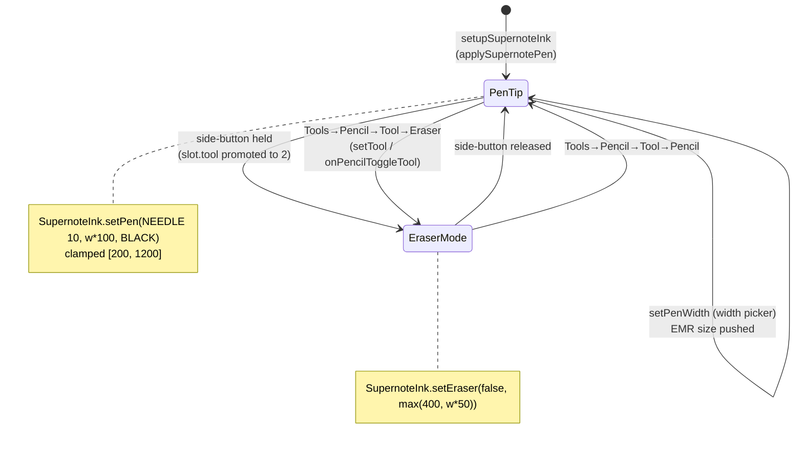
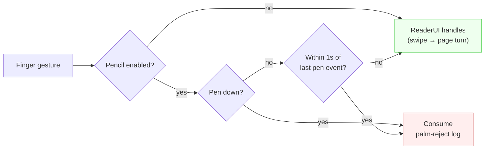
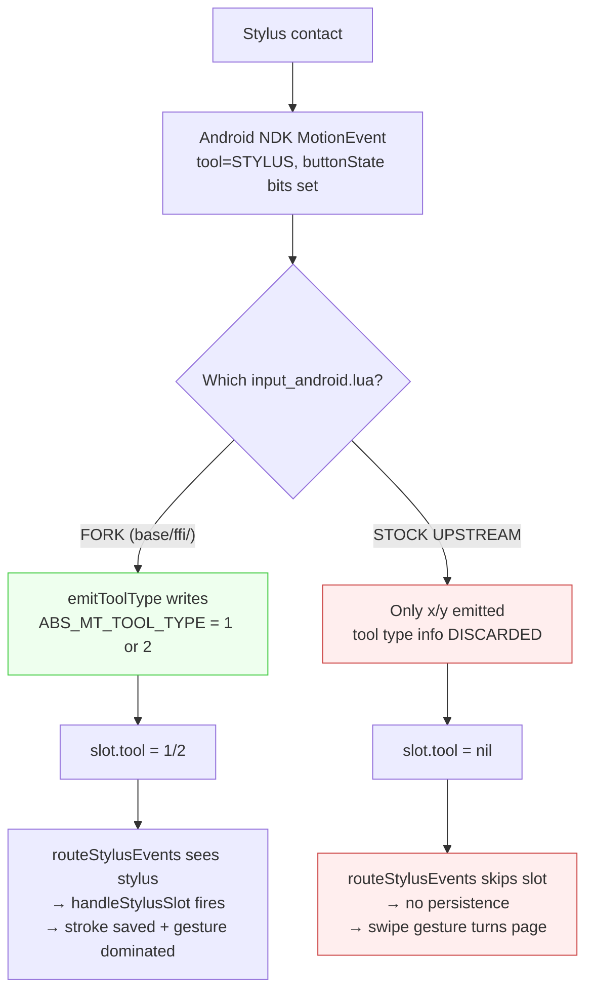
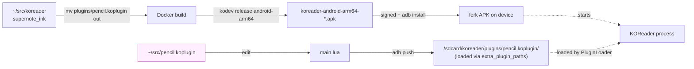

# Porting KOReader stylus annotation to the Supernote Nomad

*An end-to-end story of layering a second e-reader's stylus stack on top
of an existing Sony DPT-CP1 fork, the surprisingly different architecture
needed for it, and the deployment trick that let us iterate on the
plugin without rebuilding the APK.*

## Summary

This change brings the KOReader pencil plugin to life on Supernote
A5X2-family devices (Nomad confirmed, Manta expected). The hard part
wasn't writing the integration — it was discovering that **Supernote's
stylus stack inverts the Sony architecture**. Where Sony makes the *app*
own the ink pipeline (custom `SurfaceView`, per-segment `lockCanvas`,
kernel DHW toggle), Supernote makes the *firmware* own it: a system-side
Binder service paints stroke pixels directly into the EPDC overlay at
sub-frame latency, and the app's job is just to tell that service "I own
the pen now, here's the pen config, please clear your buffer when I'm
done."

Result on the device: live ink under the pen tip with no perceptible
lag, side-button-as-eraser, palm rejection, ink that persists across
page turns. Same APK still runs on the Sony DPT-CP1 — the Supernote path
lights up at runtime via a Binder lookup; on non-Supernote hardware the
lookup returns null and every Supernote call no-ops.

## Background: two ways to put ink on an e-paper screen

E-ink panels are slow. A KOReader stroke that's painted into Lua's
`Screen.bb` then refreshed via the normal EPD waveform shows up
about 300-600 ms after the pen tip moves — way too laggy to feel like
handwriting. Vendors have invented two very different ways to close that
gap.

**Sony DPT-CP1 (the existing fork target)** exposes a kernel-side
"direct handwriting" path through `libSystemUtil.so`. The app:

1. Creates a *second* transparent `SurfaceView` over the page renderer.
2. Reflects into `SystemUtil.setDhwState(true)` to flip the kernel into
   a mode where digitizer events paint stroke pixels straight to the
   EPDC framebuffer, bypassing SurfaceFlinger composition.
3. For belt-and-braces, also rasterises each stroke segment from Java
   into the overlay via `SurfaceHolder.lockCanvas(...)` in a
   `NOCONVERT_DU` waveform mode that doesn't disturb already-painted
   pixels.
4. Gates KOReader's own `ANativeWindow_lock` while a stroke is in
   flight so the Lua refresh path doesn't wipe the kernel-painted ink.

**Supernote A5X2 family** does *all of that, in firmware*. The
device runs a system service (`service_myservice`, interface token
`android.demo.IMyService`) that listens for stylus events at the EPDC
overlay layer and paints them at sub-frame latency. The app's role is
limited to four Binder transactions:

| Transaction | Purpose |
|---|---|
| `tx=0` `sendWriteAppInfo` | "This app is the active pen owner" |
| `tx=1` `setDisableAreas` / `setFullScreenDisable` | Tell firmware which screen rects must skip ink (toolbars / menus) |
| `tx=2` `setPen` / `setEraser` | Pen type code, EMR size, color |
| `tx=6` `clearAll` | Wipe the EPDC ink overlay (used after we bake the stroke into the page) |

Plus one reflection call,
`getSystemService("eink").enableFullUiAuto(true)`, to make the firmware
paint ink everywhere on screen rather than only inside its whitelisted
apps.

That's it. No second `SurfaceView`. No `lockCanvas`. No kernel DHW
toggle. No input forwarding. KOReader's existing
`pencil.koplugin/handleStylusSlot` path receives stylus events through
the normal evdev pipeline, unchanged. The whole job collapses to
"register pen ownership, push pen config, clear overlay at the right
moment."



The architectural contrast — *who owns the ink path* — is the whole
post. Everything below is a consequence.

## The six-layer model and how Supernote slots into it

KOReader's stylus pipeline crosses six layers between digitizer hardware
and the user-visible page. Adding a device means deciding, at each
layer, whether it's *device-agnostic* (already works) or *device-
specific* (you wire it).



For each layer, here's how the two devices compare:

| Layer | Sony DPT-CP1 | Supernote Nomad |
|---|---|---|
| 1. Input source | `AInputQueue` in NativeActivity → `input_android.lua` cooks to evdev | same |
| 2. Tool classification | `AMotionEvent_getToolType` + side-button promotion in `emitToolType` | same |
| 3. Lua input cook | fork's `Input:routeStylusEvents` → `pencil.handleStylusSlot` | same |
| 4. Userspace overlay | **required** — Java `StylusView` rasterises segments | **not needed** — firmware paints |
| 5. Kernel-fast path | `SonyDhw.setDhwState(true)` via JNI reflection | `SupernoteInk` Binder `tx=2 setPen` |
| 6. Refresh policy | gate `ANativeWindow_lock` while stroke active, clear overlay 300 ms after commit | gate mid-stroke `Screen:refresh*` (firmware already paints), clear firmware overlay 300 ms after commit |

Layers 4 and 6 are where the implementations diverge most. Sony's
overlay is *required* because a NativeActivity primary surface is
ANativeWindow-bound and Java `lockCanvas` doesn't work on it; the only
way to paint Java strokes into the EPD is a second SurfaceView. On
Supernote, that whole layer dissolves — the firmware does the painting
and there's nothing for us to render in userspace mid-stroke.

## Control flow: one stroke, end-to-end

The interesting part is the choreography between three asynchronous
actors: the **firmware** (which paints under the pen tip in real time),
**KOReader's Lua** (which keeps stroke records and bakes them into the
persistent framebuffer at idle), and the **pencil plugin** (which
brokers between them).



Three details from that diagram deserve highlighting.

**Mid-stroke refresh is gated.** Step "loop pen drag" never calls
`Screen:refreshFast`. The firmware is already showing live ink; an EPD
refresh issued by Lua during the same moment would *fight* the firmware
and visibly flicker the stroke. The plugin's `addRawPoint` checks
`self.supernote_ink_active` and skips its mid-stroke refresh path on
Supernote (Sony, by contrast, does want `refreshFast` to fire because
its kernel DHW pixels need to be re-presented).

**The page-bake and the overlay-clear are paired.** Steps "setDirty" and
"clearAll" run about 300 ms apart. We must bake first (so KOReader's persistent
framebuffer has the stroke), *then* tell the firmware to wipe the overlay
(so its ink-mode doesn't double-print on top of our persistent stroke at
the next page refresh). Doing it in the other order, or simultaneously,
produces a brief "stroke flashes off the screen" effect during the
hand-off.

**The delayed-refresh timer is keyed off pen *lift*, not pen *down*.**
KOReader has a 600 ms grace before committing, and the timer restarts
on every stylus event. So if you pause mid-word for half a second and
keep writing, no commit fires; if you genuinely stop, the page bakes
600 ms later.

## Tool state: pen ↔ eraser

The plugin also has to keep the firmware's pen config synchronised with
KOReader's logical tool. Three things can change the effective tool:



The bridge from "effective tool changed" to "firmware knows" lives in
`Pencil:applySupernotePen()` and is wired into five callers:

- `setTool` (menu)
- `onPencilToggleTool`, `onPencilSelectPen`, `onPencilSelectEraser` (gestures)
- `handleStylusSlot` tool-flip detection (side-button → eraser)
- `setPenWidth` (width picker, with `supernote_last_tool = nil` to bust the cache)

The function short-circuits if the effective tool hasn't changed since
the last call, so per-stroke overhead is one Lua compare.

## Palm rejection

Without intervention, a palm resting on the screen while writing
becomes a Swipe gesture, which `ReaderPaging` interprets as a page
turn — pages flip out from under you mid-word. The fix:

- `Pencil` is in `self.ui.active_widgets`, which receives gestures
  *before* `ReaderUI` does.
- Pencil defines `onTap`, `onSwipe`, `onHold`, `onPan`, `onMultiSwipe`,
  `onPinch`, `onSpread`, `onHoldRelease`, `onHoldPan`, `onPanRelease` —
  each silently consumes the gesture (returns `true`) while a
  rejection window is open.
- The rejection window is "pencil enabled AND (pen currently down OR
  pen was on screen within the last 1000 ms)." The 1-second grace
  catches the case where the palm lingers after the pen lifts.



## The all-Lua experiment, and why we backed off

A natural next thought: if the Supernote side of all this is just
Binder calls, can the whole integration live inside the pencil plugin
itself — no launcher patches required — so the same plugin folder
drops onto stock KOReader and lights up?

The answer is *almost*. The plugin can absolutely make every Binder
call from Lua via JNI reflection
(`Class.forName("android.os.ServiceManager")` →
`getMethod("getService", String).invoke(...)` →
`IBinder.transact(int, Parcel, Parcel, int)` with hand-built Parcels).
That part shipped to a branch (`supernote_ink` on
`~/src/pencil.koplugin`) and worked: on stock KOReader, the firmware
ink path lit up and the pen visibly drew on screen.

What didn't work on stock KOReader was *everything else*. Two layers
broke at once:



The fork patches `base/ffi/input_android.lua` to call `emitToolType`
inside the local `motionEventHandler` cook function. Stock upstream
discards that information. Once the cook is done, the `AMotionEvent` is
gone — neither a plugin nor a user patch can reach back to recover the
tool type, because the only relevant code is inside a `local function`
in a submodule.

We considered shipping a userpatch alongside the plugin that
`package.loaded["ffi/input_android"]`-replaces the whole base module
with a forked copy. That would work, but it locks the user to a
specific upstream KOReader version — every official KOReader update
would risk crashing the patch. The whole point of the all-Lua exercise
was to enable easy updates, so the patch-the-base approach defeats it.

We backed off. The shipping configuration is:

- **Fork APK** (this repo's `supernote_ink` branch built into an arm64
  APK via the koreader/koandroid Docker image), which carries:
  - `frontend/device/input.lua`'s `registerStylusCallback` /
    `routeStylusEvents` additions
  - `base/ffi/input_android.lua`'s `emitToolType` button promotion
  - `platform/android/luajit-launcher/`'s `SupernoteInk.kt` Binder
    client + JNI wrappers + Activity-lifecycle hooks
- **Pencil plugin** living at `/sdcard/koreader/plugins/pencil.koplugin/`
  (sourced from `~/src/pencil.koplugin`, branch `supernote_ink`,
  *commit `9b7089d`*) which uses the launcher's `android.supernoteInk*`
  JNI methods to drive the firmware. **Not bundled in the APK**, so
  iteration is `adb push`-fast.

The all-Lua-only branch (`supernote_ink` HEAD on the pencil repo, commit
`082b6f7`) is preserved for the day either KOReader upstreams
`registerStylusCallback` + `emitToolType`, or the fork ships an
`input_android.lua` patch the plugin can rely on by version-detection.

## Deployment: external plugin + fast iteration

The plugin sits *outside* the koreader fork. The Makefile (line 155-156)
symlinks `plugins/` into the install, so we explicitly move
`pencil.koplugin` out before building:



`PluginLoader:_discover` scans both `plugins/` (extracted from APK) and
`/sdcard/koreader/plugins/` (auto-registered via the `extra_plugin_paths`
setting). With the bundled copy excluded, the on-device copy is the
single source and there are no duplicate-loaded issues. A working
adb-push cycle for a Lua edit is about 5 seconds; a full Docker rebuild
takes about 5 minutes (plus a `pm clear` to force asset re-extraction
because `git-rev` doesn't bump within a session). 60x speedup on the
inner loop.

## Trade-offs

**Monochrome ink in the live preview.** The firmware EPDC overlay only
supports its own grayscale color codes (BLACK / GRAY / DGRAY / LIGHT).
KOReader's color picker (Red / Orange / etc.) renders the *persistent*
stroke baked into `Screen.bb` in color, but the in-progress live ink is
always black. Acceptable on grayscale e-paper.

**No mid-stroke refresh from Lua on Supernote.** This is intentional —
the firmware is the canonical pen renderer, and a Lua-side `refreshFast`
during the same stroke would race the firmware and flicker. The cost:
stroke pixels in `Screen.bb` don't appear on screen until the 600 ms
delayed-commit fires. On Sony, the kernel DHW path makes that gap
invisible by painting through it; on Supernote, the firmware overlay
serves the same role.

**Disable-area UI gating is best-effort.** The firmware will happily
paint ink wherever the pen touches, including inside KOReader menus and
dialogs. The current implementation disables ink on `Activity.onPause`
and re-enables on `Activity.onResume`, plus `setupSupernoteInk` enables
and `teardownSupernoteInk` disables. Per-overlay (menu open / dialog
shown) gating would need to listen to KOReader's `UIManager` show/hide
events and push `setDisableAreas` for the menu's bounding rect. Deferred.

**Pen type fixed to firmware `NEEDLE` (10).** KOReader has one logical
"pen" tool with a configurable width; the firmware exposes four styles
(Needle / Ink / Mark / Calligraphy). Needle is the closest match to
KOReader's `drawLineSegment` (uniform-width round-cap lines). Ink (16)
and Calligraphy (15) vary width with pressure/angle and disagree with
the baked Screen.bb stroke. Exposing the other three would need new
menu entries in `pencil.koplugin`.

**Stock KOReader unsupported.** As documented above. To support it
without a fork-APK, upstream KOReader needs `registerStylusCallback` /
`routeStylusEvents` in `frontend/device/input.lua` *and*
`emitToolType` in `base/ffi/input_android.lua`. The pencil plugin's
`supernote_ink` HEAD already includes a runtime monkey-patch for the
first; the second is unreachable from a plugin.

## Key files

```
~/src/koreader  (branch: supernote_ink)
  frontend/device/input.lua          — registerStylusCallback + routeStylusEvents,
                                       BTN_STYLUS / BTN_STYLUS2 tracking
  frontend/version.lua               — fallback for fork git tags not matching vYYYY.MM
  platform/android/luajit-launcher   — submodule pinned to supernote_ink HEAD
  base                                — submodule pinned to supernote_ink (was sony-stylus)

~/src/koreader/platform/android/luajit-launcher  (branch: supernote_ink)
  app/.../device/supernote/SupernoteInk.kt
                                     — Binder client: tx 0/1/2/6 + enableFullUiAuto reflection
  app/.../device/DeviceInfo.kt       — SUPERNOTE_MANTA enum + Build.* heuristic
  app/.../LuaInterface.kt            — 5 supernoteInk* JNI method signatures
  app/.../MainActivity.kt            — onResume/onPause hooks + JNI impls
  assets/android.lua                 — Lua wrappers calling the JNI methods

~/src/koreader/base  (branch: supernote_ink)
  ffi/input_android.lua              — emitToolType writes ABS_MT_TOOL_TYPE,
                                       buttonState promotes pen → eraser
  ffi/framebuffer_android.lua        — stylusOwnsSurface() gates refresh paths

~/src/pencil.koplugin  (branch: supernote_ink)
  main.lua                           — setupSupernoteInk / applySupernotePen /
                                       teardownSupernoteInk; addRawPoint gates
                                       mid-stroke refresh; scheduleDelayedRefresh
                                       fires SupernoteInk.clearAll 300 ms after commit
  lib/supernote_ink.lua  (HEAD only) — all-Lua/JNI binder client (experiment;
                                       see "all-Lua experiment" section)
  lib/input_stylus_hook.lua (HEAD only)
                                     — runtime monkey-patch of Device.input
                                       (experiment; works on stock KOReader only
                                       partially — see same section)
  lib/geometry.lua                   — coordinate transforms (unchanged from
                                       Sony-era plugin)
```

The shipping configuration is **commit `9b7089d` of the pencil repo**
(launcher-dependent path) running on top of the fork-built APK from the
koreader repo's `supernote_ink` branch with both submodules on their
`supernote_ink` heads.

## End-to-end verification recipe

On a Supernote Nomad with the fork APK installed and the pencil plugin
pushed to `/sdcard/koreader/plugins/`:

```bash
adb -s <SERIAL> logcat -c
# write 5 strokes, pause 1s, write 5 more, turn page, write 2 more
adb -s <SERIAL> logcat -d | \
    grep -E 'SupernoteInk|Pencil: (raw stroke|Supernote|delayed|saveStrokes)'
```

Expected pattern at startup:

```
SupernoteInk: found binder for "service_myservice"
SupernoteInk: tx=0 reply=realTimeHandWriting     ← sendWriteAppInfo OK
SupernoteInk: tx=1 reply=realTimeHandWriting     ← setFullScreenDisable OK
Pencil: Supernote ink enabled
Pencil: Supernote pen -> ink, width= 3
```

Per stroke:

```
Pencil: raw stroke started
Pencil: raw stroke ended with N points
```

Once per pause (no stroke for 600 ms):

```
Pencil: delayed refresh triggered
SupernoteInk: tx=6 ...                            ← clearAll
```

On page turn:

```
Pencil: saveStrokes - filepath = ...
Pencil: saved N strokes to ...
```

Counter-examples that indicate regression: `tx=6` between consecutive
strokes inside the same burst (`clearAll` is firing too eagerly);
multiple `delayed refresh triggered` per pause (timer-cancel-by-fn-ref
broke); `saveStrokes` during writing (save policy regressed). Each of
those was a real bug at some point in this work.
