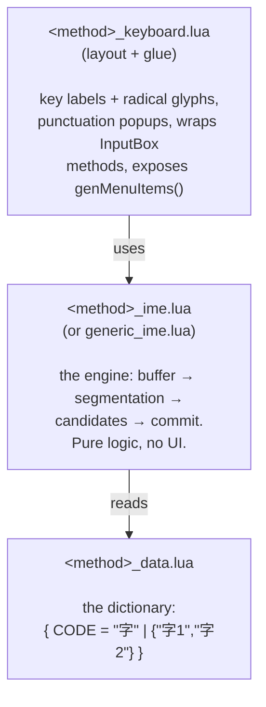

# KOReader: Adding Another Traditional Chinese Input Keyboard

Yes — very feasible. PR [#15196](https://github.com/koreader/koreader/pull/15196/) (Cangjie/倉頡) is a near-perfect template, and KOReader's architecture is built for exactly this. Here's the picture.

## How the input-method system is wired

Every keyboard is just a Lua table in `frontend/ui/data/keyboardlayouts/`. A Chinese-style IME keyboard is composed of three decoupled pieces:

The only core touchpoint is two lines in `virtualkeyboard.lua:813` — registering the layout name in `lang_to_keyboard_layout` (and optionally `lang_has_submenu`). That's the *only* thing the PR changes outside its own new files.

There are already three IMEs following this exact pattern: `zh_keyboard` (五筆畫 stroke), `zh_CN_keyboard` (拼音 pinyin), and now `cj_keyboard` (倉頡) in the PR.

## Patch vs. plugin

**Patch (recommended).** KOReader has a first-class userpatch system (`frontend/userpatch.lua`): any `.lua` in `koreader/patches/` runs at startup with no rebuild. You'd:
1. Drop your `xxx_keyboard.lua` / `xxx_ime.lua` / `xxx_data.lua` into the keyboardlayouts dir (or load them from the patch itself).
2. In a patch file like `2-add-tc-keyboard.lua`, inject your entry into `VirtualKeyboard.lang_to_keyboard_layout`.

This is clean, survives updates, and needs no fork. On your Supernote you'd just `adb push` like you already do for pencil.koplugin.

**True plugin (`.koplugin`).** Possible but a worse fit — plugins are for reader/UI features, and the keyboard registry isn't designed to be extended from a plugin's lifecycle. The patch route is the idiomatic one for keyboards.

## Which TC method, and how much work

The effort is **almost entirely about the dictionary**, not the code:

| Method | Engine effort | Data availability | Notes |
|---|---|---|---|
| **速成 / 簡易** (Quick) | about zero | **reuse cj_data** | Just first+last Cangjie radical → trivial derivation from the PR's own data. Easiest possible win. |
| **行列 30 (Array)** | low | open (rime-array, GPL) | Numeric keys, simple max-match — same engine shape as Cangjie. |
| **大易 (Dayi)** | low | open (rime-dayi) | Same as above. |
| **注音 (Bopomofo)** | medium | open (rime, libchewing) | Most popular in Taiwan, but needs tone keys + phonetic→char mapping with heavier candidate ranking. More than a radical lookup. |
| **嘸蝦米 (Boshiamy)** | low code | ⚠️ proprietary table | Engine is easy; the dictionary is non-free — licensing blocker, same reason rime ships it separately. |

If the goal is "another TC keyboard with minimal effort," **速成** is essentially free (reuse the PR's `cj_data` + 90% of `cj_keyboard.lua`, change only the segmentation to take first+last radical). If the goal is "the one Taiwanese users actually want," that's **注音**, which is a real but bounded project.

A couple of caveats worth flagging up front: the PR is still **open/unmerged**, so building on its `new_cangjie_ime.lua` means tracking a moving target; and the data files are GPL (rime-derived), which is fine for KOReader (also GPL) but matters if you redistribute.
