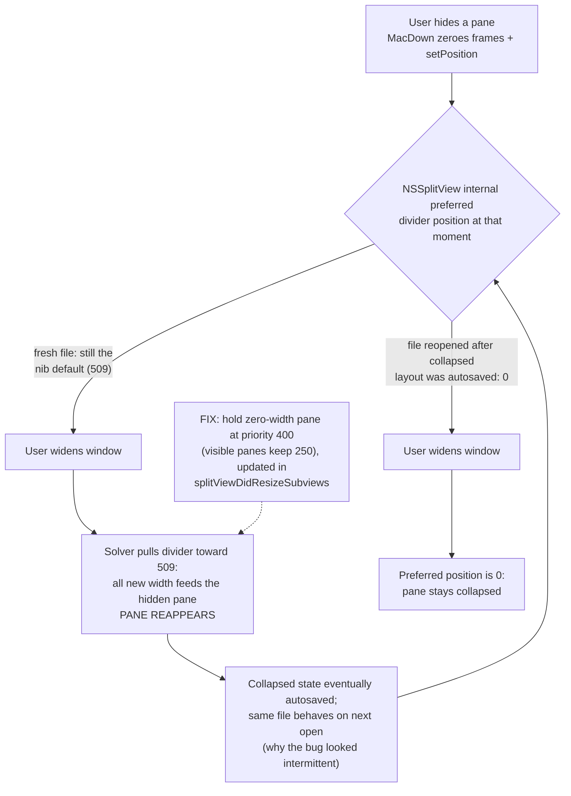

2026-07-11

# MacDown: collapsed pane no longer reopens when the window is resized

## What was broken

In preview-only layout (editor pane hidden — whether via the
default-layout preference, the View menu, or the toolbar layout
switcher), making the window *wider* pulled the hidden editor pane back
open. Worse, every point of new width went to the hidden pane while the
visible preview didn't grow at all. The bug also had a maddening
quality: it seemed to have been fixed at some point, then came back.
It had never been fixed — it was state-dependent (see below), and the
installed build was current with the repo, so "old version in
/Applications" was ruled out early.

## Root cause

MacDown "hides" a pane by zeroing its frame and calling
`-[NSSplitView setPosition:ofDividerAtIndex:]`
(`MPDocumentSplitView.m`). The pane becomes zero-width, but it is not
*collapsed* in NSSplitView's own sense.

The split view is auto-layout managed (the xib has `useAutolayout`,
both panes at equal holding priority 250). In this mode NSSplitView
keeps an **internal preferred divider position** which `setPosition:`
does **not** update. For a file opened for the first time it still
holds the nib default (509 pt); for a reopened file it holds whatever
the per-file split-view autosave last recorded. When the window is
widened, the layout solver re-solves toward that stale preferred
position — reopening the zero-width pane.

That's also why the bug appeared intermittent: window resizes write the
autosave quickly, so once a *collapsed* layout had been saved and the
file was reopened, the preferred position was 0 and resizing behaved
perfectly for that file — while any fresh document still showed the
bug.

## How it was diagnosed

Static analysis found nothing that moved the divider on resize, and
minimal harnesses (even one loading the app's real compiled nib)
behaved correctly. The breakthrough came from injecting probe dylibs
into a second instance of the real app via `DYLD_INSERT_LIBRARIES`
(the bundle is ad-hoc signed without hardened runtime, and launching
the binary directly bypasses LaunchServices single-instancing, so the
user's running MacDown was never touched). Logging pane widths across
scripted resizes showed the smoking gun: with a fresh file opened
preview-only at 673 pt, the editor pane width tracked
`window width − 673` exactly on every widening step, capped at the nib
value 509 — while a file whose collapsed layout had been autosaved
stayed at 0 through the same resizes.

## The fix

`MPDocument` (already the split view delegate) now re-asserts holding
priorities from `splitViewDidResizeSubviews:`, which fires on every
divider change — menu toggles, the default-layout preference at open,
and manual divider drags. A zero-width pane is held at priority 400;
visible panes keep the xib's 250. The visible pane then absorbs all
window-resize deltas, and the solver can no longer drift the collapsed
pane open. Restoring a pane is unaffected because divider placement
happens at required priority, which outranks the hold.

An A/B probe against Release builds confirmed it end-to-end: on the
unfixed binary the editor pane gained every point of widening; on the
fixed binary it stayed at exactly 0 through +500 pt, pane restore and
re-hide worked at any width, shrink/grow cycles held, and the mirrored
case (hidden preview pane) held too.

Shipped as v0.8.2 (build 1121), tagged and installed to /Applications.

One build-system note for future releases: the "Update Build Number"
script phase declares no inputs/outputs, so the build system schedules
it nondeterministically relative to `ProcessInfoPlistFile`; when it
loses the race the product plist keeps the placeholder 0.1/1. The
release was finalized by running `Tools/update_build_number.sh`
manually against the built product and re-signing (ad-hoc, nested
Sparkle framework first). Also, modern Xcode requires
`MACOSX_DEPLOYMENT_TARGET=11.0` on the command line: the project's
10.6–10.8 targets demand the removed `libarclite`.
