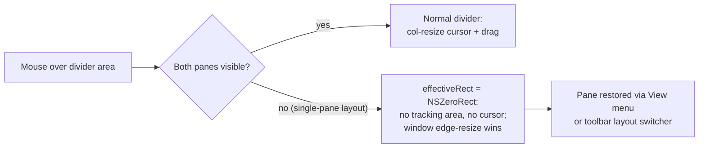

2026-07-12

# MacDown: no divider cursor/drag in single-pane layouts

## What it does and why

In preview-only (or editor-only) layout, the split divider sits flush
against the window edge. Its col-resize cursor kept flickering against
the window-resize cursor in the same few pixels, and an edge drag could
grab the divider instead of the window. Since panes are restored from
the View menu or the toolbar layout switcher — not by dragging the
divider back from the edge — the divider's mouse interactivity has no
job in single-pane layouts.

`MPDocument` (the split view delegate) now implements
`splitView:effectiveRect:forDrawnRect:ofDividerAtIndex:` and returns
`NSZeroRect` whenever only one pane is visible. The divider then gets
no mouse-tracking area at all: no resize cursor, no drag, and the
window's own edge-resize behavior wins cleanly. With both panes
visible the proposed rect is returned unchanged, so normal divider
dragging is untouched.

## Verification

Synthetic mouse down/drag/up events posted into a Release build (same
dyld-probe harness as the v0.8.2 pane-resize fix, documented in the
repo's `.claude/skills/verify/SKILL.md`):

- Preview-only: a 150 pt drag starting at the left window edge left the
  collapsed editor at 0 — the event fell through to the window frame,
  which performed a window edge-resize instead (the desired winner).
  The pane also stayed collapsed through that resize, re-confirming the
  v0.8.2 holding-priority fix.
- Two panes: dragging the divider −100 pt moved it exactly −100 pt.
- Editor-only: a drag at the right window edge left the collapsed
  preview at 0.

Shipped as v0.8.3 (build 1122), tagged, pushed, installed to
/Applications, and the running instance restarted onto the new binary
(a running app keeps executing the old deleted binary after the bundle
is replaced — the same trap that made the v0.8.2 fix look broken).
