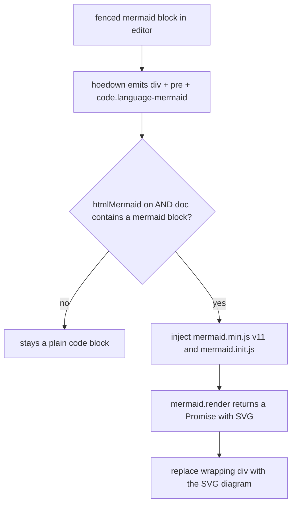

# MacDown — Mermaid diagrams render as code instead of diagrams

**Branch:** `mermaid-v11-rendering` (pushed to `plateaukao/macdown`)
**Commit:** `d99dd44`
**Date:** 2026-06-07

## Problem

In MacDown's preview, ` ```mermaid ` fenced code blocks rendered as **raw code**, not as
diagrams. The mermaid feature already existed (preference `htmlMermaid`, a "Mermaid" checkbox in
HTML preferences, a bundled `mermaid.min.js`, an init script, and renderer wiring), but it produced
nothing visible for real-world diagrams.

## Root Cause

The bundled library was **mermaid v8.4.3 (2019)**, which cannot parse modern mermaid syntax. Proven
by running the *actual bundled library* in a headless WebKit harness:

| Library | Source | Result |
|---|---|---|
| bundled v8.4.3 | `graph LR …` (2019 syntax) | renders, no error |
| bundled v8.4.3 | `flowchart LR …` (modern) | `Error: Parse error on line 1` |
| mermaid v11 | `flowchart` + `sequenceDiagram` | 2 SVGs, in both legacy WebView and WKWebView |

Two contributing/adjacent issues surfaced:

1. **Coupled toggle.** Mermaid scripts were only injected when *both* `htmlSyntaxHighlighting` **and**
   `htmlMermaid` were enabled (mermaid's block was nested inside the syntax-highlighting `if`). Both
   default to off, so a user who ticked only "Mermaid" still got nothing.
2. **Launch crash.** `MPToolbarController.m` indexed an **empty C array**
   (`int spaceAfterIndices[] = {}`) inside a loop — an out-of-bounds stack read. Older toolchains
   happened to read adjacent stack and "worked"; modern Xcode/macOS hardening turns it into a fatal
   `EXC_BREAKPOINT` during toolbar setup, so the app crashed on launch before anything could be
   verified.

## Solution

- **Upgrade** `mermaid.min.js` to **v11** (esbuild dist that still exposes a global `window.mermaid`).
- **Rewrite** `mermaid.init.js` for v11's API: `mermaid.render(id, src)` is now **async** and returns
  a Promise `{ svg, bindFunctions }` (v8 took a synchronous callback). It reads each
  `code.language-mermaid` block and replaces the wrapping `<div>` with the rendered SVG.
- **Decouple** mermaid from syntax highlighting in `MPRenderer` (preview stylesheets, preview
  scripts, and the export path), and make injection **content-aware** — only pull in the ~3.3 MB
  library when the rendered HTML actually contains `language-mermaid` (preview re-renders on every
  edit, so always-loading would tax every keystroke).
- **Default** `htmlMermaid` to YES so diagrams work out of the box.
- **Fix** the `MPToolbarController` out-of-bounds read with a bounds check.



## Key Files

- `MacDown/Resources/Extensions/mermaid.min.js` — v8.4.3 → v11
- `MacDown/Resources/Extensions/mermaid.init.js` — v11 async render API
- `MacDown/Code/Document/MPRenderer.m` — decouple from syntax highlighting; content-aware injection
  (`currentHTMLHasMermaid`); applied to `stylesheets`, `scripts`, and `HTMLForExportWithStyles`
- `MacDown/Code/Preferences/MPPreferences.m` — `htmlMermaid` defaults on
- `MacDown/Code/Application/MPToolbarController.m` — bounds-check fix for launch crash

## Lessons Learned

- **Vendored JS libraries silently rot.** A feature can be fully wired up and still "not work"
  because the bundled library is years out of date and rejects current input syntax. The failure
  looked like "scripts not loading" but the library *was* loading and running — it was throwing a
  parse error.
- **Diagnose with the real artifact.** Loading the exact bundled `mermaid.min.js` into a headless
  `WebView`/`WKWebView` and reading back `window.__err` / SVG count isolated the cause (parse error
  on `flowchart`) far faster than reasoning from the source — and proved the fix in both engines
  before touching the app.
- **Undefined behavior is a time bomb across toolchains.** Indexing a zero-length C array was
  harmless for years until compiler/OS hardening made the same code crash on launch. Worth grepping
  for similar fixed-size-array indexing patterns.
- **Build prerequisites for this repo on modern macOS:** `pod install`,
  `git submodule update --init Dependency/prism`, build with `MACOSX_DEPLOYMENT_TARGET=10.13` (the
  project's 10.8 target can't link — `libarclite` is gone), and ad-hoc `codesign --force --deep
  --sign -` the `.app` (arm64 won't run unsigned).
