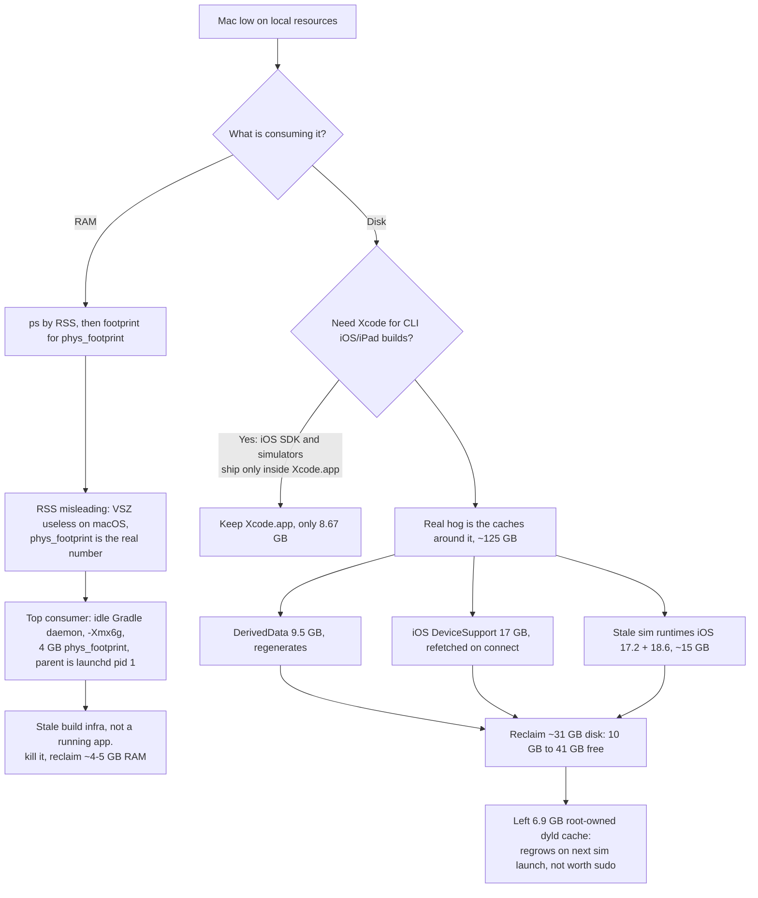

2026-06-21

# Reclaiming local RAM and disk: stale Gradle daemons and Xcode caches

A routine "what's eating my Mac" check turned into a meaningful cleanup. The machine
was quietly being drained from two directions at once — a multi-gigabyte idle JVM in
RAM, and ~125 GB of Xcode caches on a disk that was down to 10 GB free. Neither was an
app the user was actually using. This ADR records what was found, why the obvious
metrics lied, and the decisions made while cleaning up.

## What was wrong

**RAM.** The top "process" by resident memory looked like Arc and a `java` process tied
at ~850 MB. But RSS is a poor proxy on macOS:

- `VSZ` (virtual size) is useless here — it counts the entire mapped address space
  (OrbStack's helper reported an 8.8 *TB* VSZ). It says nothing about real usage.
- `RSS` undercounts dirty private memory. The honest per-process number is
  `phys_footprint` (what Activity Monitor's "Memory" column shows), obtained via
  `footprint -p <pid>`.

Once measured properly, the `java` process was the runaway: **4055 MB phys_footprint**,
roughly 5x its RSS. Its parent was `launchd` (pid 1) and its command line was
`org.gradle.launcher.daemon.bootstrap.GradleDaemon 8.14.5` launched with `-Xmx6g` — an
**idle Gradle build daemon** left over from an earlier Android/Gradle build, detached
and sitting in the background holding ~4 GB. Not a running app; stale build infra.

**Disk.** Separately, the user asked whether the 8.67 GB `Xcode.app` could be dropped in
favor of the Command Line Tools for command-line iOS/iPad builds. It can't — and the
8.67 GB was never the problem anyway.

## Decisions

**Kill idle Gradle daemons.** They self-detach and persist between builds by design (to
keep a warm JVM), so they accumulate. The user killed two, reclaiming ~4–5 GB of RAM.
System memory pressure went back to a healthy 71% free with no remaining `java`/`gradle`
processes.

**Keep Xcode; clean the caches around it instead.** The Command Line Tools provide only
`clang`, git, make, and the **macOS** SDK. The **iOS/iPadOS SDK, the iPhoneOS platform,
and the simulators ship exclusively inside `Xcode.app`** — `xcodebuild` pulls them from
there even for headless builds. So for iOS/iPad work, full Xcode is mandatory and the
.app is the *smallest* part of the footprint. The real ~125 GB lived in regenerable
caches.

Reclaimed (~31 GB net; free space went 10 GB to 41 GB):

| Item | Size | Why safe |
| --- | --- | --- |
| `DerivedData` | 9.5 GB | Build cache; rebuilds on next compile |
| `iOS DeviceSupport` | 17 GB | Debug symbols; re-fetched on next device connect |
| iOS 17.2 + 18.6 sim runtimes | ~15 GB | Stale; re-downloadable on demand. Kept iOS 26.2 / 26.4 |
| Orphaned sim devices | — | `simctl delete unavailable` |

**Left the last 6.9 GB alone.** The remaining `CoreSimulator/Caches` is a root-owned
`dyld` shared cache. It regenerates the instant any simulator next launches, so deleting
it (with an interactive `sudo`) would buy ~7 GB that immediately comes back. Not worth
it. The rest of CoreSimulator (Volumes + Cryptex) *is* the two iOS 26 runtimes being
kept.

## The diagnostic path



## Recurring hygiene

- **Gradle daemons** regrow with every Android/Gradle build. Either run `gradle --stop`
  after builds, or set `org.gradle.daemon.idletimeout` in `~/.gradle/gradle.properties`
  so idle daemons self-terminate.
- **`DerivedData`** and **`iOS DeviceSupport`** silently regrow; safe to wipe anytime
  they balloon.
- Need iOS 17/18 again later? Re-download the runtimes from Xcode → Settings →
  Components (or `xcrun simctl runtime`).

## Useful commands

```bash
# Real per-process memory (not RSS/VSZ)
footprint -p <pid> | grep phys_footprint

# Find a mystery process's identity and parent
ps -p <pid> -o user=,ppid=,lstart=,command=

# Xcode disk hogs
du -sh ~/Library/Developer/Xcode/DerivedData \
       ~/Library/Developer/Xcode/"iOS DeviceSupport" \
       /Library/Developer/CoreSimulator

# Prune simulator runtimes
xcrun simctl runtime list
xcrun simctl runtime delete <runtime-id>
xcrun simctl delete unavailable
```
