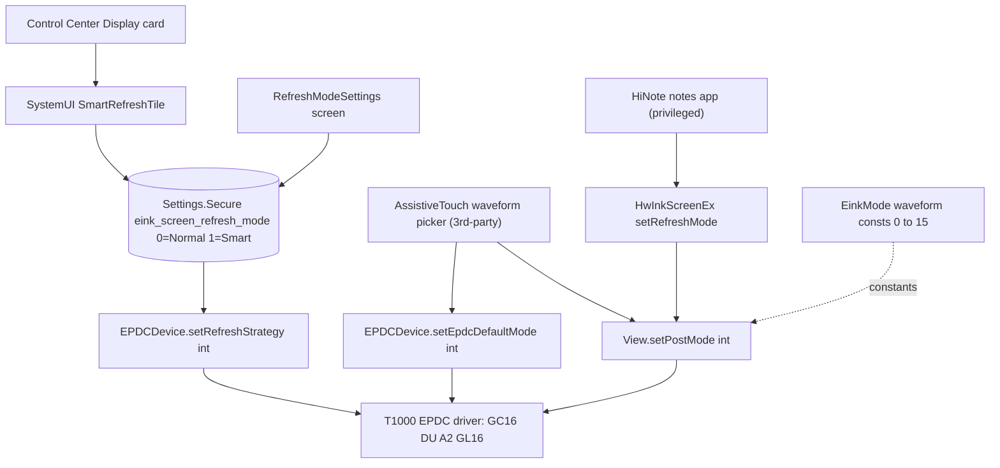
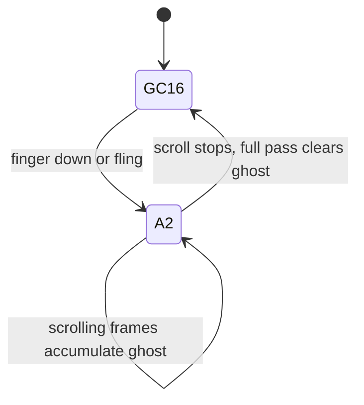

2026-06-24

# Huawei MatePad Paper e-ink refresh modes: reverse-engineering the stack and driving EPD waveforms from a third-party app

## Status

Accepted / Implemented (study + working prototype on device `HMW-W09`, Android 10).

## Context

The question that started this: *does the Notes app have a setting to change the screen
refresh mode?* The device is a **Huawei MatePad Paper** (model `HMW-W09`) e-ink tablet, and
the "Notes app" is **HiNote** (`com.huawei.hinote`). The investigation grew into a full map of
how e-ink refresh is controlled on this ROM — from the user-facing toggle down to the EPD
(Electronic Paper Display) waveform driver — and then into a practical question: **can a normal
third-party app drive these waveforms itself?** This matters because fast/clean e-ink refresh
(A2 for scrolling, GC16 to settle) is the single biggest UX lever on an e-ink device, and it is
not exposed to apps through any public SDK.

All findings below come from static analysis (apktool + jadx) of APKs/JARs pulled from the
device, cross-checked against live behavior (logcat, on-device testing).

## Investigation and findings

### 1. There is no refresh-mode control inside the Notes app

HiNote exposes **no** refresh-mode setting. Its resources contain zero `模式`/`刷新` strings of
that kind; the editor "more" menu only has handwriting-to-text, clear/delete page, share,
export, print, and note-lock. What HiNote *does* have is automatic anti-ghosting:
`com.huawei.hinote.common.residualshadows.EinkResidualShadowsController` calls the framework
`HwInkScreenEx.clearResidualShadows()` after every ~10 strokes (or immediately on dark fills),
throttled to once per second. That is per-app ghosting management, not a user-selectable mode.

### 2. The refresh mode is a system control, and it lives in SystemUI (not Control Center)

The "重新整理模式 / Refresh mode" panel (一鍵重新整理 / 普通模式 / 智慧模式) is rendered in the
**Control Center** (`com.huawei.controlcenter`) but **defined in SystemUI**
(`com.android.systemui`) as a quick-settings plugin:

- Tile: `com.huawei.smartbooklightqs.tiles.SmartRefreshTile` (+ `SmartBookBaseTile`)
- Util/state: `com.huawei.smartbooklightqs.utils.SmartBookQSUtils`
- Long-press opens `android.settings.REFRESH_MODE_SETTINGS_ACTIVITY` →
  `com.android.settings.RefreshModeSettings`.

### 3. The two layers of "refresh mode"

This is the crux. "Refresh mode" means two different things at two layers:

| Layer | Key / API | Values | Who sets it |
|---|---|---|---|
| **Global strategy** | `Settings.Secure "eink_screen_refresh_mode"` → `EPDCDevice.setRefreshStrategy(int)` | **0 = Normal, 1 = Smart** (read as `!= 0`); default 1 | SystemUI tile, Settings screen |
| **Per-view waveform** | `EinkMode` consts → `View.setPostMode(int)` / `EPDCDevice.setEpdcDefaultMode(int)` | **0..15 waveform indices** + flag bits | HiNote (via `HwInkScreenEx`), apps |

So the stored user setting (`eink_screen_refresh_mode`) is effectively a **boolean** — only Normal
or Smart — confirmed in `RefreshModeSettings`: two radio buttons writing `0` and `1`, read back as
`refreshMode != 0 ? smart : normal`. There is **no hidden third value** at that key.

The rich set the panel does *not* expose is the EPD waveform layer in `eink.framework.jar`
(`android.eink.api.EinkMode`):

```
0 INIT      1 DU       2 GC16     3 GC4/GL16/REAGL   4 GCC16/GLR16
5 DU4/GLD16 6 ANIM     7 DU4      13 MOD32           15 AUTO
plus flags: 1BPP=8192, DITHER=256, FAST=131072, UPDATE_FULL=32, A2_1BP=8198, DU_1BP=8193 ...
```

Notably **A2 = `EINK_REFRESH_MODE_A2_1BP = 8198 = 0x2006 = 1BPP(8192) | ANIM(6)`** — i.e. Huawei's
"A2" is the **ANIM waveform (mode 6)** plus the 1-bit flag.

### 4. Architecture



### 5. Access analysis: can a normal app do this?

Two independent gates:

- **Global mode** needs to write `Settings.Secure`, gated by `WRITE_SECURE_SETTINGS`
  (`signature|privileged|development`). HiNote can do it only because it is a **PRIVILEGED SYSTEM
  app** holding that permission. The `development` flag means it is **adb-grantable** to any app
  (`pm grant ... WRITE_SECURE_SETTINGS`) — fine for personal/dev use, not for store distribution.
- **Per-view waveform** (`View.setPostMode`, `android.eink.*`, `HwInkScreenEx`) is hidden,
  non-SDK Huawei framework on the bootclasspath. The device reports `hidden_api_policy = null`
  (default) and `hidden_api_blacklist_exemptions = null` (no exemptions). Static analysis alone
  suggested third-party reflection would likely be blocked; tellingly, neither EinkBro nor
  KOReader (sophisticated sideloaded e-ink apps) ship any Huawei refresh path.

### 6. Empirical result (the surprise)

The static caution was **wrong** for this ROM. A normal sideloaded debug app
(`com.android.mirror.assisttouch`) reflectively called the hidden APIs and **all succeeded**:

```
mode 6: default+ force+ post+
```

i.e. `EPDCDevice.setEpdcDefaultMode(6)`, `EPDCDevice.forceRefresh(6)`, and `View.setPostMode(6)`
all returned without being blocked, and logcat showed the native EPDC layer reacting:

```
EinkSfpatchData_T1000: current epdcMode is 5, hex 0x5; waveform_mode = 5, update_mode = 0
DISPLAY_DITHER_V201_ALGO: huawei_eink_is_enable waveformMode=5 ...
```

So on this device the Huawei e-ink members are **not** hidden-API-blocked in practice — a normal
app can drive EPD waveforms by reflection. (Whether each native command is honored is a separate,
per-command question, but the JNI path is reachable.)

### 7. Behavioral characterization of the waveforms

Observed on device, scrolling content:

- **Mode 6 (ANIM / A2):** fastest; ghosting accumulates heavily *during* the scroll, then the
  screen settles **clean** when scrolling stops (the system issues a full pass on settle). This is
  textbook A2 — the speed comes from skipping the full grey LUT, so motion residue is inherent.
- **Mode 7 (DU4):** 4-level direct update — the usual reading sweet spot (much less smear, still
  fast).
- **Mode 1 (DU):** 2-level, fast, cleaner transitions than ANIM.
- **Mode 2 (GC16):** slowest, full 16-grey, used to clear ghosting.



The "right" UX is **fast waveform only while moving, GC16 on settle** — not a single fixed global
mode.

## Decision

1. **Document** the two-layer model so future work does not conflate the global Normal/Smart
   setting with the per-view EPD waveforms.
2. **Build a probe/experiment tool** rather than guess: a long-press popup in the
   `AssistiveTouch` fork (branch `eink-waveform-mode-picker`, package
   `com.android.mirror.assisttouch`) that lets you pick waveform 0..15 and applies it three ways
   (`setEpdcDefaultMode`, `forceRefresh`, `View.setPostMode`), reporting which calls succeed via a
   toast. This is how the empirical result above was obtained.
3. **Grant `WRITE_SECURE_SETTINGS` via adb** to that package on the device so the same app can also
   flip the global strategy when needed.

## Consequences

**Positive**
- A normal app on this ROM *can* control EPD waveforms (reflection), so an e-ink-aware drawing/
  reading app (e.g. the `supernote_draw` work) can implement A2-on-motion / GC16-on-settle itself,
  no system signature required.
- The probe tool is reusable to characterize any waveform index on any similar Huawei e-ink ROM.

**Negative / caveats**
- Reflection into hidden Huawei APIs is **device/ROM-specific** and **not store-distributable**
  (compile-time references are impossible; behavior may change across firmware).
- The global `eink_screen_refresh_mode` path needs `WRITE_SECURE_SETTINGS` (adb-grant only).
- Fixing a single global waveform (current popup behavior) trades motion ghosting against
  settle-cleanliness; a proper implementation should switch per gesture, not globally.

**Follow-ups**
- Add a "true A2 (8198, 1-bit)" entry and an auto fast-on-fling / GC16-on-stop mode to the picker.
- Verify whether `setRefreshStrategy`/`setEpdcDefaultMode` accept values beyond the UI's {0,1} at
  the driver level (the framework does not bound them).

## Appendix

**Artifacts pulled from device:** `com.huawei.hinote` (78 MB), `HwControlCenter.apk`,
`SystemUI.apk` (46 MB), `Settings.apk` (113 MB), `eink.framework.jar`, `hwframework.jar`,
`framework.jar`, plus EinkBro/KOReader for comparison.

**Key classes:**
`SmartRefreshTile`, `SmartBookQSUtils` (key `eink_screen_refresh_mode`, default 1),
`RefreshModeSettings` / `RefreshModePreferenceController`,
`android.eink.EPDCDevice` (native `nativePostCommand`: `set-refresh-strategy`,
`epdc-default-mode`, `epdc-refresh`), `android.eink.api.EinkMode` (waveform consts),
`com.huawei.android.view.HwInkScreenEx` (`isValidMode` gates per-view modes by the global
Smart/Normal flag), `com.huawei.hinote.common.residualshadows.EinkResidualShadowsController`.

**On-device setup used:**
```
adb install -r -g app-debug.apk
adb shell pm grant com.android.mirror.assisttouch android.permission.WRITE_SECURE_SETTINGS
adb shell appops set com.android.mirror.assisttouch SYSTEM_ALERT_WINDOW allow
adb shell settings put secure enabled_accessibility_services \
    com.android.mirror.assisttouch/.service.AssistiveTouchService
```
