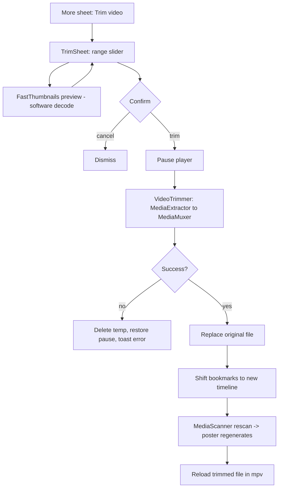

# mpvEx — Lossless Video Trim with Scrub Preview

## Summary

Added a head/tail **video trim** to the mpv-based player: the user crops the start and/or
end of the currently playing video and the kept range is written back **over the same file**.
The trim is **lossless** (stream copy, no re-encode), reachable from the player's More (⋯)
sheet. The trim sheet shows a **live frame preview** that tracks the slider handle being
dragged, so the user can see exactly where each cut lands.

Scope was deliberately narrowed with the user up front: crop prefix/postfix only (no
mid-clip removal), overwrite in place (not export-to-new-file), and fast + lossless for the
common MP4 family rather than full-format coverage.

## Approach

**Engine — stream copy, no re-encode.** `VideoTrimmer` uses `MediaExtractor` -> `MediaMuxer`
to copy the compressed samples of the kept range into a fresh MP4. It seeks to the keyframe
at/before the requested start (`SEEK_TO_PREVIOUS_SYNC`), rebases timestamps to zero, and
preserves rotation via `setOrientationHint`. Consequences of staying lossless: the **start
snaps to the nearest keyframe** (the first output frame must be independently decodable),
while the **end is sample-accurate**. Format coverage is whatever `MediaMuxer` can write
(MP4 family: H.264/HEVC/AV1 + AAC); unsupported inputs (e.g. MKV) fail gracefully via
`addTrack` throwing, leaving the original untouched. Android's platform muxer was chosen over
bundling FFmpeg to avoid APK bloat and the maintenance burden of a post-FFmpegKit world.

**Safe in-place overwrite.** The muxer writes to a cache temp file (it needs a seekable fd to
finalize the MP4 `moov` atom, which SAF output streams don't reliably provide). Only after a
fully written temp does it replace the original: for `file://` it stages a sibling and
`renameTo` (atomic on the same filesystem) with an in-place-copy fallback; for `content://`
it truncates and rewrites via `openOutputStream(uri, "wt")`. A failure anywhere leaves the
source intact. The player is paused during the rewrite and the trimmed file is reloaded after.

**Scrub preview — avoiding decoder contention.** First implementation used
`MediaMetadataRetriever.getScaledFrameAtTime`, which stalled for tens of seconds: it decodes
on the **hardware** codec, and while the trim sheet is open the player still holds the HW
decoder — phones expose only a few HW codec instances, so the retriever blocked. The fix was
to switch `FramePreviewer` to the app's existing libmpv thumbnailer (`FastThumbnails`) with
**software decode** (`useHwDec = false`), the same fast path the library grid uses. It seeks
to the nearest keyframe, caches results (so re-dragging a spot is instant), and the start
handle's preview mirrors the keyframe snap. `MediaMetadataRetriever` survives only as a
fallback for sources FastThumbnails can't open, disabled after its first failure so it can't
repeatedly stall. Decoding is debounced (about 90 ms) so dragging doesn't queue a decode per pixel.

**Side effects of changing the file.** Bookmarks for the video are rebased onto the new,
shorter timeline: kept bookmarks shift left by the cropped prefix, those falling in the
removed head/tail are deleted with their thumbnails. The library poster thumbnail is cached
in `ThumbnailRepository` by `size | dateModified | duration` — all of which shrink on trim —
so a `MediaScannerConnection.scanFile` re-index is enough to make the browser compute a new
content key and regenerate the poster from the new first frame. Bookmark thumbnails need no
regeneration: a kept bookmark points at the same moment, so its frame content is unchanged.

## Trade-offs

- **Start is keyframe-aligned, not frame-exact.** Inherent to lossless trimming; surfaced in
  the UI ("the start snaps to the nearest keyframe") and the start preview shows the real
  keyframe, not an idealized position. Frame accuracy would require re-encoding the leading
  GOP.
- **MP4 family only.** Lossless remux is bounded by `MediaMuxer`'s writable formats. MKV/AVI
  fail with a toast rather than silently re-encoding. Full coverage would mean bundling FFmpeg.
- **Destructive by design** (the user asked for in-place overwrite). Mitigated by
  temp-then-replace so a failure can't corrupt the original, plus an explicit confirm dialog.
- **`content://` write-back can fail** when the source was opened read-only (e.g. some "open
  with" intents). Handled gracefully; the in-app `file://` browse path is the happy path.
- **Preview spins up a second libmpv (software) decode** alongside playback. Cheap for a
  single keyframe and avoids the HW-decoder contention that made the first approach unusable.

## Key Files

- `utils/media/VideoTrimmer.kt` — stream-copy trim engine (new).
- `utils/media/FramePreviewer.kt` — FastThumbnails-based scrub preview, MMR fallback (new).
- `ui/player/controls/components/sheets/TrimSheet.kt` — range slider + preview + confirm,
  and the trim progress overlay (new).
- `ui/player/PlayerViewModel.kt` — `trimVideo()`, safe in-place `replaceOriginal()`,
  bookmark rebasing, MediaStore rescan, trim/preview state, `currentTrimSource()`.
- `ui/player/PlayerActivity.kt` — `reloadCurrentVideo()` (re-open after overwrite).
- `ui/player/controls/{PlayerSheets,PlayerControls}.kt`,
  `ui/player/controls/components/sheets/MoreSheet.kt`, `ui/player/PlayerEnums.kt` — More-sheet
  entry, sheet wiring, progress overlay.
- `database/dao/BookmarkDao.kt`, `database/repository/BookmarkRepository.kt` —
  `getBookmarksByMedia` + `shiftBookmarksAfterTrim`.
