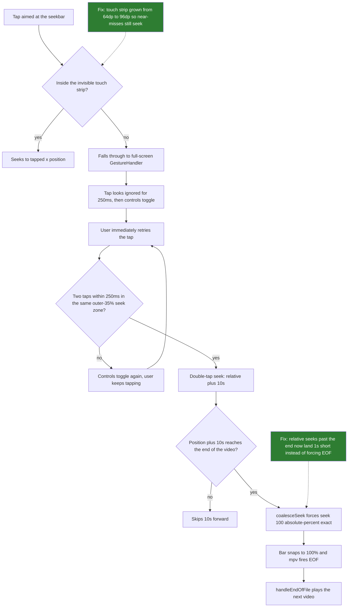

2026-08-10

# mpvEx: imprecise seekbar tap snapped progress to 100% and skipped to the next video

## What was broken

Tapping the player's bottom seekbar to jump forward or backward worked when the tap
landed on the bar, but a slightly-off tap could make the progress bar snap to 100%
and immediately advance to the next playlist video. From the user's point of view a
small aiming error turned into "video skipped".

## Root cause

The 100% jump never came from the seekbar's own tap math — that path is clamped.
It was a cascade across three layers:

1. **The seekbar's real touch target is a thin invisible strip** (64dp tall,
   `Seekbar.kt`). Anything outside it falls through to the full-screen
   `GestureHandler` composed behind the controls.
2. **A missed tap looks ignored.** GestureHandler waits 250ms before running the
   single-tap action (toggle controls), so the natural reaction — tap again — forms
   a *double tap*. The left/right double-tap zones are each the outer 35% of the
   screen and default to Seek (+/-10s), and you tap the right side of the bar
   precisely when seeking forward. A 650ms "multi-tap continuation" window let every
   further frustrated tap stack another +10s.
3. **The kicker:** `PlayerViewModel.coalesceSeek()` contained an explicit rule that
   any relative seek reaching past the end runs
   `seek 100 absolute-percent+exact` — deliberately forcing EOF "to ensure EOF is
   triggered". EOF makes `handleEndOfFile()` call `playNext()`. So near the end of a
   video (or on short clips), the accidental double-tap seek became: bar snaps to
   100%, mpv fires EOF, next video starts.

A second, latent contributor: the seekbar's gesture handlers are registered with
`pointerInput(Unit)`, and a `pointerInput` block only restarts when its *key*
changes — recomposition does not re-capture the lambda. The handlers therefore kept
the `duration` (and callbacks) captured at first composition. If the playlist
advanced to a shorter video while the controls stayed on screen, tap positions were
computed against the *previous* video's duration, overshot the real one, and got
clamped to the end — same 100% + EOF symptom, this time even from a tap that hit
the bar.

## The fix (commit `4d308b2` on `ui_modified`)

- **`PlayerViewModel.coalesceSeek()`**: a relative seek past the end now lands 1s
  short of it (`seek <duration-1> absolute+exact`) instead of forcing EOF. A stray
  double-tap worst-case skips near the end; the last second plays out and the
  playlist advances naturally.
- **`PlayerViewModel.seekTo()`**: absolute seeks are clamped to `duration - 1`, so
  tapping or dragging to the bar's right edge can no longer fire EOF mid-scrub.
- **`Seekbar.kt`**: the tap/drag handlers read `duration`, `onValueChange`, and
  `onValueChangeFinished` through `rememberUpdatedState`, eliminating the stale
  capture; and the invisible touch strip grew from 64dp to 96dp so a near-miss tap
  seeks to where the user aimed instead of arming the double-tap gesture layer.

The intentional ways to reach the next video (the skip-next button, natural
playback to EOF) are unaffected.
