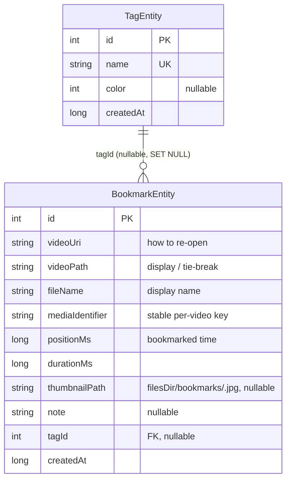
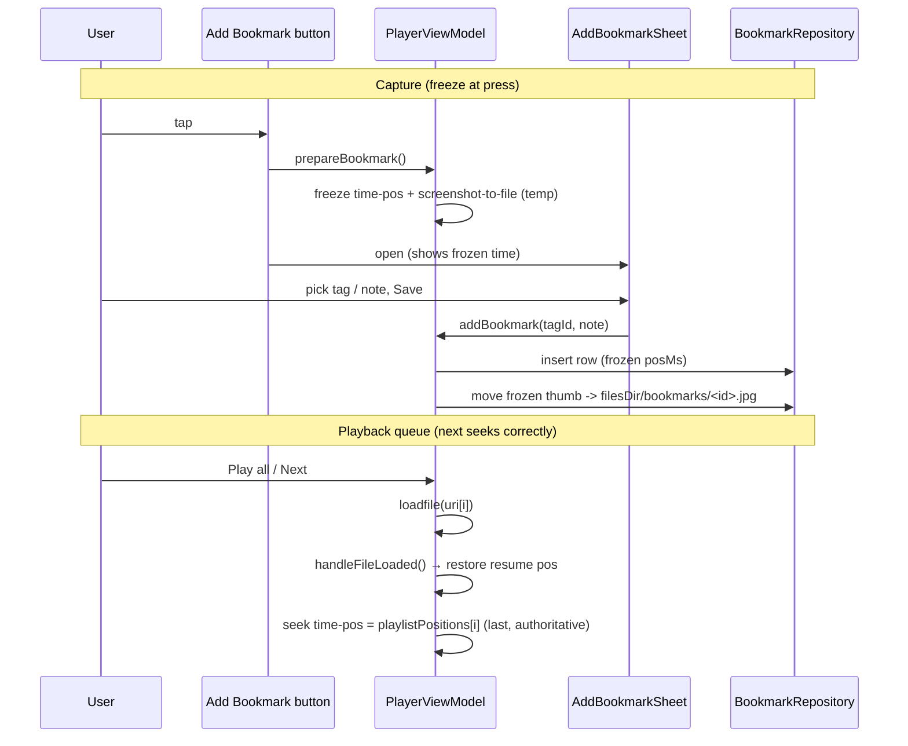

# mpvEx — Video bookmarks with tag playlists

## Summary

mpvEx now lets you mark a **specific moment inside a video**: tapping an
**Add Bookmark** button in the player records the video, the exact playback
timestamp at the instant the button was pressed, and a thumbnail of that frame.
A bookmark may carry **one optional tag**, and each tag behaves like a playlist
of moments — opening it plays each bookmarked file in turn, seeking straight to
the bookmarked time, while the player's **next / previous** controls walk the
bookmarks that share the tag.

The bookmarks browser lives **inside the Playlists tab** (a chip row of
tags: All / Untagged / each tag), and its detail list supports the same
**list/grid layout and sorting** controls as the Home browser.

Three product decisions shaped the design:

- **One nullable tag per bookmark** — no many-to-many join table.
- **Surfaced in the existing Playlists tab** — no new bottom-nav destination.
- **Tags are optional** — a bookmark saves immediately; tagging is a follow-up.

## Approach

### Data model

Two new Room entities. A bookmark points at a video by **`mediaIdentifier`**
(the same stable key the player already uses for resume state — `fileName` for
local files, `fileName + uriHash` for network streams), so identical filenames
and re-opened streams round-trip correctly. The tag is a nullable foreign key
with `ON DELETE SET NULL`, so deleting a tag leaves its bookmarks as "Untagged"
rather than destroying them.

### Migration into a quirk

The database was at `version = 8`, but `DatabaseModule` already **registered a
`MIGRATION_8_9`** — a pre-staged PlaybackState "repair" migration that never ran
(Room only executes an `(8,9)` migration once the DB version is bumped to 9).
Rather than introduce a second, conflicting `(8,9)` migration (Room forbids
duplicates), the new `CREATE TABLE` statements were **appended to that existing
migration body** and the DB bumped to `version = 9`. The migration SQL was
verified against Room's generated `9.json` (column order, the
`ON UPDATE NO ACTION ON DELETE SET NULL` foreign-key clause, every index) so the
runtime schema-validation passes — important because `fallbackToDestructiveMigration(true)`
would otherwise silently wipe data on a mismatch. Confirmed on-device: an
in-place 8→9 upgrade preserved existing playback state and created the tables.

### Capturing the moment — freeze at button-press

The capture is **frozen when the button is pressed**, not when the user finishes
picking a tag. This matters because the tag sheet stays open while the video
keeps playing; reading the position at *save* time would drift by however long
the user dawdled. `prepareBookmark()` runs on the button press: it snapshots the
precise `time-pos` and writes a `screenshot-to-file` of the current frame to a
temp file. The tag sheet shows that frozen timestamp, and `addBookmark()` reuses
the frozen position + pre-captured frame on save (falling back to a live capture
only if the screenshot failed). The save path **claims the frozen state
synchronously** before launching its coroutine, so a concurrent dismiss/discard
can't race it. A row is always inserted first, so a failed screenshot just
yields a thumbnail-less bookmark rather than losing the bookmark.

### Playback as a queue, and the seek-authority fix

A bookmark queue is launched through the **existing playlist intent path** plus
one new extra: `playlist_positions` (a `LongArray` parallel to the `playlist`
URIs, milliseconds per item). `MediaUtils.playBookmarks()` builds it.

The subtle part was *where* to apply the per-item seek. The first attempt set
`time-pos` immediately after the asynchronous `loadfile` command — which raced
the file load and, worse, was overwritten on every "next" by two things in
`handleFileLoaded()`: `setIntentExtras()` re-applying the intent's single
`position` extra (the *first* bookmark's time), and `loadVideoPlaybackState()`
restoring that video's saved resume position. The fix applies the bookmark seek
**last, at the end of the file-loaded coroutine**, after the resume restore — so
it is authoritative for every item, first and next alike. Regular playlists and
single videos carry an empty `playlistPositions`, so their normal resume
behaviour is untouched.

### Browser UI

The **Add Bookmark** control is a new entry in the customizable player-button
system (`PlayerButton.ADD_BOOKMARK`), added to the default control layouts so
fresh installs show it; existing installs can add it via the Control Layout
Editor since their layout is a persisted preference.

In the Playlists tab, `BookmarkTagsSection` renders a horizontal chip row
(All / Untagged / each tag with counts) that opens `BookmarkTagScreen`. That
screen reuses the Home browser's view machinery: it switches between
`LazyColumn` and `LazyVerticalGrid` on the shared `mediaLayoutMode`, and a
`BookmarkSortDialog` (wrapping the shared `SortDialog`) offers the layout
toggle, a grid-column slider, and bookmark-specific sort fields (Date Added /
Timestamp / Title). The play queue follows the **sorted display order**, so
"next" walks bookmarks in the order the user sees them. A startup sweep removes
orphaned thumbnail files with no matching bookmark id.

## Trade-offs

- **One tag per bookmark.** Simpler model and UI; to put one moment into two
  tag-playlists the user makes two bookmarks. A cross-ref join table was the
  alternative and was explicitly declined for v1.
- **Extending the inert `MIGRATION_8_9`** rather than adding a clean `(9,10)`
  step. It keeps a single 8→9 path (Room requirement) and is idempotent via
  `CREATE TABLE IF NOT EXISTS`, at the cost of one migration that does two
  unrelated things (PlaybackState repair + bookmark tables).
- **Pre-capturing the thumbnail on every press**, even if the user cancels,
  leaves at most one small temp file in `cacheDir` (overwritten each press, OS
  reclaims it). Accepted to keep the timestamp and thumbnail consistent and to
  avoid temp-file lifecycle races.
- **Grid/sort prefs reuse the shared video layout prefs** (`mediaLayoutMode`,
  `videoGridColumns*`) rather than bookmark-specific ones, so changing the
  bookmark grid also affects the video grid. Only the *sort* prefs are
  bookmark-specific. Acceptable for consistency; revisit if they should diverge.
- **`content://` permissions can expire** for externally-opened files; a queued
  item that fails to load should fall through to the next rather than stall.

## Key Files

New:

- `database/entities/{TagEntity,BookmarkEntity}.kt` — the two entities.
- `database/dao/BookmarkDao.kt` — DAO + `TagWithCount` projection.
- `database/repository/BookmarkRepository.kt` — CRUD, `getOrCreateTag`,
  thumbnail/orphan cleanup.
- `ui/player/controls/components/sheets/AddBookmarkSheet.kt` — tag/note picker.
- `ui/browser/bookmarks/{BookmarkTagScreen,BookmarkTagsSection,BookmarkSortDialog}.kt`
  — the Playlists-tab section, the detail list, and its sort/view dialog.
- `ui/browser/cards/BookmarkCard.kt` — list + grid card.

Modified:

- `database/MpvExDatabase.kt` — `version = 9`, entities, `bookmarkDao()`.
- `di/DatabaseModule.kt` — extended `MIGRATION_8_9`, `BookmarkRepository` DI.
- `ui/player/PlayerActivity.kt` — `currentBookmarkContext()`,
  `playlistPositions`, and the authoritative per-item seek in
  `handleFileLoaded()`.
- `ui/player/PlayerViewModel.kt` — `prepareBookmark()` / `addBookmark()` /
  `discardPendingBookmark()`, frozen-moment state.
- `ui/player/PlayerEnums.kt`, `ui/player/controls/{PlayerControlsShared,PlayerSheets}.kt`,
  `preferences/PlayerButton.kt`, `preferences/AppearancePreferences.kt` — the
  `AddBookmark` sheet + the `ADD_BOOKMARK` player button and default layout.
- `utils/media/MediaUtils.kt` — `playBookmarks()` queue launcher.
- `preferences/BrowserPreferences.kt`, `utils/sort/SortUtils.kt` — bookmark sort
  prefs/enum and `sortBookmarks()`.
- `ui/browser/playlist/PlaylistScreen.kt`, `App.kt` — section wiring + startup
  orphan-thumbnail sweep.

Commits (branch `ui_modified`, pushed to `plateaukao/mpvEx`):
`92c713c` (feature), `5623cf5` (per-item seek fix), `d37215a` (list/grid + sort).
