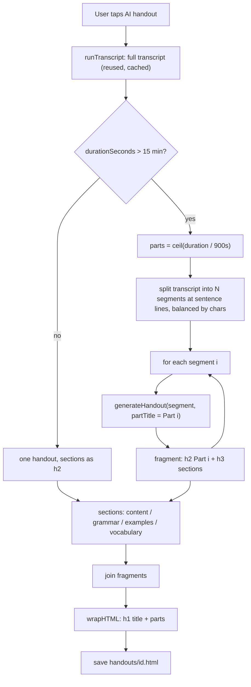

2026-06-16

# NerLan — AI handout: split long episodes into about 15-minute Part I/II/III sections

## Summary

NerLan's AI handout turns an episode's transcript into an HTML study sheet via
OpenAI. Previously it produced a single handout with three sections (文法重點 /
例句 / 單字) regardless of episode length, which got unwieldy for long episodes —
a 40-minute lesson collapsed into one flat list that didn't track the lesson's
progression.

The handout now adapts to length:

- **≤ 15 min** — one handout with **four** sections: **內容說明** (new — a short
  content explanation), **文法重點**, **例句**, **單字**.
- **> 15 min** — split into about 15-minute **Part I / II / III…** sections, each
  labelled with its audio time range (e.g. `Part I（00:00–15:00）`) and each
  containing the same four sub-sections.

This applies uniformly to NER language episodes and to podcasts (both flow
through the same `AIContentStore.runHandout`).

## Approach

**Split the transcript, not the audio.** The transcript is already produced (and
cached) for the standalone transcript feature, so the handout reuses it rather
than re-chunking and re-transcribing the audio. Re-transcription would double the
paid Whisper cost for no benefit. Part count is `ceil(durationSeconds / 900)`,
and the transcript is divided into that many contiguous segments, broken only at
line (sentence) boundaries and balanced by character count — since speech is
roughly uniform, each segment approximates one 15-minute audio span. The only
added cost is one (cheap) chat completion per part.

**Duration drives the split; the time labels come from the audio clock.** Each
`EpisodeRecord` carries `durationSeconds` (NER episode length, or a podcast's
`itunes:duration`). The part header's time range uses the real 15-minute audio
boundaries (`00:00–15:00`, `15:00–30:00`, last part ends at the true duration),
while the *content* mapping is the approximate text split. When duration is
unknown (older records), it falls back to splitting by transcript length
(about 3500 chars ≈ 15 min) and omits the time range, showing just `Part I`.

**Heading levels keep the document readable.** A single chat call per part returns
the four sections as a fragment. For multi-part episodes the four sections are
`h3` and the code prepends a deterministic `<h2>Part N（range）</h2>` (so numbering
and time ranges are never left to the model); for single-part episodes the four
sections stay at `h2`. Wrapped by `wrapHTML`, the hierarchy reads: episode title
(h1) → Part N (h2) → 內容說明/文法重點/例句/單字 (h3). Roman numerals are generated
in code.

## Trade-offs

- **Text-proportional split, not exact audio timestamps.** The transcript has no
  per-line timing, so a part's content boundary can drift from its labelled time
  range by a sentence or two. Exact alignment would require timestamped
  transcription (word/segment timings) — deferred; the approximation is more than
  adequate for a study aid and avoids a transcription-format change.
- **More chat calls for long episodes.** An hour-long episode is 4 parts = 4 chat
  completions instead of 1. Chat is far cheaper than transcription and the parts
  are generated sequentially with per-part progress (`生成講義中…（2/4）`).
- **A 16-minute episode yields a tiny Part II.** `ceil` means just-over-15-min
  audio produces a second part covering only the final minute. Accepted as the
  literal, predictable interpretation of "longer than 15 minutes → 15-min parts."
- **Only applies on (re)generation.** Handouts saved before this change keep their
  old three-section form until regenerated (long-press the handout icon → 重新產生).

## Key Files

iOS (`~/src/nerlan`):

- `NerLan/Sources/OpenAIService.swift` — `generateHandout` gains an optional
  `partTitle`; emits the four sections (內容說明 added) at `h2`/`h3` and prepends
  the `Part …` heading when chunked.
- `NerLan/Sources/AIContentStore.swift` — `runHandout` computes the part count,
  splits the transcript (`handoutSegments`), generates per part, and joins;
  `partTitle` / `romanNumeral` / `timeStamp` helpers; `handoutPartSeconds = 900`.
- `NerLan/Sources/Models.swift` — `EpisodeRecord.durationSeconds` (already added
  for podcasts) is what the split keys on.

A matching change will mirror to the Android app (`plateaukao/nerlan-android`).
