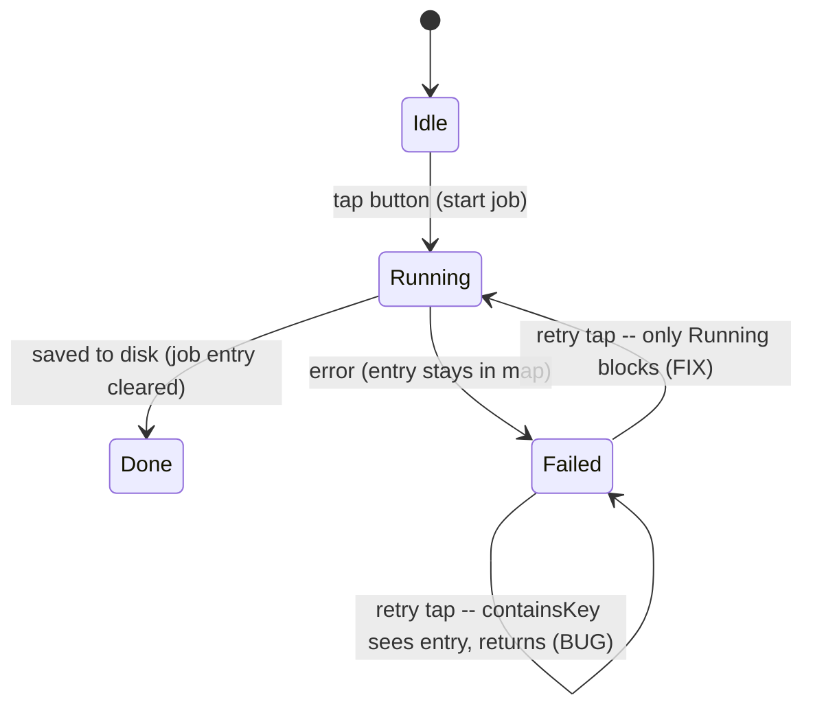

2026-07-07

# NerLan: the AI error dialog's 重試 button was a permanent no-op

## What was broken

When a transcript or handout job failed (bad API key, no network, OpenAI error), the
button showed the error icon and tapping it opened the failure dialog with a 重試
(retry) button — but tapping 重試 did nothing. No spinner, no new attempt, no new
dialog. The only recovery was killing the app or discovering the long-press →
重新產生 menu. Reproduced on the emulator with an invalid API key: after the first
failure dialog, 重試 produced no activity for 45 seconds (a real attempt fails and
re-shows the dialog within ~30 s).

## Root cause

`AIContentStore.processTranscript` / `processHandout` guarded new runs with

```kotlin
if (_jobs.value.containsKey(k) || hasTranscript(record.id)) return
```

A failed run leaves `JobState.Failed` in `_jobs` (that's what drives the error icon),
so the key is present forever and `containsKey` treats "failed" as "already running".
The retry button routes straight back into this guard. `translate()` already used the
correct check (`is JobState.Running`) — the other two triggers were the anomaly.



## Fix

Both guards now block only on a *running* job:

```kotlin
if (_jobs.value[k] is JobState.Running || hasTranscript(record.id)) return
```

Verified on the emulator: with an invalid key, first tap fails and shows the dialog;
tapping 重試 now starts a fresh run (spinner) and the second failure dialog
auto-appears ~30 s later — the retry actually executes.

Commit: `22b0f6f` in nerlan-android.
