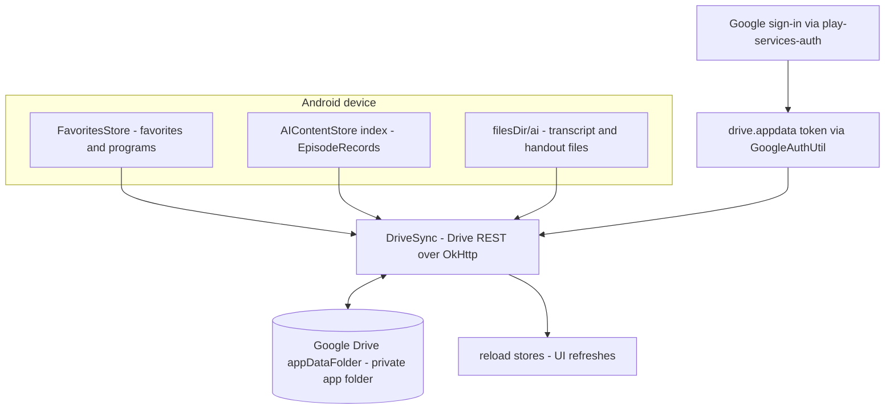

# NerLan Android — AI tab, large-screen two-pane & Google Drive sync

## Summary

Brings the Android app to parity with the recent iOS work and adds cross-device
sync: a record index + AI tab, a tablet/large-screen two-pane layout, and
syncing of favorites and AI study content to the user's own Google Drive
(appDataFolder). Audio is never synced. (A separate small commit ported the iOS
transcript-punctuation prompt refinement.)

## Approach

### Parity (mirrors iOS)
- **Record index:** `AIContentStore` now keeps `ai/index.json` (`Map<id,
  EpisodeRecord>`, a `records` StateFlow), written on generation and backfilled
  at launch from downloads/favorites. It powers the **AI tab** — episodes with a
  transcript/handout, grouped by program or language, reusing `RecordRow` in an
  `aiReadyOnly` mode that opens existing content without an API key.
- **Two-pane:** the transcript/handout/PDF dialog bodies were extracted into
  reusable `*Content` composables (with a shared `leading` slot) used by both the
  phone dialogs and the panel. At width **≥ 800dp** (the tablet in landscape),
  `MainScreen` renders a browser pane + a `StudyDetailPanel`. A
  `StudyPanelController` provided via `LocalStudyPanel` (null on phones) routes
  the AI/講義 buttons to the panel vs. a dialog — the Android analog of iOS
  `StudyPanel`/`usesSidePanel`. Playback auto-loads the episode's content (PDF
  handout → AI handout → transcript). A chevron toggle in the panel header
  collapses/restores the browser pane for full-width reading. The detail pane is
  raw (not in a `Scaffold`), so it's inset from the system bars with
  `windowInsetsPadding` — without it the header sat under the status bar (found on
  the e-ink tablet). The handout WebView has pinch-to-zoom enabled.

### Google Drive sync (chosen over Firebase)
The closest analog to the iOS iCloud model — data lives in the **user's own**
Drive, app-private, at no developer cost.

Key decisions:
- **Lightweight stack.** `play-services-auth` for sign-in + the `drive.appdata`
  token via `GoogleAuthUtil`; the Drive REST API is called directly over the
  app's existing OkHttp client. This avoids the heavy, R8-finicky
  `google-api-client` dependency tree (and core-library-desugaring) that the
  official Drive client would pull in.
- **No built-in auto-sync.** Unlike iCloud, Android has no OS-level account-tied
  file/KV sync, so `DriveSync` runs the sync itself on launch / sign-in / a
  manual "立即同步". (Push-on-change is a future enhancement.)
- **Merge model:** small metadata (favorites, programs, AI index) is
  **union-merged by id**; write-once content files are **copied if missing**.
  After a pull, `FavoritesStore.reload()` / `AIContentStore.reloadIndex()`
  refresh the flows so the UI updates.
- **No JSON/secret in the app.** An Android OAuth client authorizes by package
  name + SHA-1; nothing is embedded. Sign-in failures (notably
  `DEVELOPER_ERROR`/10 before the Cloud client is registered) are surfaced in the
  settings status text rather than swallowed.

## Trade-offs

- **Setup burden:** Drive sync needs a one-time Google Cloud setup (enable Drive
  API, OAuth consent screen with the `drive.appdata` scope + test user, Android
  OAuth client with package + SHA-1). iCloud needed none of this.
- **Deletions of favorites don't propagate** cross-device (union-merge);
  additions and reinstall-restore do — a backup tradeoff matching the iOS sync.
- **Not real-time** — syncs on launch/sign-in/manual.
- `GoogleSignIn` is Google-deprecated (Credential Manager is the successor) but
  remains the simplest reliable way to obtain the Drive scope token on minSdk 24.

## Key Files

- `data/AIContentStore.kt` — record index, `recordsWithContent()`, `reloadIndex()`.
- `ui/AiTabScreen.kt` — new tab; `ui/StudyPanel.kt` — controller + `StudyDetailPanel`.
- `ui/MainScreen.kt` — 4th tab + two-pane split + auto-load on play.
- `ui/{TranscriptDialog,HandoutDialog,AttachmentViewer}.kt` — extracted `*Content`.
- `ui/FavoritesScreen.kt` (`RecordRow` ready-only + panel routing),
  `ui/AiActions.kt`, `ui/PlayerSheet.kt` — panel routing.
- `data/DriveSync.kt` — new; sign-in, token, REST sync engine.
- `data/SettingsStore.kt` (`syncToDrive`), `ui/SettingsScreen.kt` (sign-in UI),
  `NerLanApp.kt` (instantiate + launch sync), `data/FavoritesStore.kt`
  (`reload()`), `app/build.gradle.kts` + `gradle/libs.versions.toml`
  (play-services-auth).
