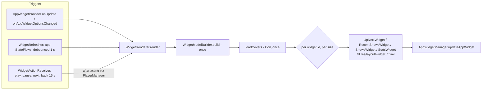

2026-08-28

# APK 4.65 MB to 3.36 MB: locale filter, packaging excludes, widgets off Glance

After the media3 keep-rule fix
([nerlan-android-media3-r8-keep-rule-scoped](nerlan-android-media3-r8-keep-rule-scoped.md))
the release APK was 4.65 MB. An `apkanalyzer` pass over what remained found three
things worth cutting, in ascending order of effort; together they take it to
3.36 MB (−28%), and 5.26 → 3.36 MB (−36%) across the day.

| | what | saving |
|---|---|---|
| 1 | `localeFilters` | −454 KB |
| 2 | packaging excludes | −31 KB |
| 3 | Glance → RemoteViews for the four widgets | ≈ −800 KB |

## 1. Locale filter

`resources.arsc` was 702 KB, stored uncompressed in the APK. `aapt2 dump` showed
**87 locales** of strings — not the app's (its UI strings live in Kotlin) but
appcompat's, media3-session's and Google Play services'. The user only ever sees
a handful of those (media3's notification action labels, essentially), so
`androidResources.localeFilters` keeps `en`, `zh-rTW`, `zh-rHK`, `zh-rCN`, `ja`
and `ko`; the arsc drops to 248 KB.

## 2. Packaging excludes

Licence copies under `META-INF/androidx/**`, `META-INF/*.version` markers,
`kotlin/**` builtins metadata (only kotlin-reflect reads it) and `DebugProbesKt.bin`
— 31 KB of files nothing at runtime opens.

## 3. Widgets: Glance replaced by plain RemoteViews

The four home-screen widgets (繼續收聽, 最近播放, 我的節目, 學習紀錄) were written in
Glance. Glance is Compose for RemoteViews, and it pays for that abstraction in the
APK:

- `glance-appwidget` ships **913 generated layout XMLs** — its layout matrix of
  every Row/Column/Box combination. Those were essentially the entire `res/` of the
  APK (1,171 XML files, 534 KB), and resource shrinking can't remove them because
  Glance references them from code.
- It drags in WorkManager (→ Room) and DataStore (→ its own protobuf runtime):
  ~480 KB of dex, all of which had to be force-kept in `proguard-rules.pro` for
  reflection (three separate release-only crashes had been traced to R8 stripping
  bits of WorkManager and Room — see the removed rule blocks' comments).

The rewrite keeps the same four widgets, the same receivers (so widgets already
on a home screen survive the update), the same `nerlan://` deep links, the same
size-adaptive layouts and the same visual design, on the platform API:

Design points that came out of the port:

- **Sizes.** Glance's `SizeMode.Exact` re-composed for the widget's real size. On
  API 31+ the launcher lists every size the widget can take
  (`OPTION_APPWIDGET_SIZES`), so the renderer builds one `RemoteViews` per size and
  hands the launcher the map; below that it falls back to the portrait/landscape
  pair. The row/column/grid maths is unchanged from the Glance code.
- **Dynamic sizing without API 31.** RemoteViews can't set a view's size at
  runtime before API 31, which the 我的節目 grid needs. Cover bitmaps are instead
  rendered at the wanted dp and given a `Bitmap.density` such that a
  `wrap_content` ImageView measures to exactly that size; pixels are capped at
  176 and the host scales up, as Glance did with its 128 px sources.
- **Dynamic rows.** `RemoteViews.addView` nests one layout per row, so list rows
  and grid cells are still driven by data.
- **Colours.** `GlanceTheme` became `res/values/colors.xml` (M3 baseline),
  `values-night`, and `values-v31` / `values-night-v31` mapping to the system's
  dynamic `system_accent1_*` / `system_neutral*` colours — the same split Glance
  made internally.
- **Actions.** Glance `ActionCallback`s became broadcasts to
  `WidgetActionReceiver`, which does the same `PlayerManager` calls under
  `goAsync()`. Extras don't take part in `PendingIntent` identity, so each
  intent's request code hashes its action and extras.
- **Pinned shows.** The 我的節目 selection moved from Glance's DataStore state to
  `SharedPreferences` keyed by widget id. Existing pins are not migrated — a
  previously configured widget falls back to automatic ordering until it is
  reconfigured.

Verified on the API 34 emulator: all four widgets placed and rendered with real
data (cover art, progress, play button, empty states, dark dynamic colours).

What's left in the 3.36 MB is mostly the floor: Compose (~1 MB of dex),
ExoPlayer + session (~750 KB), the app itself. Two smaller candidates were noted
but not taken: dropping `media3-transformer` for MediaCodec/MediaMuxer (also
sheds lottie, appcompat, coroutines-guava and 35 KB of shaders it pulls in), and
replacing play-services-auth with AppAuth for everyone.
