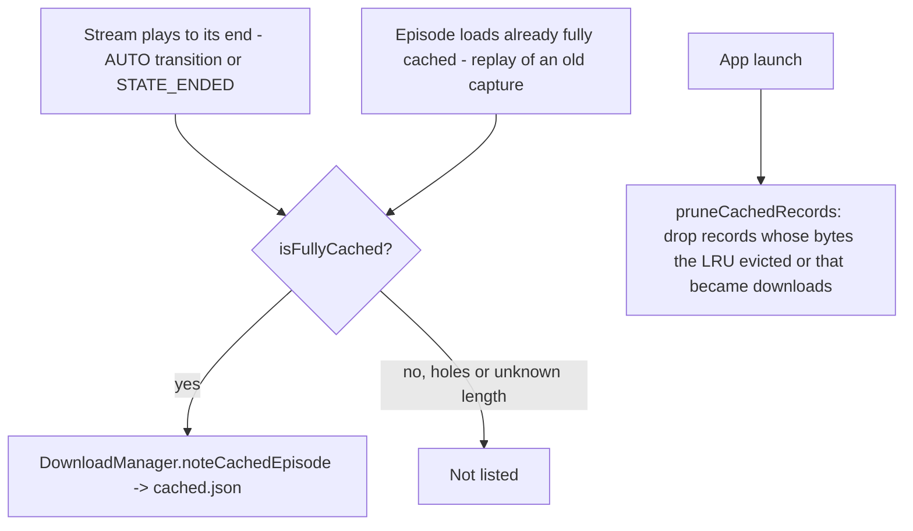

2026-07-29

# NerLan Android: cached episodes in the Downloads tab, episode-number sorting

The Android port of the iOS change from earlier the same day
(nerlan-cached-downloads-episode-sort). Same two features — streamed-cache
captures listed in 下載 with a dimmed badge and a kind filter, and
episode-number sorting for the Downloads/AI lists — but the cache half needed a
different design because the two players cache differently.

## Why the cache part isn't a straight port

iOS captures a stream as one complete file (`CachingPlayerItem` hands over a
fully-buffered temp file when the stream ends), so "cached" is a file-exists
check. Android's `AudioCache` is ExoPlayer's `SimpleCache`: a byte-range LRU
(2 GB cap) keyed by URL, written passively as the player pulls bytes. That
means there is no "download finished" moment, an episode the listener seeked
through has holes, and the LRU can evict spans at any time.

So on Android an episode counts as cached only when
`AudioCache.isFullyCached(url)` proves it: the cache knows the content length
and holds every byte of it. The moments that check runs:

Playing-to-the-end is the natural completion signal (a full listen is exactly
what fills the cache), and the load-time check backfills captures made before
records existed — same healing behavior as iOS. `cached.json` lives in
filesDir but deliberately stays out of Drive sync: the bytes it describes are
device-local, so syncing the records would list phantom rows on other devices.

Lifecycle ties: swipe-deleting a cached row removes the record and evicts the
bytes (`SimpleCache.removeResource`); an explicit download supersedes and
evicts the capture; 設定's "清除快取音檔" now clears the records along with
the cache.

UI mirrors iOS with Material idioms: a funnel `DropdownMenu` (全部/已下載/快取,
default 全部) beside the 節目/語言 segmented control, and a trailing badge per
row — filled primary `CheckCircle` for real downloads, outlined
`onSurfaceVariant` for captures. Fill-not-tint carries the distinction, which
also reads on the e-ink tablet.

## Episode-number sorting

Identical reasoning to iOS: the lists sorted by `playDate`, but Channel+
bulk-publishes course episodes with one shared release date, so the sort
degenerated to insertion (download/generation) order. `EpisodeRecord` gains an
optional `episodeNo` (kotlinx.serialization default null, so old JSON
decodes), filled from the API's `episodeNumber`; a shared `episodeOrder`
comparator sorts number-first with date/title fallback, used by the Downloads
and AI tabs.

`EpisodeNumberBackfill` runs at launch on an IO coroutine: it collects NER
records missing the number across downloads, cached records, favorites, and
the AI index (podcasts skipped — no numbers), resolves ids from the on-disk
`CatalogCache` episode pages first, sweeps the API per still-unresolved
program, applies via `copy(episodeNo = …)` in each store, and persists — a
no-op on every later launch.

## Verification

Built the signed release (R8 rule: never trust debug for this app) and drove
the emulator end-to-end: downloaded EP01/EP02 of a course, enabled 串流快取,
streamed EP03 to completion at 2×. The Downloads tab then showed EP01/EP02
with filled checks and EP03 with the dimmed outline check, in episode order,
with all three filter states correct — and the half-streamed EP04 correctly
absent. Awaiting the user's on-phone check; the phone wasn't attached during
the session.
