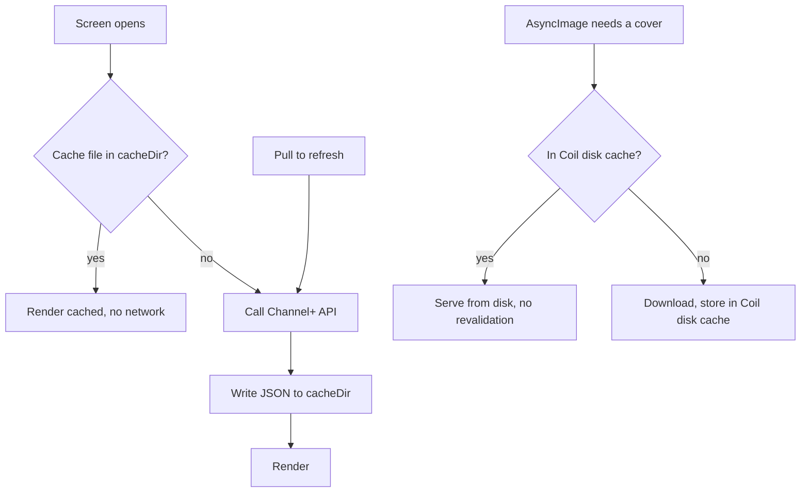

# NerLan Android — Cache catalog and covers; add episode pull-to-refresh

## Summary

Port of the iOS catalog/cover caching change to the Android app
(`plateaukao/nerlan-android`). The browse UI re-fetched on every use: the program
list reloaded after process death (`remember` state is lost), the episode list
re-fetched on each program open, and Coil revalidated covers over the network on
every cold start. The Channel+ catalog rarely changes, so this was wasted traffic
and a network-dependent UI. Now the catalog and covers persist on disk; the
network is touched only on a cache miss or an explicit pull-to-refresh.

## Approach

Three caches, all under `cacheDir` (derived, re-fetchable data the OS may evict;
user data — favorites, downloads — stays in `filesDir`).

- **`CatalogCache`** — kotlinx.serialization JSON cache in `cacheDir/catalog/` for
  the program list (`programs.json`) and each program's loaded episode pages
  (`episodes-{programId}.json`). The episode cache stores the pagination cursor
  (`page`/`totalPages`/`totalCount`) with the episodes, so reopening restores the
  list and infinite scroll resumes without re-fetching seen pages. Reads/writes
  run on `Dispatchers.IO`.

- **Screens** — `ProgramListScreen` and `ProgramDetailScreen` load from the cache
  first (no network), persist after each fetch, and gain pull-to-refresh via
  `PullToRefreshBox` (material3). On the detail screen an `initialized` flag gates
  the infinite-scroll `LaunchedEffect` so it can't race the cache-load effect and
  fire a redundant page-1 fetch. A failed refresh keeps the cached list on screen.

- **Covers** — Android already disk-caches images through Coil, so unlike iOS no
  custom store was needed. The gap was that Coil *respects cache headers* by
  default, and the image endpoint sends no `Cache-Control`, so Coil revalidated
  each cover over the network on cold start. Making `NerLanApp` a Coil
  `ImageLoaderFactory` with `respectCacheHeaders(false)` (plus a 256 MB disk
  cache) makes Coil serve a fetched cover straight from disk on later loads —
  the same "no network after first fetch" behavior as the iOS explicit cache,
  achieved through configuration rather than a hand-rolled cache.

The download-progress throttling from the iOS change was **not** ported: the
Android `DownloadManager` already publishes progress only on 10% steps, so the
recomposition concern was already handled. The iOS app-icon fix is iOS-specific
(Android uses adaptive icons) and does not apply.

## Trade-offs

- **Staleness is intentional.** The catalog is authoritative until pull-to-refresh;
  correct for a catalog that changes rarely.
- **Refresh resets episode pagination** to page 1. Episodes are ascending, so
  newly-added ones surface at the end as the user scrolls after refreshing.
- **R8 / release build.** The new `@Serializable EpisodePageCache` is covered by
  the existing generic keep rule (`-if @kotlinx.serialization.Serializable class **`),
  so no proguard change was needed. Verified by installing the signed release on
  the real device (no `SerializationException`).
- **`respectCacheHeaders(false)` is global** to the app's ImageLoader. That's fine
  here — every image it loads is static Channel+ cover art keyed by a unique id.

## Key Files

- `app/src/main/java/com/example/nerlan/data/CatalogCache.kt` (new) — disk cache
  for programs + episode pages.
- `app/src/main/java/com/example/nerlan/NerLanApp.kt` — wires `CatalogCache`;
  implements `ImageLoaderFactory` with `respectCacheHeaders(false)`.
- `app/src/main/java/com/example/nerlan/ui/ProgramListScreen.kt` — cache-first
  load; `PullToRefreshBox`; resilient refresh.
- `app/src/main/java/com/example/nerlan/ui/ProgramDetailScreen.kt` — cache-first
  load with restored cursor; persists each page; pull-to-refresh; `initialized`
  race guard.
