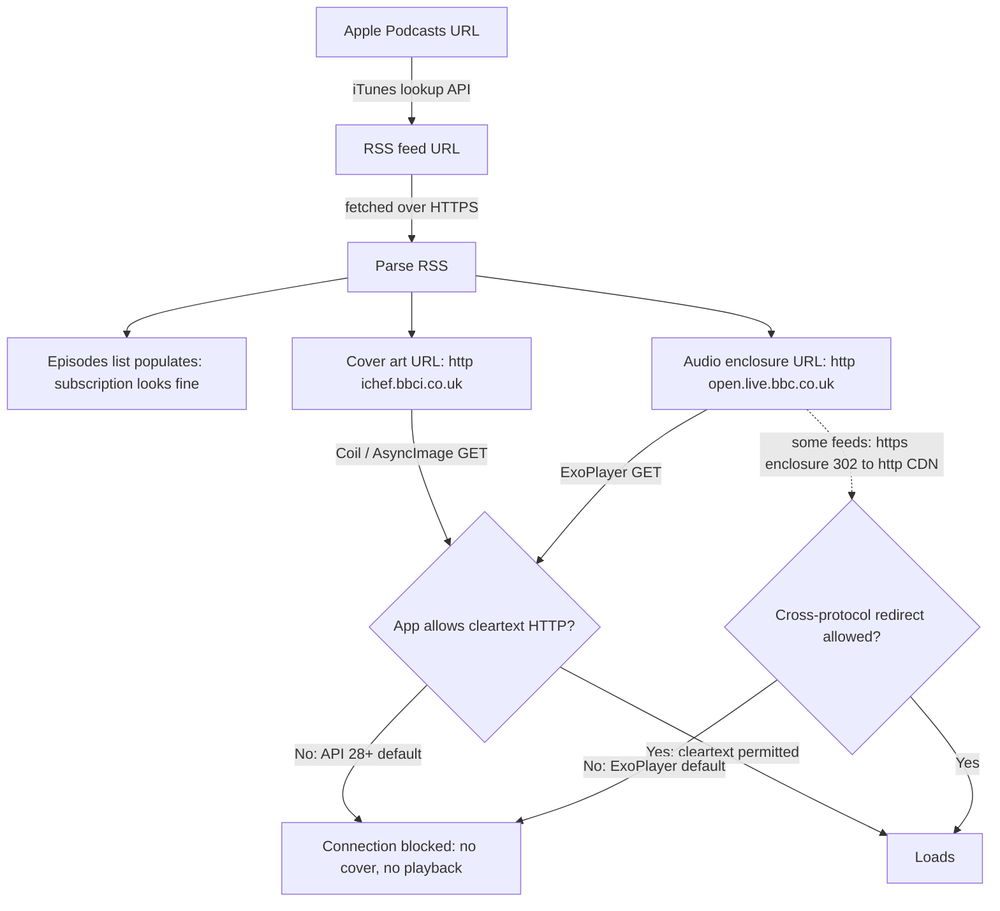

# NerLan (Android): cleartext-HTTP podcast feeds wouldn't show art or play

## Problem

Subscribing to a podcast via its Apple Podcasts URL (reported case: BBC Inside Science) produced a half-broken subscription on Android: the episode list populated, but **no cover art appeared and not a single episode would play**. NER programs and other podcasts were unaffected.

## Root Cause

The feed serves every asset over plain **cleartext HTTP**, not HTTPS:

- Cover art: `http://ichef.bbci.co.uk/images/ic/3000x3000/p0m1wy8q.jpg`
- All 656 audio enclosures: `http://open.live.bbc.co.uk/.../*.mp3`

The app targets `targetSdk = 36` with no `usesCleartextTraffic` flag and no network-security-config. Since Android 9 (API 28) the platform default is `usesCleartextTraffic="false"`, so the OS silently refuses every `http://` connection. Coil couldn't fetch the cover and Media3/ExoPlayer couldn't open the audio. The subscription itself looked fine because the RSS XML is fetched over HTTPS and `PodcastFeedParser` parsed it normally — only the per-asset image/audio loads died.

A naive `http`→`https` rewrite wouldn't fix audio: the BBC audio endpoint `302`-redirects to a *cleartext* `http://bbc.pdn.tritondigital.com/...` host even when started from HTTPS, and ExoPlayer's `DefaultHttpDataSource` blocks cross-protocol (https→http) redirects by default. Because feeds come from arbitrary user-supplied domains, hosts can't be enumerated for a per-domain exception.

## Solution

1. Added `app/src/main/res/xml/network_security_config.xml` with `<base-config cleartextTrafficPermitted="true"/>` and referenced it from `<application android:networkSecurityConfig="@xml/network_security_config">`. A network-security-config (rather than the blunt `android:usesCleartextTraffic="true"`) keeps the decision documented; cleartext is permitted globally because podcast hosts are arbitrary and can't be whitelisted. App API traffic (NER, OpenAI) is HTTPS regardless.
2. Gave ExoPlayer's `DefaultDataSource.Factory` an HTTP base of `DefaultHttpDataSource.Factory().setAllowCrossProtocolRedirects(true)` in `AudioCache.kt`, so feeds whose https enclosure redirects to an http CDN also play. (OkHttp in `DownloadManager` already follows http↔https redirects by default.)

Verified on the Pixel 9 Pro XL: the BBC cover art loads and episodes stream.

## Key Files

- `app/src/main/res/xml/network_security_config.xml` — new; permits cleartext.
- `app/src/main/AndroidManifest.xml` — references the config on `<application>`.
- `app/src/main/java/com/example/nerlan/player/AudioCache.kt` — cross-protocol redirects on the ExoPlayer HTTP datasource.

## Lessons Learned

- A "subscription works but nothing loads" symptom on Android points at the cleartext-HTTP block before anything app-specific — the XML fetch (HTTPS) succeeds while the asset fetches (HTTP) fail, which exactly produces a populated-but-dead list.
- For a podcast client that ingests arbitrary feeds, blanket cleartext is the correct posture, not a code smell; the long tail of legacy/public-broadcaster feeds is still http-only.
- Don't stop at "upgrade the URL to https" — check the *redirect chain*. A protocol that downgrades mid-redirect needs `setAllowCrossProtocolRedirects(true)`, not just cleartext permission.
