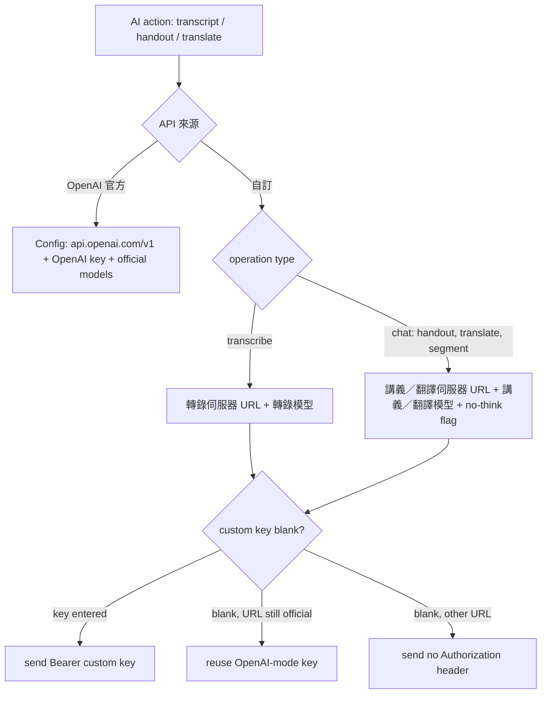

2026-08-09

# NerLan Android: custom AI server settings behind an API 來源 switch

NerLan's AI features (逐字稿, 講義, 翻譯) previously talked only to the official
OpenAI API with a hardcoded `https://api.openai.com/v1` base URL. The iOS app
already lets the user point those features at self-hosted OpenAI-compatible
servers — usually cheaper or on the LAN (whisperASR, Ollama) — via an
「API 來源」 segmented picker in Settings. This change brings the Android app to
parity: a two-tab **OpenAI 官方 / 自訂** switch where the custom tab configures
two independent endpoints, one for transcription and one for handout/translation
chat, each with its own URL, model, and optional API key.

## What the custom tab configures

- **轉錄伺服器** — URL (up to `/v1`, used for `/audio/transcriptions`), free-text
  轉錄模型, optional key, and a 「驗證轉錄伺服器」 probe row.
- **講義／翻譯伺服器** — URL (used for `/chat/completions` by handout,
  translation, and sentence segmentation), free-text 講義／翻譯模型, optional
  key, a 「停用思考模式（no think）」 toggle, and a 「驗證講義／翻譯伺服器」 probe
  row. The no-think toggle sends `reasoning_effort=none`, which stops local
  thinking models (qwen3, deepseek-r1, …) from dumping their reasoning into the
  handout.

Both providers' settings persist independently (new SharedPreferences keys:
`api_provider`, `custom_transcription_url/model/key`,
`custom_chat_url/model/key`, `custom_chat_no_think`), so switching back and
forth is lossless. The provider raw values (`openAIOfficial` / `custom`) match
the iOS enum verbatim.

## How a call resolves its endpoint

`OpenAIService` no longer hardcodes a base URL or takes loose
`(model, apiKey)` parameters. Every entry point takes an iOS-style
`Config(baseUrl, apiKey, model, requiresKey, disableThinking)`, and
`SettingsStore.transcriptionConfig()` / `chatConfig()` resolve one per call
from the active provider. The key-fallback rule mirrors iOS: an explicit
custom key wins; a blank key reuses the OpenAI-mode key while the custom URL
still points at the official server; any other URL sends no Authorization
header at all, because keyless local servers reject a Bearer header less
gracefully than no header.

## Design notes

- **The AI-button gate became provider-aware.** The UI used to show AI actions
  only when the OpenAI key was non-blank. That gate is now
  `SettingsStore.aiConfigured` (official: key set; custom: transcription URL
  set), consumed by FavoritesScreen, PlayerSheet, and TranscriptDialog — so
  custom mode works with no OpenAI account at all.
- **Verify probes prove the whole pipeline, not just reachability.** The
  transcription probe POSTs a generated 0.5 s silent 16 kHz WAV to
  `/audio/transcriptions`; the chat probe asks for a one-word completion. A
  failure renders the server's own error message under the row, which required
  teaching the error parser the three shapes in the wild: OpenAI
  (`error.message`), Ollama (string `error`), and proxies (`message`), with a
  host + HTTP status + body-snippet fallback.
- **Blank or unparseable custom URLs fall back to the official base** (as on
  iOS) so a misconfiguration fails with a clear server error instead of a
  crash.
- **No manifest work was needed for LAN servers** — the app already permits
  cleartext HTTP app-wide, so `http://…:11434/v1` works as-is.

Verified on the emulator end-to-end: both tabs render and persist, typing into
the dialog's fields works through the real IME (the settings screen is a
Compose `Dialog`, the window type where IME targeting historically breaks), and
both probe rows round-trip against the real OpenAI server, surfacing its 401
message in red. A signed release build went to the Pixel 9 Pro XL.

Deliberately deferred from the iOS feature: Bonjour/NSD LAN discovery (the
magnifying-glass sheet browsing `_whisperasr._tcp`) and the
`gpt-4o-transcribe-diarize` model option with its `diarized_json` handling.
