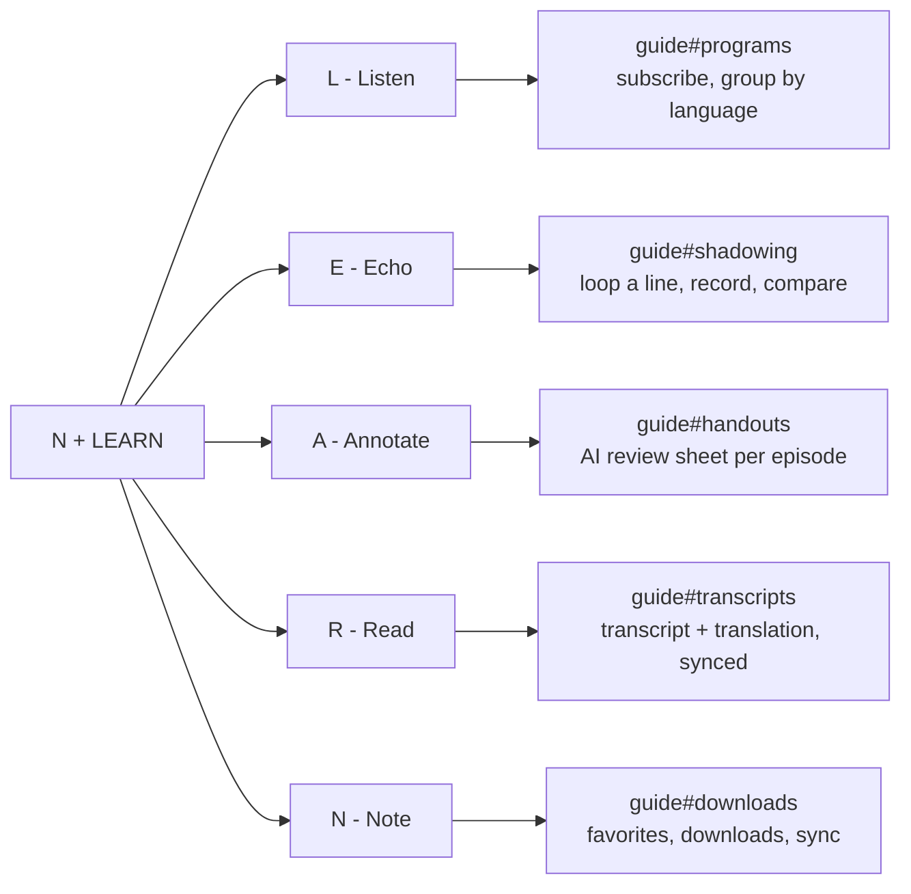

2026-08-16

# NerLan docs: dropping the NER framing and explaining the name

The docs site launched describing NerLan as an app that streams 國立教育廣播電臺 (National Education Radio) language courses, with "and your own podcasts" tacked on as a secondary capability. That ordering no longer matches the app. Everything the app plays now arrives through a podcast feed you subscribe to yourself — the NER programs included — so the site was advertising a catalog relationship the app doesn't have, and a content-licensing claim ("Course content is provided by 國立教育廣播電臺") we shouldn't be making on their behalf.

This change reframes the whole site around the user's own shows, and fills the space that reframing opened up with something the site never explained: where the name comes from.

## What changed in the copy

The rewrite is mostly a vocabulary shift applied consistently across both language editions (`docs/` and `docs/zh-tw/`): **course → show**, 課程 → 節目. It reads as a find-and-replace but isn't quite one, because several sentences carried assumptions that only held for a curated catalog:

- "sorted in course order" became "sorted in episode order" — with arbitrary feeds there is no course to order by, only the episodes within a show.
- Program rows advertised a level badge (初階) unconditionally; that field comes from NER metadata, so it's now "level where one is published" / 程度（有標示時）.
- "Podcast episode pages work like course pages" became "work like any other show page" — with no catalog, there is no other kind of page to contrast against.
- The note-taking feature was justified by "NER episode titles are often just EP12". The justification survives without the attribution — plenty of feeds do this — so it now reads "episode titles are often just EP12".
- Both footers dropped the NER credit for a generic one: audio comes from each show's own feed and belongs to its publisher.

## The naming section

With the hero no longer leaning on a recognizable institution for credibility, the name has to carry more weight — and "NerLan" is opaque on first read. A new `.naming` section sits directly under the hero on both home pages, giving two readings that are both true:

- **Said aloud**, Ner·Lan is *near language* — the distance the app tries to close, framed as "how far you are from understanding the sentence you just heard" rather than vocabulary count.
- **Spelled out**, the six letters are exactly N + LEARN, with nothing left over.

The second reading pays off in a five-row strip where each letter of LEARN names a feature and links to that feature's section of the guide:

The mapping is a genuine constraint satisfied, not a label stuck on afterwards: every letter had to land on a feature that already exists and already has its own guide anchor. Verified before committing that all five anchors (`#programs`, `#shadowing`, `#handouts`, `#transcripts`, `#downloads`) resolve in both `docs/guide.html` and `docs/zh-tw/guide.html`.

The Chinese edition keeps both readings rather than translating them away — the *near language* pun only works in English, so it's presented as an English pun with a Chinese explanation (靠近一種語言), and each strip row shows the English word beside its Chinese gloss (Listen 聽, Echo 跟讀, …). Translating "Echo" to a pure Chinese term would break the acronym the section exists to demonstrate.

## Styling

`docs/style.css` gained the `.naming` block (~85 lines). The section sits on `--wash` to separate it from the hero above and the feature grid below, with the two readings as bordered cards on `--paper`.

The strip rows are a three-column grid — letter / name / description — which needed two responsive breaks. At ≤900px the two reading cards stack to one column. At ≤480px the three-column row would crush the description, so the letter keeps its own narrow column spanning both rows (`grid-row: span 2`) while name and description stack beside it, keeping the letter visually anchored as the thing the row is about.
