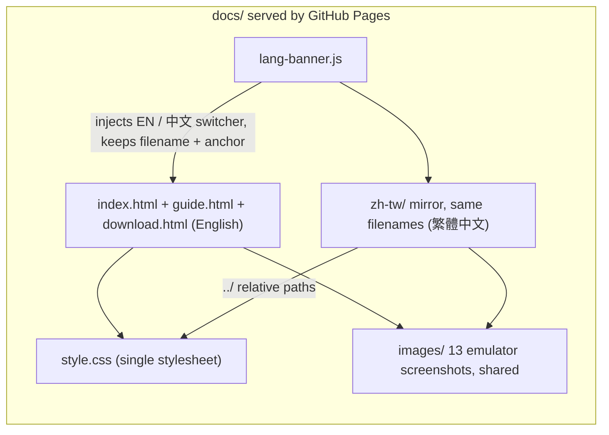

2026-08-09

# NerLan: bilingual docs site under docs/, modeled on the EinkBro site

NerLan had no user-facing documentation. This adds a complete docs site at
`docs/`, published by GitHub Pages ("deploy from branch", `main` `/docs`) at
https://plateaukao.github.io/nerlan-android/ — in English and 繁體中文. The
copy deliberately never names the platform: NerLan is presented as an app,
not as "an app for &lt;OS&gt;".

## Why this shape

The EinkBro docs site (`../einkbro/docs/`) was the explicit reference, and
its approach was adopted wholesale because it has no moving parts: raw HTML
with a single stylesheet, no static-site generator, no build step, no CI —
GitHub Pages serves the directory as-is. Localization is full page
duplication into a `zh-tw/` subdirectory with the same filenames, plus a
~40-line `lang-banner.js` that injects an EN / 中文 switcher into the nav,
computing the counterpart URL by prefixing/stripping `zh-tw/` while keeping
the filename and `#anchor`. Each translated file starts with a
`&lt;!-- translated-from: ../file.html @ sha --&gt;` marker so staleness is
greppable.

What was *not* copied: EinkBro's grayscale e-ink palette. The stylesheet
keeps its structural patterns (sticky nav with `scroll-padding-top`, the
CSS-only phone bezel around the hero shot, caption-above-image galleries via
`flex-direction: column-reverse`, the sticky guide sidebar, `.setting-item`
reference rows) but uses NerLan's own identity: the player UI's indigo as
accent, the app icon's orange for highlights, Noto Sans TC as the one
bilingual font family.

## Pages

- **index.html** — hero (player screenshot in the CSS bezel), six feature
  cards, and a 3×3 gallery arranged as a story: browse (catalog + podcasts,
  program page) → play (player) → study (逐字稿, 翻譯, 跟讀, AI 講義) →
  keep (downloads, custom AI servers).
- **guide.html** — the full manual with a sidebar TOC: the four tabs,
  browsing/podcasts, player, downloads &amp; streaming cache, AI setup
  (OpenAI 官方 and 自訂 servers, matching the just-shipped custom AI
  settings), 逐字稿/翻譯/跟讀/AI 講義/PDF 講義, favorites &amp; notes,
  widgets, Drive sync, statistics, a settings reference, and e-ink/deep-link
  tips. Every app label appears verbatim in Chinese with an English
  explanation on the EN page.
- **download.html** — release cards linking GitHub Releases plus a
  hand-written changelog for v1.6–v1.8, paraphrased platform-neutrally from
  the release notes.

## Screenshots: real content, staged deliberately

All 13 images were captured on the emulator via sim-use, with the status bar
in demo mode (10:00, full battery) for visual consistency. Two rounds of
feedback shaped them:

1. **Language choice** — the first pass used 臺灣客語 programs (first in the
   catalog); the user pointed out that Japanese/Korean/English learners are
   the actual audience, so app state was wiped and rebuilt around 早安日語
   and 韓語好好玩, plus a user-added Korean podcast for the 我的 Podcast shot.
2. **Show the study features, don't just describe them** — the core screens
   (逐字稿, 翻譯, 跟讀, AI 講義) initially had no screenshots because
   generating AI content needs an API key the emulator lacks. The user
   synced their Google Drive study library onto the emulator, which made
   real transcripts, cached translations and handouts openable without any
   key (the AI tab intentionally opens synced content with no AI
   configured). The transcript shot required seeking 60 s past the episode's
   ad intro so the synced highlight sits on real dialogue; the shadowing
   shot doubles as a bilingual-view demo since translation stays active in
   跟讀 mode.

The AI-tab, translation and handout screenshots are therefore genuine
end-to-end artifacts of the app's sync + AI pipeline, not mockups.

Publishing was completed by enabling GitHub Pages on the repo
(`gh api repos/…/pages -X POST`, branch `main`, path `/docs`).
