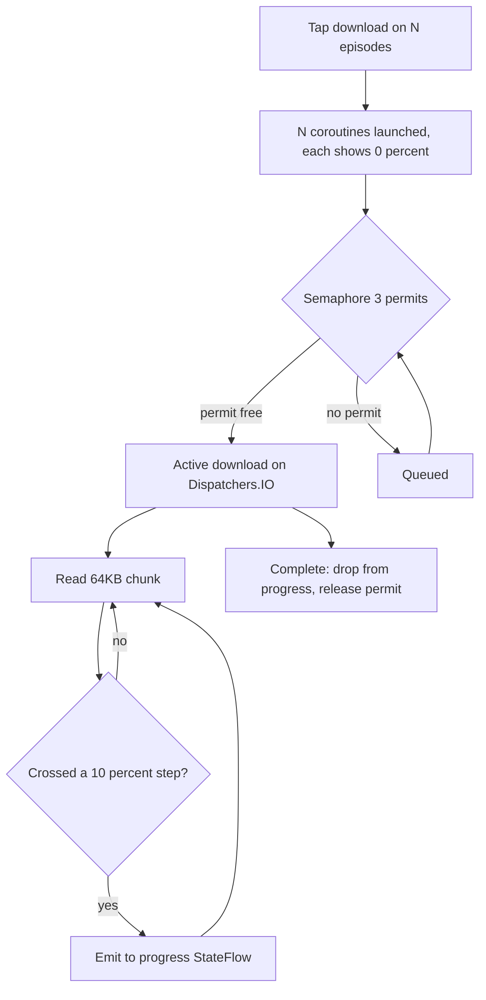

# NerLan Android — throttle download progress & cap concurrency

## Summary

Two efficiency changes to the Android `DownloadManager`, mirroring an iOS crash fix:

1. **Progress is emitted only on 10% steps** instead of on every 64KB chunk.
2. **Concurrent audio downloads are capped at 3** via a `Semaphore`.

Android was not crashing (unlike iOS — see below), so this is a preventive/efficiency change rather than an incident fix.

## Approach

The iOS twin of this code *was* crashing: its `URLSession` delegate ran on the main thread and republished a `@Published` progress fraction on every byte-chunk, which — because the download manager is a root `environmentObject` — re-evaluated the whole view tree continuously, pegged the main thread at about 91% CPU, and got the app killed by iOS's background CPU watchdog (`cpu_resource_fatal`, 80%-over-60s limit).

Android is structurally immune to that specific kill, which is why no fix was strictly required:

- The download loop runs on `Dispatchers.IO`, so the byte work never touches the UI thread.
- `progress` is a `StateFlow` consumed via `collectAsState()`; StateFlow **conflates**, so recomposition is capped at the frame rate no matter how fast chunks arrive — it cannot be flooded the way SwiftUI's `objectWillChange` was.
- Android has no equivalent "kill the app for sustained background CPU" rule.

What remained were two genuine inefficiencies worth tidying:

- `_progress.value += (id to fraction)` allocated a fresh map and emitted on *every* chunk. Now a `lastStep` guard emits only when the whole-10%-step changes (≤10 emissions/download). The on-screen indicator is a 24dp `CircularWavyProgressIndicator` that can't resolve finer than about 10% anyway.
- Downloads use OkHttp's **synchronous** `execute()`, which bypasses the dispatcher's per-host/total request limits. Tapping download on many episodes could launch up to about 64 simultaneous connections (Dispatchers.IO's pool) and starve other IO. A `Semaphore(3)` now bounds concurrency. The `progress = 0f` marker is set *before* the permit is acquired, so a queued episode shows its spinner immediately rather than looking dead.

## Trade-offs

- **10% granularity** makes the progress ring advance in visible jumps rather than smoothly. Acceptable for a 24dp indicator; chosen deliberately to minimize emissions/recompositions.
- **Semaphore(3)** serializes large batch downloads instead of running them all at once. Total wall-clock for a big batch is similar (bandwidth-bound), but individual files finish more predictably and other IO isn't starved. 3 is a guess at a good balance; trivially tunable.
- The iOS app dropped progress entirely (its list spinner ignored the value), but Android's determinate wavy ring genuinely shows the fraction, so the value is kept here — just coarsened.

## Key Files

- `app/src/main/java/com/example/nerlan/data/DownloadManager.kt` — `downloadAudio()`: `audioSemaphore` (`Semaphore(3)`) + `withPermit`, and the `lastStep` 10%-throttle on `_progress`.

Commit `3ce0155` on `plateaukao/nerlan-android` @ `main`.
