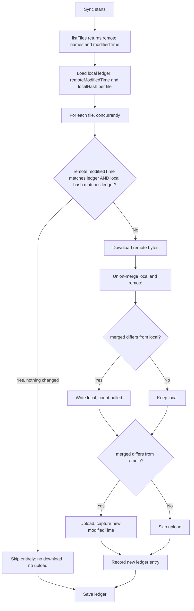

# NerLan Android — Skip-unchanged Drive sync via modifiedTime + content hashing

## Summary

NerLan syncs favorites, AI study content, podcast subscriptions, and listening
stats to each user's own Google Drive `appDataFolder` (no developer backend). The
sync had no change detection: every run re-listed the folder, re-downloaded every
metadata/podcast file, re-merged it, and **unconditionally re-uploaded** it — plus
re-uploaded the device's stats blob and re-downloaded every peer's — all as a
single sequential chain of blocking REST calls. A steady-state sync where nothing
had changed was still **~12 + N round-trips** (N = other devices' stats blobs),
which took tens of seconds on high-RTT or cellular links.

The fix makes an unchanged sync collapse to a **single `listFiles` call**, and runs
the work that does remain **concurrently**.

## Approach

Persist a small per-file change ledger locally (`drive-sync-state.json`) holding,
for each Drive file, two version tokens:

- **`remoteModifiedTime`** — the Drive `modifiedTime` already returned by
  `listFiles` (it advances whenever *any* device writes the file).
- **`localHash`** — a SHA-256 of the bytes this device last wrote locally.

A file is skipped entirely — no download, no upload — when both tokens still match
the previous sync. Otherwise the file is downloaded, union-merged, written back to
disk only if the merge differs from local, and uploaded only if it differs from the
remote. `upsert` now requests `?fields=id,modifiedTime` and returns the new
`modifiedTime`, so the freshly-written remote token is captured immediately — vital,
otherwise the next sync would mistake this device's own upload for a remote change
and re-download it.

The independent file syncs (3 metadata files, podcasts, content files, stats) now
run with `async`/`awaitAll` instead of one after another. They all target
`www.googleapis.com`, so OkHttp multiplexes them onto a single HTTP/2 connection;
content-file transfers are capped at 6 concurrent via a `Semaphore`. State updates
are returned from each unit and merged single-threaded after the barrier, so there
is no shared-mutable-state race during the concurrent phase. Listening stats get
the same treatment: the device's own blob re-uploads only when its hash changed,
and peer blobs are pulled only when their `modifiedTime` advanced (the win here
grows with device count — previously every peer re-downloaded on every sync).

A design constraint worth recording: the sync is union-merge with **last-writer-
wins** and *no* server-side change feed, and the rule that "deletions don't
propagate" (a backup tradeoff) had to be preserved. The ledger only suppresses
redundant transfers — it never changes which records win a merge — so the existing
semantics are untouched. modifiedTime is also a cheap, server-authoritative token
that costs nothing extra to obtain (it rides along in the `listFiles` response that
every sync already makes), which is why it was chosen over, say, MD5 checksums that
would each need a separate metadata fetch.

## Trade-offs

- **First sync after the update is full cost.** With no ledger file present, every
  file looks changed, so one complete pass runs and rebuilds the ledger. This is
  the safe default (no risk of skipping a genuine change) and self-heals if the
  ledger is ever lost or corrupt.
- **A local edit triggers one extra rewrite.** When the user changes a favorite,
  the file is briefly in the store's own JSON formatting; the sync re-merges and
  rewrites it in the sync layer's formatting, so the hash matches on the next idle
  sync. One redundant rewrite per user change — harmless, and it converges.
- **Stats own-blob skip depends on byte-stable serialization.** If the stats maps
  ever serialize in a non-deterministic order, the own blob could re-upload when
  unchanged. Worst case that is a single upload (what the old code did every time
  anyway) — never a correctness issue.
- **Concurrency raises peak connections slightly.** Up to ~11 in-flight requests
  during a full sync vs. 1 before. HTTP/2 multiplexing and the content-file
  semaphore keep this well-behaved, and the common idle sync issues just one call.

## Key Files

- `app/src/main/java/com/example/nerlan/data/DriveSync.kt` — the entire change:
  the `FileState`/`SyncState` ledger types and `loadState`/`saveState`/`hash`
  helpers; the concurrent `sync()` orchestration; the change-detecting
  `syncMetadataFile`, `syncPodcasts`, `syncStats`, and `syncContentFiles`; and
  `upsert` returning the new `modifiedTime`.
- `drive-sync-state.json` (runtime, in `filesDir`) — the persisted ledger; never
  uploaded to Drive, purely local per-device sync state.

The iOS app's iCloud-based `DriveSync` mirrors this same sync model and is the next
target for the identical optimization.
