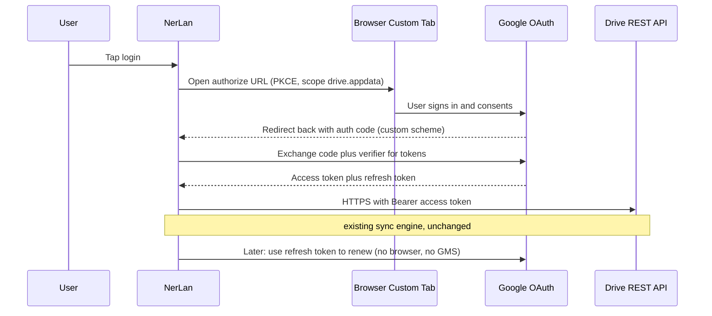

# NerLan Android — Google Drive sync on GMS-less devices (deferred)

**Status:** Deferred — leave as-is, revisit later. Decided 2026-06-14.

## Summary

On a de-Googled Hisense A7 (model HNR320T, adb id `20201205023939`), tapping
"使用 Google 帳戶登入" in Settings can't enable Google Drive sync. Investigation
showed **NerLan itself is fine** — the device simply has no working Google Play
Services. There is a clean way to make Drive sync work without GMS (browser-based
OAuth), but adopting it forces a one-time re-login on every already-linked device,
so for now we are **leaving it as-is**.

## Findings (what actually happened)

- NerLan did **not** crash — its process stayed alive throughout. The login flow
  launched correctly (`com.google.android.gms.auth.api.signin.internal.SignInHubActivity`
  was registered).
- The app's Play Services client failed to connect a moment later:
  ```
  E GoogleApiManager: Failed to get service from broker.
  java.lang.SecurityException: addOnPermissionsChangeListener: Neither user 10152
  nor current process has android.permission.OBSERVE_GRANT_REVOKE_PERMISSIONS
  ```
- The device's own GMS processes (`com.google.android.gms.persistent`) were
  crash-looping independently:
  ```
  SecurityException: writing to settings requires android.permission.WRITE_SECURE_SETTINGS
  ```
- **Root cause:** the A7 ships a broken/partial GMS stub. Google Sign-In and the
  Drive API are part of Play Services, so the login screen can open but the token
  request can never complete. This is inherent to a de-Googled device, not a bug
  in the app.

## Why it is *almost* fixable cheaply

The sync engine already talks to the Drive REST API directly over OkHttp with a
Bearer token. The **only** GMS dependency is obtaining that token.

`DriveSync.kt:120-121`
```kotlin
val account = GoogleSignIn.getLastSignedInAccount(context)?.account ?: error("尚未登入 Google 帳戶")
val token = GoogleAuthUtil.getToken(context, account, "oauth2:$SCOPE")
```

Everything after that line (`listFiles`, `syncMetadata`, all Drive calls) is
plain HTTPS to `googleapis.com` and is already GMS-independent.

## Options considered

### Option 1 — Browser OAuth 2.0 + PKCE (AppAuth-Android) — recommended path

Replace GMS sign-in + `GoogleAuthUtil.getToken` with an Authorization-Code + PKCE
flow run in a Chrome Custom Tab; exchange the returned code for access + refresh
tokens; feed the access token to the existing Drive code. Works on any device with
a browser, no Play Services. Would also let us drop the `play-services-auth`
dependency entirely.



Cost: add `net.openid:appauth`, one small auth class, rewire the Settings login
button and the DriveSync token source (the sync engine itself stays untouched),
plus a new OAuth client in Google Cloud Console (installed-app / custom-scheme
redirect, `drive.appdata` scope, offline access for a refresh token). The GCP
console step is the only part that must be done by the project owner.

### Option 2 — microG — rejected

A device-level open-source reimplementation of GMS would let the current code work
unchanged. But it needs signature spoofing (patched ROM / Magisk) and removal of
the A7's broken GMS stub. Fragile, device-specific, and not an app change.

### Option 3 — service account / manual token paste — rejected

Wrong tool: a service account writes to the developer's Drive, not the user's;
manually pasted tokens expire and get revoked.

## Decision

**Leave as-is (defer Option 1).** The blocking trade-off is that switching token
mechanisms invalidates the existing GMS sign-in session, so every already-linked
device (the Pixel, the GoColor7) must sign in **once** through the new browser
flow. The old session and its tokens cannot migrate — different OAuth client,
different token store, and Google will not hand a non-GMS app a token for a
session that GMS created.

For a single-user app where Drive sync already works on the GMS devices, that
one-time cross-device re-login is not worth it right now solely to enable sync on
one de-Googled device. Synced data is unaffected regardless — it lives in the
user's Drive `appDataFolder` and locally.

## Revisit when

- A primary / daily-driver device becomes GMS-less (then the browser flow pays for
  itself), **or**
- We want to drop the `play-services-auth` dependency for other reasons, **or**
- A one-time re-login across devices becomes acceptable.

If revisited: implement Option 1 (AppAuth), keep the Drive REST sync engine
untouched, and set up the GCP OAuth client. The iOS app uses iCloud and is
unaffected either way.

## Key Files

- `app/src/main/java/com/example/nerlan/data/DriveSync.kt` — account/sign-in
  (`:55`, `:120`), token via GMS (`:121`, the only thing that would change), GMS
  sign-in client (`:271`).
- `app/src/main/java/com/example/nerlan/ui/SettingsScreen.kt` — login button and
  result launcher (`:71`, `:194`).

No code was changed for this ADR — it is a decision record only.
