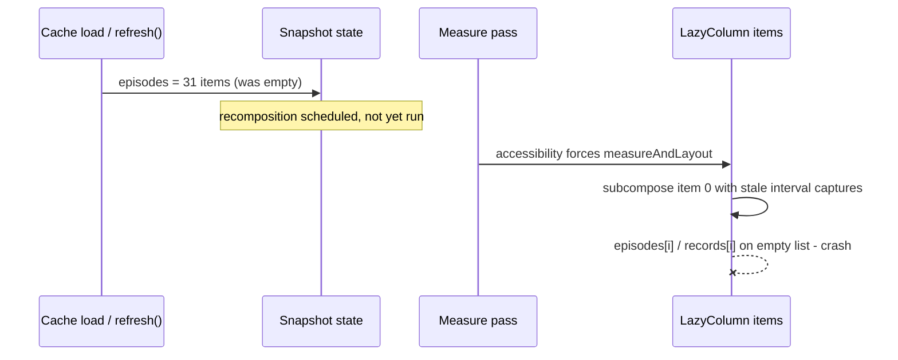

2026-07-07

# NerLan: IndexOutOfBounds crash opening a program's episode list

## What was broken

Opening a program in the browse tab could crash the app with
`IndexOutOfBoundsException: Index 0 out of bounds for length 0` at
`ProgramDetailScreen.kt:241`. It surfaced reliably on the emulator when the episode
cache was warm (the list flips from empty to 31 items immediately on open) while an
accessibility service was reading the screen — but the same window exists for real
users with TalkBack, and `refresh()` opens a second variant of the window for
everyone.

## Root cause

The lazy list drove its rows from **two parallel lists**:

```kotlin
val records = remember(episodes) { episodes.map { EpisodeRecord.from(it, program) } }
...
items(episodes.size, key = { episodes[it].episodeId }) { i ->
  EpisodeRow(episode = episodes[i], record = records[i], queue = records)
}
```

`episodes` is snapshot state read live inside the lambdas, while `records` is a
derived value captured when the interval was registered. Those can disagree:

- A measure-time subcomposition (forced by an accessibility pass, before the
  pending recomposition runs) executes item lambdas whose captured lists are stale
  relative to the just-written `episodes`.
- Pull-to-refresh *replaces* `episodes` with page 1 only, so the list can shrink
  below indices the stale interval count still covers.

Either way `episodes[i]` / `records[i]` indexes an empty (or shorter) list.



## Fix

One combined list now drives count, keys and content, so they always read the same
snapshot — there is no cross-list indexing left to disagree:

```kotlin
val rows = remember(episodes) { episodes.map { it to EpisodeRecord.from(it, program) } }
val records = remember(rows) { rows.map { it.second } }
...
items(rows, key = { it.first.episodeId }) { (episode, record) ->
  EpisodeRow(episode = episode, record = record, queue = records)
}
```

Verified on the emulator: three consecutive warm-cache opens of the program detail
screen (the previously crashing path) with no crash.

Commit: `4b0dde5` in nerlan-android.
