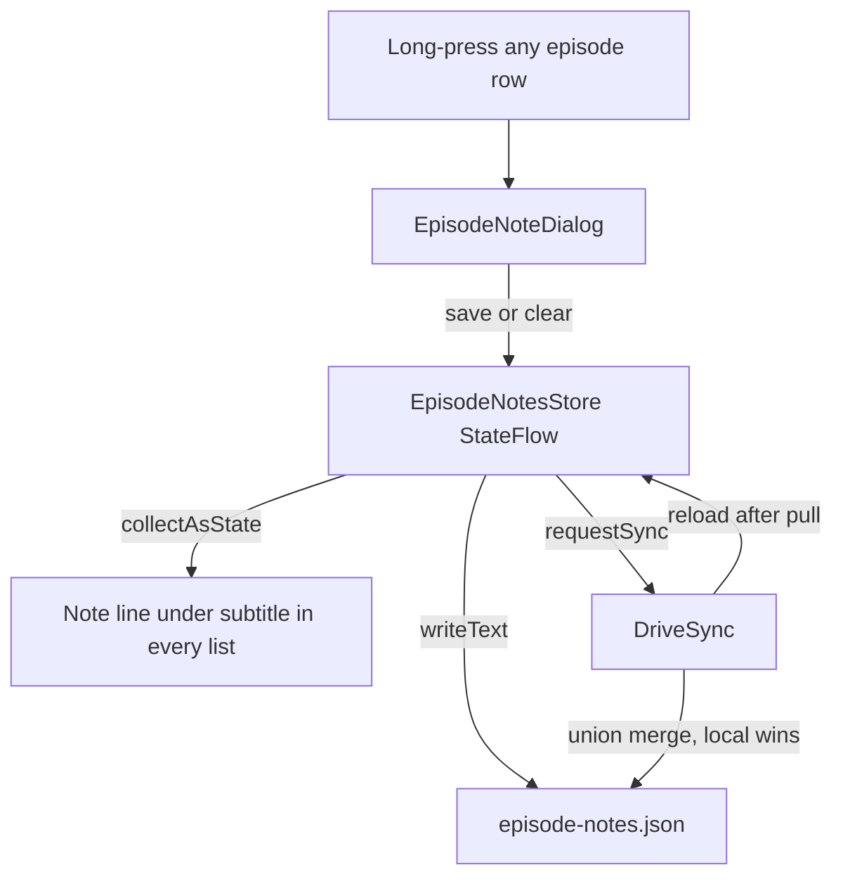

2026-08-01

# NerLan Android: per-episode user notes shown in episode lists

Course episodes on Channel+ are often titled just "EP12", so the episode lists give no clue what a lesson actually covers. The iOS app gained per-episode user notes yesterday (commit `fd56dfb`); this change brings the same feature to Android (`4ce20a9`, swipe gesture in `140978a`). Long-pressing any episode row — in the program episode list, Downloads, Favorites, a podcast's episode list, or the AI tab — opens a small dialog to write a note, and the note then appears under that episode's metadata in every list.

The session also confirmed the second half of the ask was already done: cached episodes appearing in the Downloads tab (with the 全部/已下載/快取 filter) landed on Android in `badd57b` on 2026-07-29, explicitly mirroring the iOS change. Nothing to add there.

## How it fits the existing architecture

- **`EpisodeNotesStore`** follows the `FavoritesStore` template exactly: a plain class constructed once in `NerLanApp.onCreate()`, a `StateFlow<Map<String, String>>` (episode id → note) the UI collects, JSON persisted synchronously to `episode-notes.json` on each mutation, and `reload()` for after a Drive pull. The filename matches iOS deliberately, even though the two sync systems (iCloud KVS vs Drive appDataFolder) never talk to each other. Saving trimmed-empty text deletes the note, same as iOS.
- **Drive sync** got one more `async` entry in the fan-out, using the same generic `syncMetadataFile` machinery. The merge is the `ai-index.json` shape: union of remote and local maps, local winning on key conflict, keys sorted so identical content produces identical bytes (no spurious uploads). Like favorites, the union merge does not propagate deletions across devices — a documented tradeoff of the whole metadata-file design, accepted here for consistency. iOS's KVS sync is remote-authoritative and *does* propagate deletes; the platforms differ on this edge and that's fine.
- **UI** needed only the two shared row composables. `EpisodeRow` (program episode list) and `RecordRow` (Downloads/Favorites/Podcast/AI) each grew a `combinedClickable` long-press and a note line under the subtitle — one edit covers all five lists because `RecordRow` is shared. The note line is bodySmall in the theme's tertiary color with a sticky-note icon (iOS uses orange; on the color e-ink devices the icon, not the tint, carries the distinction).
- **Swipe, like iOS** (follow-up commit `140978a`): the program episode list also opens the editor on a trailing swipe, mirroring iOS's `swipeActions`. Compose has no first-party swipe-actions row, but `SwipeToDismissBox` works as one when its `confirmValueChange` vetoes every settle: the drag reveals a sticky-note icon on `tertiaryContainer`, crossing the threshold sets the edit state, and the veto snaps the row back instead of dismissing. One deliberate difference from iOS: release-past-threshold opens the editor directly (one gesture) rather than revealing a button to tap. The record lists stay long-press-only since their trailing swipe is delete — the same split iOS made.

Two small interaction decisions: on `EpisodeRow` the row's `clickable(enabled = playable)` became an always-enabled `combinedClickable` with the playable guard moved into `onClick`, so notes can be written even on rows without audio; and on `RecordRow` the long-press coexists with the `SwipeToDismissBox` wrapper — verified working together.

## Verification

Built the signed release (`bri`) — the R8 lesson from the widgets crash — and drove it on the API 34 emulator with sim-use: created a note via long-press in the program list, confirmed it renders in both the program list and Downloads tab, confirmed the dialog pre-fills on re-open and 刪除註記 clears it, and confirmed swipe-to-delete still works alongside the long-press. No new reflection surface (the store serializes `Map<String, String>` with built-in serializers), so no proguard changes were needed. On-device check on the real phone still pending — the A7 was unplugged by then.

Earlier in the same session, the A7's standing crash-on-launch turned out to be a stale build: the phone had received the one broken APK built in the five-minute window on 07-26 between the widgets commit (which introduced the Glance→WorkManager→Room R8 trap) and the proguard fix. Installing the current release fixed it; no code change was involved.
